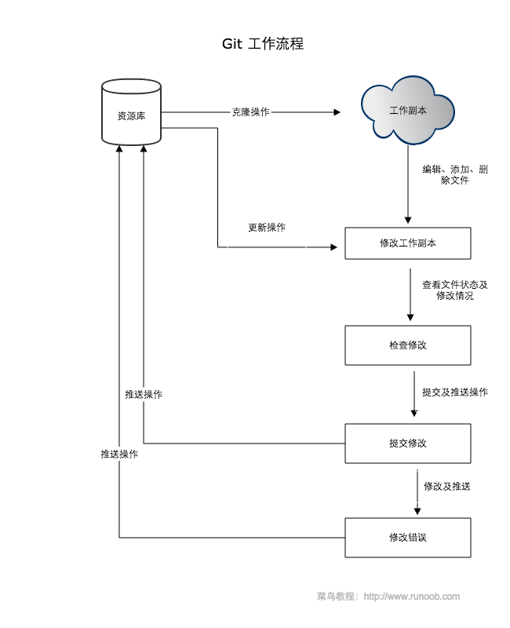

# linux 笔记
- [linux 笔记](#linux-%E7%AC%94%E8%AE%B0)
  - [常用命令](#%E5%B8%B8%E7%94%A8%E5%91%BD%E4%BB%A4)
    - [用户和用户组管理](#%E7%94%A8%E6%88%B7%E5%92%8C%E7%94%A8%E6%88%B7%E7%BB%84%E7%AE%A1%E7%90%86)
    - [系统服务管理](#%E7%B3%BB%E7%BB%9F%E6%9C%8D%E5%8A%A1%E7%AE%A1%E7%90%86)
    - [ssh 服务安装与链接](#ssh-%E6%9C%8D%E5%8A%A1%E5%AE%89%E8%A3%85%E4%B8%8E%E9%93%BE%E6%8E%A5)
    - [基础命令](#%E5%9F%BA%E7%A1%80%E5%91%BD%E4%BB%A4)
    - [文件操作](#%E6%96%87%E4%BB%B6%E6%93%8D%E4%BD%9C)
    - [文件目录管理命令](#%E6%96%87%E4%BB%B6%E7%9B%AE%E5%BD%95%E7%AE%A1%E7%90%86%E5%91%BD%E4%BB%A4)
    - [归档命令与文件搜索](#%E5%BD%92%E6%A1%A3%E5%91%BD%E4%BB%A4%E4%B8%8E%E6%96%87%E4%BB%B6%E6%90%9C%E7%B4%A2)
  - [管道符、重定向和环境变量](#%E7%AE%A1%E9%81%93%E7%AC%A6%E9%87%8D%E5%AE%9A%E5%90%91%E5%92%8C%E7%8E%AF%E5%A2%83%E5%8F%98%E9%87%8F)
    - [重定向](#%E9%87%8D%E5%AE%9A%E5%90%91)
    - [管道符](#%E7%AE%A1%E9%81%93%E7%AC%A6)
    - [通配符](#%E9%80%9A%E9%85%8D%E7%AC%A6)
    - [转义字符](#%E8%BD%AC%E4%B9%89%E5%AD%97%E7%AC%A6)
    - [环境变量(PATH 变量)](#%E7%8E%AF%E5%A2%83%E5%8F%98%E9%87%8FPATH-%E5%8F%98%E9%87%8F)
  - [VIM 与 Shell Script](#VIM-%E4%B8%8E-Shell-Script)
    - [Vim 编辑器](#Vim-%E7%BC%96%E8%BE%91%E5%99%A8)
    - [shell 脚本](#shell-%E8%84%9A%E6%9C%AC)
      - [变量与数组](#%E5%8F%98%E9%87%8F%E4%B8%8E%E6%95%B0%E7%BB%84)
        - [变量](#%E5%8F%98%E9%87%8F)
        - [字符串](#%E5%AD%97%E7%AC%A6%E4%B8%B2)
        - [数组](#%E6%95%B0%E7%BB%84)
      - [参数的接受](#%E5%8F%82%E6%95%B0%E7%9A%84%E6%8E%A5%E5%8F%97)
      - [条件判断语句](#%E6%9D%A1%E4%BB%B6%E5%88%A4%E6%96%AD%E8%AF%AD%E5%8F%A5)
      - [基本运算](#%E5%9F%BA%E6%9C%AC%E8%BF%90%E7%AE%97)
      - [echo 与 read 、printf 命令](#echo-%E4%B8%8E-read-printf-%E5%91%BD%E4%BB%A4)
      - [test 命令](#test-%E5%91%BD%E4%BB%A4)
      - [let 命令](#let-%E5%91%BD%E4%BB%A4)
      - [流程控制语句](#%E6%B5%81%E7%A8%8B%E6%8E%A7%E5%88%B6%E8%AF%AD%E5%8F%A5)
        - [if 分支语句](#if-%E5%88%86%E6%94%AF%E8%AF%AD%E5%8F%A5)
        - [for 迭代语句](#for-%E8%BF%AD%E4%BB%A3%E8%AF%AD%E5%8F%A5)
        - [while 循环语句](#while-%E5%BE%AA%E7%8E%AF%E8%AF%AD%E5%8F%A5)
        - [until 语句](#until-%E8%AF%AD%E5%8F%A5)
        - [case 语句](#case-%E8%AF%AD%E5%8F%A5)
      - [函数](#%E5%87%BD%E6%95%B0)
    - [文件包含](#%E6%96%87%E4%BB%B6%E5%8C%85%E5%90%AB)
  - [Git 的使用](#Git-%E7%9A%84%E4%BD%BF%E7%94%A8)
    - [安装](#%E5%AE%89%E8%A3%85)
    - [配置](#%E9%85%8D%E7%BD%AE)
    - [git 的工作流程](#git-%E7%9A%84%E5%B7%A5%E4%BD%9C%E6%B5%81%E7%A8%8B)
    - [git 的工作区，暂存区，版本库](#git-%E7%9A%84%E5%B7%A5%E4%BD%9C%E5%8C%BA%E6%9A%82%E5%AD%98%E5%8C%BA%E7%89%88%E6%9C%AC%E5%BA%93)
    - [创建仓库](#%E5%88%9B%E5%BB%BA%E4%BB%93%E5%BA%93)
    - [常用操作](#%E5%B8%B8%E7%94%A8%E6%93%8D%E4%BD%9C)
    - [git 分支管理](#git-%E5%88%86%E6%94%AF%E7%AE%A1%E7%90%86)
    - [git 提交历史](#git-%E6%8F%90%E4%BA%A4%E5%8E%86%E5%8F%B2)
    - [Git 远程仓库](#Git-%E8%BF%9C%E7%A8%8B%E4%BB%93%E5%BA%93)
  - [awk 编程](#awk-%E7%BC%96%E7%A8%8B)
## 常用命令

### 用户和用户组管理

**newgroup** 方便属于多组的用户切换所属的用户组
**su username** 切换当前使用的用户,在Ubuntu等环境下需要sudo执行

### 系统服务管理

在 redhat 系发行版上, 已经更换为 systemd.  
在 Ubuntu 等系统上仍未改动.

| 旧版命令(Ubuntu)    | 新版命令(RHEL7)                  | 备注                           |
| :------------------ | :------------------------------- | :----------------------------- |
| service foo start   | systemctl start foo.service      | 启动服务                       |
| service foo restart | systemctl restart foo.service    | 重启服务                       |
| service foo stop    | systemctl stop foo.service       | 停止服务                       |
| service foo reload  | systemctl reload foo.service     | 重新加载配置文件（不终止服务） |
| service foo status  | systemctl status foo.service     | 查看服务状态                   |
| chkconfig foo on    | systemctl enable foo.service     | 开机自动启动                   |
| chkconfig foo off   | systemctl disable foo.service    | 开机不自动启动                 |
| chkconfig foo       | systemctl is-enabled foo.service | 查看特定服务是否为开机启动     |

### ssh 服务安装与链接

微软自 windows10 1803 开始内置 openSSH,在虚拟机中安装 centOS 并配置网络后可以通过

```bash
[root@localhost ~]# systemctl start sshd.servie
[root@localhost ~]#systemctl enble sshd.service
```

将 ssh 服务启动并加入到开机启动列表中.
然后通过

```bash
[root@localhost ~]# ifconfig
```

或者

```bash
[root@localhost ~]# ip addr
```

查看虚拟机 ip.
在 windows 下可通过

```powershell
ssh root@192.168.0.100
```

如果在 VirtualBox 下部署的虚拟机 ip 地址无效,则应当检查网卡配置.  
一般配置为桥接网络,可以正常获取有效 IP.
通过 SSH 链接虚拟机中 Linux 后,输入 root 用户密码后进入.
也可以通过编辑 ssh 配置文件,为虚拟机设置别名,方便使用.

```powershell
PS C:\Users\admintrato> ssh local
root@192.168.0.100's password:
Last login: Tue Jul  9 12:20:27 2019 from 192.168.0.104
```

### 基础命令

1. echo 命令
   输出打印字符串

```bash
[root@localhost ~]# echo test
test
```

2. date 命令
   可以通过+(%Y%m%d%H%M%S)参数进行格式化输出日期时间.

```bash
[root@localhost ~]# date "+%Y-%m-%d-%H:%M:%S"
2019-07-09-12:43:28
```

3. reboot 命令  
   重启
4. poweroff 命令  
   关机
5. wget 命令

- -c 断点续传
- -b 后台下载,可通过 wget -log 查询下载情况

```bash
[root@localhost ~]# wget -cb https://www.guancha.cn/images/mian-logo.png
Continuing in background, pid 7149.
Output will be written to ‘wget-log’.
[root@localhost ~]# ls
anaconda-ks.cfg  dircolors-solarized  mian-logo.png wget-log
```

1. ps 命令用于查看系统中的进程状态，格式为“ps [参数]”。

```bash
[root@localhost ~]# ps
  PID TTY          TIME CMD
 7093 pts/0    00:00:00 bash
 7177 pts/0    00:00:00 ps
```


7. top 命令  
   用于查看系统当前负载信息和进程活动

```bash
top - 13:22:19 up  5:17,  1 user,  load average: 0.00, 0.01, 0.05
Tasks:  92 total,   1 running,  91 sleeping,   0 stopped,   0 zombie
%Cpu(s):  0.0 us,  0.0 sy,  0.0 ni,100.0 id,  0.0 wa,  0.0 hi,  0.0 si,  0.0 st
KiB Mem :  1882300 total,  1378352 free,   125964 used,   377984 buff/cache
KiB Swap:   839676 total,   839676 free,        0 used.  1572144 avail Mem

  PID USER      PR  NI    VIRT    RES    SHR S %CPU %MEM     TIME+ COMMAND
    3 root      20   0       0      0      0 S  0.3  0.0   0:00.14 ksoftirqd/0
    1 root      20   0  128008   6664   4172 S  0.0  0.4   0:01.61 systemd
    2 root      20   0       0      0      0 S  0.0  0.0   0:00.04 kthreadd
    5 root       0 -20       0      0      0 S  0.0  0.0   0:00.00 kworker/0:0H
    6 root      20   0       0      0      0 S  0.0  0.0   0:00.13 kworker/u2:0
    7 root      rt   0       0      0      0 S  0.0  0.0   0:00.00 migration/0
    8 root      20   0       0      0      0 S  0.0  0.0   0:00.00 rcu_bh
    9 root      20   0       0      0      0 S  0.0  0.0   0:00.50 rcu_sched
   10 root       0 -20       0      0      0 S  0.0  0.0   0:00.00 lru-add-drain
   11 root      rt   0       0      0      0 S  0.0  0.0   0:00.09 watchdog/0
```

8. pidof 命令  
   用于查看某个指定进程的 PID.

```bash
[root@localhost ~]# pidof systemd
1
```

9. kill 命令  
   用于中止特定 PID 的进程.
10. killall 命令  
    用于终止某个指定名称的服务所对应的全部进程.
11. ifconfig 命令  
    ifconfig 命令用于获取网卡配置与网络状态等信息.

```bash
[root@localhost ~]# ifconfig
enp0s3: flags=4163<UP,BROADCAST,RUNNING,MULTICAST>  mtu 1500
        inet 192.168.0.100  netmask 255.255.255.0  broadcast 192.168.0.255
        inet6 fe80::6dcf:ec7:d245:4142  prefixlen 64  scopeid 0x20<link>
        ether 08:00:27:da:be:4a  txqueuelen 1000  (Ethernet)
        RX packets 19662  bytes 22645898 (21.5 MiB)
        RX errors 0  dropped 0  overruns 0  frame 0
        TX packets 11536  bytes 1269990 (1.2 MiB)
        TX errors 0  dropped 0 overruns 0  carrier 0  collisions 0

lo: flags=73<UP,LOOPBACK,RUNNING>  mtu 65536
        inet 127.0.0.1  netmask 255.0.0.0
        inet6 ::1  prefixlen 128  scopeid 0x10<host>
        loop  txqueuelen 1000  (Local Loopback)
        RX packets 0  bytes 0 (0.0 B)
        RX errors 0  dropped 0  overruns 0  frame 0
        TX packets 0  bytes 0 (0.0 B)
        TX errors 0  dropped 0 overruns 0  carrier 0  collisions 0

```

12. uname

```bash
[root@localhost ~]# uname -a
Linux localhost.localdomain 3.10.0-957.el7.x86_64 #1 SMP Thu Nov 8 23:39:32 UTC 2018 x86_64 x86_64 x86_64 GNU/Linux
```

- -a 显示简略信息

13. uptime  
    用于查看系统的负载信息

```
[root@localhost ~]# uptime
 13:32:05 up  5:27,  1 user,  load average: 0.00, 0.01, 0.05
```

14. free  
    用于显示当前系统中内存的使用量信息
15. who
    用于查看当前登入主机的用户终端信息
16. last  
    用于查看所有系统的登录记录
17. history  
    用于显示历史执行过的命令

- -c 清除记录
- 使用 history 列出历史列表后,使用 `!+ 序号` 可以快速重新输入该命令

18. sosreport 命令  
    用于收集系统配置及架构信息并输出诊断文档

19.

### 文件操作

**pwd** 命令用于显示用户当前所处的工作目录  
**cd** change dictionary to 的缩写,用去切换当前工作目录  
**ls** 显示目录文件

- ls -a 显示隐藏文件
- ls -l 显示常见信息

**cat** 适宜查看小文件内容  
**more** 适宜查看大文件内容,翻页查看

`head -n 10 a.txt` 查看文件前十行  
`tail -n 10 a.txt` 查看文件后十行

**tac** 从最后一行开始显示，可以看出 tac 是 cat 的倒写
**nl** 显示的时候，顺道输出行号
**less** 与 more 类似，但是比 more 更好的是，他可以往前翻页！

> **|** 管道符 将后一个命令的输出结果输出给前一个命令作为对象

**tr** 命令用于替换文本文件中的字符

> `[a-z][a-z]` 通配符

**wc** 统计文件行数字符数,字节数

```
[root@localhost ~]# wc anaconda-ks.cfg
  47  120 1235 anaconda-ks.cfg
```

- -l 查看文件的行数
- -c 查看文件的字符数
- -w 查看文件的字节数

```bash
[root@localhost ~]# vim a.txt
[root@localhost ~]# cat a.txt
qwertyuiop
asdfghjkl
zxcvbnm
[root@localhost ~]# cat a.txt | tr [a-z] [A-Z]
QWERTYUIOP
ASDFGHJKL
ZXCVBNM
[root@localhost ~]# wc a.txt
 3  3 29 a.txt
```

**stat** 查看文件修改时间

```bash
[root@localhost ~]# stat anaconda-ks.cfg
  File: ‘anaconda-ks.cfg’
  Size: 1235            Blocks: 8          IO Block: 4096   regular file
Device: fd00h/64768d    Inode: 8409154     Links: 1
Access: (0600/-rw-------)  Uid: (    0/    root)   Gid: (    0/    root)
Context: system_u:object_r:admin_home_t:s0
Access: 2019-07-09 08:12:38.067542433 -0400
Modify: 2019-07-08 05:14:12.438000000 -0400
Change: 2019-07-08 05:14:12.438000000 -0400
 Birth: -
```

**cut** 命令  
用于按“列”提取文本字符

- -f 参数来设置需要看的列数

* -d 参数来设置间隔符号

### 文件目录管理命令

1. touch 命令  
    用于创建空白文件或设置文件的时间
   

2. mkdir 命令  
   用于创建空白的目录

- -p 参数来递归创建出具有嵌套叠层关系的文件目录

3. cp 命令  
   用于复制文件或目录，格式为“cp [选项] 源文件 目标文件”。
   

4. rm 命令  
   用于删除文件或目录，格式为“rm [选项] 文件”。

- -f 参数来强制删除
- -r 删除一个目录

5. dd 命令
   用于按照指定大小和个数的数据块来复制文件或转换文件，格式为“`dd [参数]`”。
   
   例如我们可以用 dd 命令从/dev/zero 设备文件中取出 2 个大小为 1MB 的数据块，然后
   保存成名为 1_file 的实际上为空的文件。

```bash
[root@localhost ~]# dd if=/dev/zero of=1_file count=2 bs=1M
2+0 records in
2+0 records out
2097152 bytes (2.1 MB) copied, 0.00113581 s, 1.8 GB/s
```

6. file 命令  
   用于查看文件的类型，格式为“file 文件名”。

### 归档命令与文件搜索

1. tar 命令用于对文件进行打包压缩或解压，格式为“tar [选项][文件]”。

- -c 参数用于创建压缩文件
- -x 参数用于解压文件
- -z 参数指定使用 Gzip 格式来压缩或解压文件
- -j 参数指定使用 bzip2 格式来压缩或解压文件
- 用-v 参数向用户不断显示压
  缩或解压的过程
- -C 参数用于指定要解压到哪个指定的目录
- -f 参数特别重要，它必须放到
  参数的最后一位，代表要压缩或解压的软件包名称

> 一般使用“tar -czvf 压缩包名称.tar.gz 要打包的目录”命令把指定的文件进行打包压缩；

> 相应的解压命令为“tar -xzvf 压缩包名称.tar.gz”。

```bash
[root@localhost ~]# tar -czvf a.tar.gz a.txt
a.txt
```

2. grep 命令用于在文本中执行关键词搜索，并显示匹配的结果

- -n 参数用来显示搜索到信息的行号；
- -v 参数用于反选信息（即没有包含
  关键词的所有信息行）

```bash
[root@localhost ~]# grep a a.txt
asdfghjkl
```

3. find 命令  
   用于按照指定条件来查找文件
   
   

- -exec 参数有重要的作用。这个参数用于把 find 命令搜索到的结果交
  由紧随其后的命令作进一步处理，它十分类似于管道符技术

```bash
[root@localhost ~]# find /etc -name "host*" -print
/etc/host.conf
/etc/hosts
/etc/hosts.allow
/etc/hosts.deny
/etc/selinux/targeted/active/modules/100/hostname
/etc/hostname
```

## 管道符、重定向和环境变量

### 重定向

- 标准输入重定向（STDIN，文件描述符为 0）：默认从键盘输入，也可从其他文件或命
  令中输入。
- 标准输出重定向（STDOUT，文件描述符为 1）：默认输出到屏幕。
- 错误输出重定向（STDERR，文件描述符为 2）：默认输出到屏幕。

$$输入重定向$$

| 符号                   | 作用                                            |
| ---------------------- | ----------------------------------------------- |
| 命令 < 文件            | 将文件作为命令的标准输入                        |
| 命令 << 分界符         | 从标准输入中读入，直到遇见分界符才停止          |
| 命令 < 文件 1 > 文件 2 | 将文件 1 作为命令的标准输入并将标准输出到文件 2 |

$$输出重定向$$

| 符号                                  | 作用                                                         |
| ------------------------------------- | ------------------------------------------------------------ |
| 命令 > 文件                           | 将标准输出重定向到一个文件中（清空原有文件的数据）           |
| 命令 2> 文件                          | 将错误输出重定向到一个文件中（清空原有文件的数据）           |
| 命令 >> 文件                          | 将标准输出重定向到一个文件中（追加到原有内容的后面）         |
| 命令 2>> 文件                         | 将错误输出重定向到一个文件中（追加到原有内容的后面）         |
| 命令 >> 文件 2>&1 或<br>命令 &>> 文件 | 将标准输出与错误输出共同写入到文件中（追加到原有内容的后面） |

| 命令            | 说明                                               |
| --------------- | -------------------------------------------------- |
| command > file  | 将输出重定向到 file。                              |
| command < file  | 将输入重定向到 file。                              |
| command >> file | 将输出以追加的方式重定向到 file。                  |
| n > file        | 将文件描述符为 n 的文件重定向到 file。             |
| n >> file       | 将文件描述符为 n 的文件以追加的方式重定向到 file。 |
| n >& m          | 将输出文件 m 和 n 合并。                           |
| n <& m          | 将输入文件 m 和 n 合并。                           |
| << tag          | 将开始标记 tag 和结束标记 tag 之间的内容作为输入。 |

输入重定向的作用常常是把文件直接导入到命令中。

> \>是覆盖模式

> \>>是追加模式

> /dev/null 是一个被称作 Linux 黑洞的文件，把输出信息重定向到这个文件等
> 同于删除数据

如果希望 存储错误信息的标准错误文件 stderr 重定向到 file，可以这样写：

`$ command 2 > file`  
如果希望 stderr 追加到 file 文件末尾，可以这样写：

`$ command 2 >> fil`e  
2 表示标准错误文件(stderr)。

如果希望将 stdout 和 stderr 合并后重定向到 file，可以这样写：

`$ command > file 2>&1`

或者

`$ command >> file 2>&1`

如果希望对 stdin 和 stdout 都重定向，可以这样写：

`$ command < file1 >file2`

command 命令将 stdin 重定向到 file1，将 stdout 重定向到 file2。  
**Here Document** 是 Shell 中的一种特殊的重定向方式，用来将输入重定向到一个交互式 Shell 脚本或程序。

它的基本的形式如下：

command << delimiter
document
delimiter

### 管道符

管道命令符的作
用是“把前一个命令原本要输出到屏幕的标准正常数据当作是后一个命
令的标准输入”。<br>
如通过重定向技术能够一次性地把多行信息打包输入或输出

> 管道符就好像是用于实现数据穿越的任意门，可以帮我们提高工作效率，完成之前不敢想象的复杂工作。

### 通配符

用法类似于 Python 语言中的正则表达式.

- 通配符就是通用的匹配信息的符号，
- 比如星号（\*）代
  表匹配零个或多个字符
- 问号（?）代表匹配单个字符，
- 中括号内加上数字[0-9]代表匹配 0 ～
  9 之间的单个数字的字符
- 中括号内加上字母[abc]则是代表匹配 a、b、c 三个字符中的任意
  一个字符。

```bash
[root@localhost ~]# touch abababa.txt
[root@localhost ~]# ls
1_file  abababa.txt      a.tar.gz  b      readme.txt  wget-log
a       anaconda-ks.cfg  a.txt     b.txt  solarized
[root@localhost ~]# ls [ab]*
a  ababaababa  abababa.txt  anaconda-ks.cfg  a.tar.gz  a.txt  b  b.txt
```

### 转义字符

**4 个最常用的转义字符如下所示:**

- 反斜杠（\）：使反斜杠后面的一个字符变为单纯的字符。
- 单引号（''）：转义其中所有的变量为单纯的字符串。
- 双引号（""）：保留其中的变量属性，不进行转义处理。
- 反引号（`）：把其中的命令执行后返回结果。 而如果只需要某个命令的输出值时，可以像` `命令` ``这样，将命令用反引号括起来，达到预
  期的效果。

### 环境变量(PATH 变量)

命令在 Linux 中的执行分为 4 个步骤。

1. 判断用户是否以绝对路径或相对路径的方式输入命令（如/bin/ls），如果是的话
   则直接执行。
2. Linux 系统检查用户输入的命令是否为“别名命令”，即用一个自定义的命令
   名称来替换原本的命令名称。
   - 可以用 alias 命令来创建一个属于自己的命令别名，格式为
     “alias 别名=命令”。
   - 若要取消一个命令别名，则是用 unalias 命令，格式为“unalias 别名”。

```bash
[root@localhost ~]# alias rm
alias rm='rm -i'
```

3. Bash 解释器判断用户输入的是内部命令还是外部命令。
4. 系统在多个路径中查找用户输入的命令文件，而定义这些路径的变量叫作 PATH，作用是**告诉 Bash 解释器待执行的命令可能存放
   的位置**,就如同 Python 中解释器寻找包名指向的模块所在的目录一样.
   > 使用 env 命令可以查看到 Linux 系统中所有的环境变量

> 使用 `echo $path`命令可以打印相应环境变量的值

> 使用`type`命令可以查看一个命令是内部命令还是外部命令

如下可以设置一个临时变量，而后`export`将其提升为环境变量。

```bash
[root@localhost ~]# myDir=/home
[root@localhost ~]# $myDir
-bash: /home: Is a directory
[root@localhost ~]# export myDir
```

## VIM 与 Shell Script

### Vim 编辑器

> “在 Linux 系统中一切都是文件，而配置一个服务就是在修改其配置文件的参数,而这些工作都是通过文本编辑器来完成的。

Vim 编辑器全称 Vi improved,与 centOS 预装的 VI 编辑器兼容.


<center> Vim 的界面</center>


<center >Vim 中的模式切换方法</center>
<center>命令模式常用命令</center>

| 命令 | 作用                                               |
| ---- | -------------------------------------------------- |
| dd   | 删除（剪切）光标所在整行                           |
| 5dd  | 删除（剪切）从光标处开始的 5 行                    |
| yy   | 复制光标所在整行                                   |
| 5yy  | 复制从光标处开始的 5 行                            |
| n    | 显示搜索命令定位到的下一个字符串                   |
| N    | 显示搜索命令定位到的上一个字符串                   |
| u    | 撤销上一步的操作                                   |
| p    | 将之前删除（dd）或复制（yy）过的数据粘贴到光标后面 |

<center>末行模式常用命令</center>

| 命令          | 作用                                    |
| ------------- | --------------------------------------- |
| :w            | 保存                                    |
| :q            | 退出                                    |
| :q!           | 强制退出（放弃对文档的修改内容）        |
| :wq!          | 强制保存退出                            |
| :set nu       | 显示行号                                |
| :set nonu     | 不显示行号                              |
| :命令         | 执行该命令                              |
| :整数         | 跳转到该行                              |
| :s/one/two    | 将当前光标所在行的第一个 one 替换成 two |
| :s/one/two/g  | 将当前光标所在行的所有 one 替换成 two   |
| :%s/one/two/g | 将全文中的所有 one 替换成 two           |
| ?字符串       | 在文本中**从下至上**搜索该字符串        |
| /字符串       | 在文本中**从上至下**搜索该字符串        |

### shell 脚本

Shell 脚本命令的工作方式有两种：交互式和批处理。

- 交互式（Interactive）：用户每输入一条命令就立即执行。
- 批处理（Batch）：由用户事先编写好一个完整的 Shell 脚本，Shell 会一次性执行脚本中诸多的命令。

#### 变量与数组

##### 变量

变量名不加美元符号,\$符号为 shell 保留的关键字，此外，还需

- 命名只能使用英文字母，数字和下划线，首个字符不能以数字开头。
- 中间不能有空格，可以使用下划线（\_）。
- 不能使用标点符号。
- 不能使用 bash 里的关键字（可用 help 命令查看保留关键字）。

1. 变量赋值
   变量可以像 Python 一样直接赋值而不声明，也可以通过语句赋值。
2. 变量使用
   在语句中以\${name}的形式进行使用，花括号可以省略，shell 解释器会以空格作为边界，但是某些时候会引起歧义。
3. 只读变量
   使用`readonly name`可以将变量定义为只读变量。
4. 删除变量
   `unset name`命令可以删除变量,但不能删除只读变量。

##### 字符串

shell 中存在三种变量。

- 局部变量 局部变量在脚本或命令中定义，仅在当前 shell 实例中有效，其他 shell 启动的程序不能访问局部变量。
- 环境变量 所有的程序，包括 shell 启动的程序，都能访问环境变量，有些程序需要环境变量来保证其正常运行。必要的时候 shell 脚本也可以定义环境变量。
- shell 变量 shell 变量是由 shell 程序设置的特殊变量。shell 变量中有一部分是环境变量，有一部分是局部变量，这些变量保证了 shell 的正常运行

此外 shell 中还有两种常用的数据类型：数字和字符串。

- 单引号字符串
  `'string'`单引号字符串在打印输出时会保留原有内容而忽略转义字符、变量等。

  - 单引号里的任何字符都会原样输出，单引号字符串中的变量是无效的；
  - 单引号字串中不能出现单独一个的单引号（对单引号使用转义符后也不行），但可成对出现，作为字符串拼接使用。

- 双引号字符串
  双引号中可以引用变量，也可以出现转义字符。

常用的字符串操作有：

1. 字符串拼接
   可以使用单引号、双引号进行字符串拼接操作。

```bash
   root@DESKTOP-8S1ANQI:~# str1="123"
root@DESKTOP-8S1ANQI:~# str2="456"
root@DESKTOP-8S1ANQI:~# str="$str1$str2"
root@DESKTOP-8S1ANQI:~# echo $str
123456
root@DESKTOP-8S1ANQI:~#
```

2. 获取字符串长度

```bash
root@DESKTOP-8S1ANQI:~# vim 1.sh
root@DESKTOP-8S1ANQI:~# cat ./1.sh

string="abcd"
echo ${#string}
root@DESKTOP-8S1ANQI:~# bash ./1.sh
4
```

root@DESKTOP-8S1ANQI:~#

3. 查找子字符串

```bash
root@DESKTOP-8S1ANQI:~# string="123456789"
root@DESKTOP-8S1ANQI:~# echo `expr index "$string" 7`
7
```

4. 提取子字符串（切片）

```bash
root@DESKTOP-8S1ANQI:~# string="123456789"
root@DESKTOP-8S1ANQI:~# echo ${string:1:3}
234
```

##### 数组

Shell 数组用括号来表示，元素用"空格"符号分割开，数组元素的下标由 0 开始,也可以使用下标来定义数组.

```bash
root@DESKTOP-8S1ANQI:~# cat ./1.sh
myArray=(1 2 3 4)
for i in ${myArray[@]} ; do
echo "$i"
done
root@DESKTOP-8S1ANQI:~# bash ./1.sh
1
2
3
4
```

使用@ 或 \* 可以获取数组中的所有元素,获取数组长度的方法与获取字符串长度的方法相同.

> 数组的值也可以写入变量。

> 根据数组元素索引获取该数组元素值时，数组下标可为变量

#### 参数的接受

脚本内获取参数的格式为\$n,代表获取参数的的编号。
此外还有几种较为特殊的字符用于处理参数。


\$\*与 \$@ 区别：

- 相同点：都是引用所有参数。
- 不同点：只有在双引号中体现出来。假设在脚本运行时写了三个参数 1、2、3，，则 " \* " 等价于 "1 2 3"（传递了一个参数），而 "@" 等价于 "1" "2" "3"（传递了三个参数）。
  > \$\*相当于传递了一个拼接的字符串

> \$@相当于传递了一个数组

为 shell 脚本传递的参数中如果包含空格，应该使用单引号或者双引号将该参数括起来，以便于脚本将这个参数作为整体来接收。

#### 条件判断语句

Shell 脚本中的条件测试语法可以判断表达式是否成立，若**条件成立**则返回数字**0**，否则便返回其他随机数值。

- 文件测试语句；
- 逻辑测试语句；
- 整数值比较语句；
- 字符串比较语句。

1. 文件测试语句
   
   在 Ubuntu 环境下执行下列命令

```sh
root@DESKTOP-8S1ANQI:/home/aka# [ -d ./nmb ]
root@DESKTOP-8S1ANQI:/home/aka# echo $?
0
```

2. 逻辑判断语句

- 在 Shell
  终端中逻辑“与”的运算符号是&&，它表示当前面的命令执行成功后才会执行它后面的命令
- 在 Linux 系统中"或"的运算符号为||，表示当前面的命令执行失败后才会执行它后面的命令

```sh
  aka@DESKTOP-8S1ANQI:~$ [ ! $USER = aka ] || echo $USER
  aka
```

- “非”在 Linux 系统中的运算符号是一个叹号（！），它表示把条件测试中的判断结果取相反值

3. 整数值比较语句
   整数比较运算符仅是对数字的操作，不能将数字与字符串、文件等内容一起操作，要使用规范的整数比较运算符来进行操作.

| 运算符 | 作用           | 助记             |
| ------ | -------------- | ---------------- |
| -eq    | 是否等于       | equal            |
| -ne    | 是否不等于     | not equal        |
| -gt    | 是否大于       | greater          |
| -lt    | 是否小于       | lesser           |
| -le    | 是否等于或小于 | lesser or equal  |
| -ge    | 是否大于或等于 | greater or equal |

```sh
aka@DESKTOP-8S1ANQI:~$ [ 10 -ge 8  ]
aka@DESKTOP-8S1ANQI:~$ echo $?
0
```

4. 字符串比较语句

| 运算符 | 作用                                       |
| ------ | ------------------------------------------ |
| =      | 比较字符串内容是否相同                     |
| !=     | 比较字符串内容是否不同                     |
| -z     | 判断字符串内容是否为空                     |
| -n     | 检测字符串长度是否为 0，不为 0 返回 true。 |
| \$     | 检测字符串是否为空，不为空返回 true。      |

> [ ]的逻辑判断语句常可以用 test 语句代替

#### 基本运算

shell 支持运算符种类有：

- 算数运算符
- 关系运算符
- 布尔运算符
- 字符串运算符
- 文件测试运算符
  通过 expr 表达式计算工具，我们可以完成表达式的求值操作。

```bash
root@DESKTOP-8S1ANQI:~# cat ./2.sh
#!/bin/bash

val=`expr 2 + 2`
echo "两数之和为 $val"
root@DESKTOP-8S1ANQI:~# bash ./2.sh
两数之和为 4
```


**布尔运算符**
|运算符| 说明 |举例|
|-|-|-|
|! |非运算，表达式为 true 则返回 false，否则返回 true。| [ ! false ] 返回 true。
-o |或运算，有一个表达式为 true 则返回 true。| [ $a -lt 20 -o $b -gt 100 ] 返回 true。
-a| 与运算，两个表达式都为 true 才返回 true。| [ $a -lt 20 -a $b -gt 100 ] 返回 false。

**文件测试运算符**
文件测试运算符用于检测 Unix 文件的各种属性。

| 操作符  | 说明                                                                        | 举例                      |
| ------- | --------------------------------------------------------------------------- | ------------------------- |
| -b file | 检测文件是否是块设备文件，如果是，则返回 true。                             | [ -b $file ] 返回 false。 |
| -c file | 检测文件是否是字符设备文件，如果是，则返回 true。                           | [ -c $file ] 返回 false。 |
| -d file | 检测文件是否是目录，如果是，则返回 true。                                   | [ -d $file ] 返回 false。 |
| -f file | 检测文件是否是普通文件（既不是目录，也不是设备文件），如果是，则返回 true。 | [ -f $file ] 返回 true。  |
| -g file | 检测文件是否设置了 SGID 位，如果是，则返回 true。                           | [ -g $file ] 返回 false。 |
| -k file | 检测文件是否设置了粘着位(Sticky Bit)，如果是，则返回 true。                 | [ -k $file ] 返回 false。 |
| -p file | 检测文件是否是有名管道，如果是，则返回 true。                               | [ -p $file ] 返回 false。 |
| -u file | 检测文件是否设置了 SUID 位，如果是，则返回 true。                           | [ -u $file ] 返回 false。 |
| -r file | 检测文件是否可读，如果是，则返回 true。                                     | [ -r $file ] 返回 true。  |
| -w file | 检测文件是否可写，如果是，则返回 true。                                     | [ -w $file ] 返回 true。  |
| -x file | 检测文件是否可执行，如果是，则返回 true。                                   | [ -x $file ] 返回 true。  |
| -s file | 检测文件是否为空（文件大小是否大于 0），不为空返回 true。                   | [ -s $file ] 返回 true。  |
| -e file | 检测文件（包括目录）是否存在，如果是，则返回 true。                         | [ -e $file ] 返回 true。  |
| -S      | 判断某文件是否 socket。                                                     |                           |
| -L      | 检测文件是否存在并且是一个符号链接。                                        |                           |

同时我们也可以用`$[表达式]`的形式进行运算。

```bash
root@DESKTOP-8S1ANQI:~# a=5
root@DESKTOP-8S1ANQI:~# b=6
root@DESKTOP-8S1ANQI:~# c=$[ a * b ]
root@DESKTOP-8S1ANQI:~# echo $c
30
```

#### echo 与 read 、printf 命令

echo 常用的参数有：

- -e 开启转义
- \>将输出重定向到目标文件
- 显示命令的执行结果即
  ```bash
  echo `date`
  ```
- 字符串末尾加`\c` 输出时 echo 会不自动换行

read 用于从标准输入读取单行数据。

- -a 后跟一个变量，该变量会被认为是个数组，然后给其赋值，默认是以空格为分割符。
- -d 后面跟一个标志符，其实只有其后的第一个字符有用，作为结束的标志。
- -p 后面跟提示信息，即在输入前打印提示信息。
- -e 在输入的时候可以使用命令补全功能。
- -n 后跟一个数字，定义输入文本的长度，很实用。
- -r 屏蔽\，如果没有该选项，则\作为一个转义字符，有的话 \就是个正常的字符了。
- -s 安静模式，在输入字符时不再屏幕上显示，例如 login 时输入密码。
- -t 后面跟秒数，定义输入字符的等待时间。
- -u 后面跟 fd，从文件描述符中读入，该文件描述符可以是 exec 新开启的。

printf 命令模仿 C 程序库（library）里的 printf() 程序,但是参数仍然不需要括号。

默认 printf 不会像 echo 自动添加换行符，我们可以手动添加 \n。

printf 可以进行字符串的格式化。  
%s %c %d %f 都是 printf 的格式替代符。

- d: Decimal 十进制整数 -- 对应位置参数必须是十进制整数，否则报错！

- s: String 字符串 -- 对应位置参数必须是字符串或者字符型，否则报错！

- c: Char 字符 -- 对应位置参数必须是字符串或者字符型，否则报错！

- f: Float 浮点 -- 对应位置参数必须是数字型，否则报错！
- %b: 含有转义字符的字符串--相对应的参数将被视作一个字符串，其中的转义字符也将被转义后输出。

printf 还支持转义字符，基本与 C 语言一致。


#### test 命令

Shell 中的 test 命令用于检查某个条件是否成立.
其语法与[]相似。

#### let 命令

`let`命令用于计算，比`expr 表达式`，`$[表达式]`更为简便，表达式语法与 C 语言相似，可与`((表达式))`互换。

```bash
root@DESKTOP-8S1ANQI:~# echo $c
30
root@DESKTOP-8S1ANQI:~# let "c++"
root@DESKTOP-8S1ANQI:~# echo $c
31
root@DESKTOP-8S1ANQI:~# ((c++))
root@DESKTOP-8S1ANQI:~# echo $c
32
```

let 的帮助信息中说明支持得操作符有：
operator|funtion
-|-
id++, id-- | variable post-increment, post-decrement
++id, --id | variable pre-increment, pre-decrement
-, + | unary minus, plus
!, ~ | logical and bitwise negation \*_ | exponentiation
_, /, % | multiplication, division, remainder
+, - | addition, subtraction
<<, >> | left and right bitwise shifts
<=, >=, <, > | comparison
==, != | equality, inequality
& | bitwise AND
^ | bitwise XOR
\| | bitwise OR
&& | logical AND
\|\| | logical OR
expr ? expr : expr| conditional operator
=, \*=, /=, %=,+=, -=, <<=, >>=,&=, ^=, \|= | assignment

#### 流程控制语句

##### if 分支语句

**单分支 if 语句**

```bash
if [ 逻辑判断语句 ]
then
命令序列...
else
命令序列...
fi #if语句结束
```

**多分支 if 语句**


##### for 迭代语句


类似 C 语言的写法：

```bash
for((assignment;condition:next));do
    command_1;
    command_2;
    commond_..;
done;
```

##### while 循环语句

while 不断得执行一串命令，直到条件为假。

```bash
while condition
do
    command
done
```

##### until 语句

与 C 语言中的`while(!逻辑表达式)`类似，循环会一直执行到逻辑表达式为`假`，语法形式为：

```bash
until condition
do
    command
done
```

##### case 语句

shell 中的 case 功能强于 C 语言的`switch...case`语句，可以用 case 语句匹配一个值与一个模式，如果匹配成功，执行相匹配的命令。case 语句格式如下：

```bash
case 值 in
模式1)
    command1
    command2
    ...
    commandN
    ;;
模式2）
    command1
    command2
    ...
    commandN
    ;;
esac
```

其中通配符\*用来捕捉与前述模式皆不匹配的模式，即缺省或者默认选项。
shell 中跳出循环有 break 和 continue 两种。

1. break  
   break 跳出所有嵌套的循环体。
2. continue  
   continue 仅从本层本次循环中提前结束，进入本层循环的下次循环。

#### 函数

shell 中用户可以定义函数，然后再脚本中调用。

```bash
[ function ] funname [()]

{

    action;

    [return int;]

}
```

其中 funtion 关键字可以省略，直接使用函数名称定义。  
调用函数时类似调用命令或者其他脚本，无需添加`()`即可调用。  
参数传递也与脚本、命令的调用相似，直接在函数名称后以空格分隔，函数获取参数与脚本获取参数的形式相同，以`$n`的形式按照序号获取。

```bash
root@DESKTOP-8S1ANQI:~# cat test.sh
#!/bin/bash

fun(){
for i in $@;do
echo -e "${i} \n\c"
done
return $1
}
fun 1 2 3 4 5 6
echo $?
root@DESKTOP-8S1ANQI:~# bash test.sh
1
2
3
4
5
6 1
```

另外，还有几个特殊字符用来处理参数：

| 参数处理 | 说明                                                           |
| -------- | -------------------------------------------------------------- |
| \$#      | 传递到脚本的参数个数                                           |
| \$\*     | 以一个单字符串显示所有向脚本传递的参数                         |
| \$\$     | 脚本运行的当前进程 ID 号                                       |
| \$!      | 后台运行的最后一个进程的 ID 号                                 |
| \$@      | 与\$\*相同，但是使用时加引号，并在引号中返回每个参数。         |
| \$-      | 显示 Shell 使用的当前选项，与 set 命令功能相同。               |
| \$?      | 显示最后命令的退出状态。0 表示没有错误，其他任何值表明有错误。 |

### 文件包含

和其他语言一样，Shell 也可以包含外部脚本。这样可以很方便的封装一些公用的代码作为一个独立的文件。

Shell 文件包含的语法格式如下：

```Sh
. filename   # 注意点号(.)和文件名中间有一空格

或

source filename
```

在执行脚本时，不需要被包含脚本的可执行权限。

## Git 的使用

git 是 Linux 之父 Linus 在本世纪初开发的一款分布式版本控制系统。

### 安装

Linux 系统一般自带，windows 下需要下载安装。在 windows 下 git 自带 MINGW64 环境，可以用来学习部分 LINUX 命令。  


```bash
apt-get install git
```

### 配置

git 需要配置用户名称和电子邮件地址。

```sh
root@DESKTOP-8S1ANQI:~# git config --global user.name "xiaoming"
root@DESKTOP-8S1ANQI:~# git config --global user.email "xiaoming@123.com"
root@DESKTOP-8S1ANQI:~# git config --list
user.name=xiaoming
user.email=xiaoming@123.com
```

### git 的工作流程



### git 的工作区，暂存区，版本库


(摘抄自：https://www.runoob.com/w3cnote/git-graphical.html)  
如下四条命令在工作目录、暂存目录(也叫做索引)和仓库之间复制文件。

- `git add files` 把当前文件放入暂存区域。
- `git commit` 给暂存区域生成快照并提交。
- `git reset -- files` 用来撤销最后一次`git add files`，你也可以用`git reset` 撤销所有暂存区域文件。
- `git checkout -- files` 把文件从暂存区域复制到工作目录，用来丢弃本地修改。

### 创建仓库

**`git init`** 可以在当前目录创建一个仓库。
或者使用`git init 目录地址`在指定目录创建仓库。

> 初始化后，会在 newrepo 目录下会出现一个名为 .git 的目录，所有 Git 需要的数据和资源都存放在这个目录中。

```bash
root@DESKTOP-8S1ANQI:/home/aka/test# git init
Initialized empty Git repository in /home/aka/test/.git/
root@DESKTOP-8S1ANQI:/home/aka/test# touch 1.c 2.c
root@DESKTOP-8S1ANQI:/home/aka/test# git add *.c
```

也可以从远程仓库克隆到指定目录。

```sh
git clone <repo> <directory>
```

如果要自己定义要新建的项目目录名称，可以在上面的命令末尾指定新的名字.

### 常用操作

`git add` 命令可将该文件添加到缓存区，并开始追踪文件的改动。
`git status` 命令用于查看项目的当前状态。有新改动而未被加入到缓存区的文件前会有`AM`标识。

- -s 参数可以查看简短报告。

```bash
root@DESKTOP-8S1ANQI:/home/aka/test# vim 1.c
root@DESKTOP-8S1ANQI:/home/aka/test# git status
On branch master

No commits yet

Changes to be committed:
  (use "git rm --cached <file>..." to unstage)

        new file:   1.c
        new file:   2.c

Changes not staged for commit:
  (use "git add <file>..." to update what will be committed)
  (use "git checkout -- <file>..." to discard changes in working directory)

        modified:   1.c
```

`git diff`显示已写入缓存与已修改但尚未写入缓存的改动的区别.

- 尚未缓存的改动：git diff
- 查看已缓存的改动： git diff --cached
- 查看已缓存的与未缓存的所有改动：git diff HEAD
- 显示摘要而非整个 diff：git diff --stat

```sh
root@DESKTOP-8S1ANQI:/home/aka/test# git diff
diff --git a/1.c b/1.c
index e69de29..3b5ad8c 100644
--- a/1.c
+++ b/1.c
@@ -0,0 +1,5 @@
+#include<stdio.h>
+int main()
+{
+return 0;
+}
```

`git add` 命令将想要快照的内容写入缓存区， 而执行 git commit 将缓存区内容添加到仓库中。

- -m 提供提交时的附加信息。

```bash
root@DESKTOP-8S1ANQI:/home/aka/test# git commit -m "dcidjcd"
[master (root-commit) ccdbafb] dcidjcd
 2 files changed, 0 insertions(+), 0 deletions(-)
 create mode 100644 1.c
 create mode 100644 2.c
```

`git reset HEAD` 命令用于取消已缓存的内容。

> 执行`git reset HEAD` 以取消之前 `git add` 添加，但不希望包含在下一提交快照中的缓存。

从 Git 中移除某个文件，就必须要从已跟踪文件清单中移除，然后提交。这事就必需使用 `git rm`命令。

- 如果删除之前修改过并且已经放到暂存区域的话，则必须要用强制删除选项 `-f`
- `-r` 递归删除，即如果后面跟的是一个目录做为参数，则会递归删除整个目录中的所有子目录和文件

`git mv` 命令用于移动或重命名一个文件、目录、软连接。
`git checkout`与 `git reset` 不同，`reset` 是替换整个目录树，多余的文件将被删除。而 `checkout` 只是替换指定的文件，对多余的文件保留不做任何处理。

### git 分支管理

1.列出分支  
`git branch` 会列出当前仓库目录在本地的所有分支。

2.新建分支

`git branch (branchname)`可以新建一个分支。

3.切换分支

`git checkout (branchname)`可以切换到指定分支。  
也可以使用`git checkout -b (branchname)`命令来创建新分支并立即切换到该分支下。

4.删除分支

`git branch -d (branchname)`可以删除分支。

5.分支合并  
`git checkout (branchname)`切换到合并目录分支,然后使用`git emerge (被合并分支名)`合并分支，打开文件查看是否存在合并冲突，解决后，使用`git add`命令更新文件到暂存区。

### git 提交历史

`git log`命令查看提交历史。

- --graph 选项，查看历史中什么时候出现了分支、合并
- --reverse 参数来逆向显示所有日志
- --author 查找指定用户的提交日志
- --since 和 --before 或者--until 和 --after 查看指定时间段的提交历史.

当程序到经历了一次重大更新后,可以使用`git tag`命令对此提交快照添加标签,git 将会永久保留这次提交快照.

- -a 选项意为"创建一个带注解的标签"

> 当你执行 git tag -a 命令时，Git 会打开你的编辑器，让你写一句标签注解，就像你给提交写注解一样。

### Git 远程仓库

添加远程仓库可以使用`git remote add [shortname] [url]`的命令,将在 GitHub 上创建的仓库添加为远程仓库.  
`git remote` 查看当前的远程仓库  
`git fetch`从远程仓库下载新分支与数据  
`git merge`从远端仓库提取数据并尝试合并到当前分支  
`git push [远程仓库名] [branch]`将本地改动推送至远程仓库.
`git remote rm [远程仓库名]`可以移除远程仓库.`
## awk 编程
