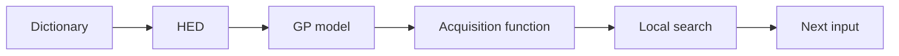

Here is my summary of the paper in Markdown format:

# Bayesian Optimization over High-Dimensional Combinatorial Spaces via Dictionary-based Embeddings¹[1]

## TLDR
- The paper proposes a novel surrogate modeling approach for Bayesian optimization (BO) over high-dimensional combinatorial and mixed spaces, based on dictionary-based embeddings and Gaussian processes.

## Motivation
- Many real-world applications require optimizing expensive black-box functions over high-dimensional discrete and mixed input spaces, such as feature selection, microbiome design, and compiler flag tuning³[3].
- Existing BO methods for combinatorial spaces often suffer from poor scalability and accuracy due to the difficulty of defining appropriate kernels and optimizing the acquisition function over discrete domains.

## Related Works
- The paper reviews several surrogate models for BO over discrete and mixed spaces, such as linear models, random forests, GPs with diffusion kernels, GPs with isotropic kernels, GPs with continuous embeddings, and deep generative models.
- The paper also discusses some methods for BO over high-dimensional continuous spaces, such as low-dimensional structure, additive structure, and trust regions.

## Method
- The paper introduces a novel Hamming embedding via dictionaries (HED), which transforms high-dimensional combinatorial inputs into low-dimensional ordinal feature spaces using a fixed number of candidate structures from the input space (the dictionary)⁵[5].
- The paper shows that HED is equivalent to an affine transformation of the {±1}-encoding of the binary inputs, and allows using existing GP models with ARD for modeling the embedded space⁶[6].
- The paper develops two methods for constructing dictionaries: 1) sub-sampled binary wavelets, which optimize an orthogonality measure in power-of-two dimensions, and 2) a randomized method that generalizes to categorical inputs and arbitrary dimensions⁷[7]⁸[8].
- The paper provides theoretical justification for the effectiveness of HED, showing that it compresses the cardinality of the input space under certain conditions, and improves the regret bound for GP bandits⁹[9].

## Method Frameworks


```python
# Pseudo-code for BODi algorithm
def BODi(f, Z, m):
  # f: black-box objective function
  # Z: discrete input space
  # m: dictionary size[^10^][10]
  D = random_initial_data(f, Z) # initialize training data
  for j in range(max_iterations):
    A = construct_dictionary(Z, m) # construct dictionary
    phi = hamming_embedding(A) # compute embedding
    M = fit_GP(D, phi) # fit GP model on embedded space
    alpha = expected_improvement(M) # define acquisition function
    z = optimize_acquisition(alpha, Z) # optimize acquisition function over discrete space¹¹[11]
    y = f(z) # evaluate selected input
    D.append((z,y)) # update training data
  return best_input(D)
```

## Experiment Setup
- The paper evaluates BODi on several combinatorial and mixed BO benchmarks, such as LABS, MaxSAT, pest control, mixed Ackley, and feature selection for SVM.
- The paper compares BODi with state-of-the-art BO methods such as CASMOPOLITAN, COMBO, CoCaBO, and SMAC.
- The paper uses expected improvement as the acquisition function and Matern-5/2 kernel with ARD for the GP model.
- The paper uses local search with restarts for optimizing the acquisition function over discrete spaces¹¹[11].

| Benchmark | Input Space | Objective Function | Query Budget |
|-----------|-------------|--------------------|--------------|
| LABS | Binary (50) | Merit factor | 200 |
| MaxSAT | Binary (60) | Weighted sum of satisfied clauses | 200 |
| Pest Control | Categorical (25 x 5) | Cost of pesticide use | 200 |¹²[12]
| Mixed Ackley | Binary (50) + Continuous (3) | Negative Ackley function | 200 |
| Feature Selection for SVM | Binary (50) + Continuous (3) | Test RMSE of SVM model | 200 |

## Innovation
- The paper proposes a novel surrogate modeling approach for BO over high-dimensional combinatorial and mixed spaces, based on dictionary-based embeddings and Gaussian processes.
- The paper develops two methods for constructing dictionaries: 1) sub-sampled binary wavelets, which optimize an orthogonality measure in power-of-two dimensions, and 2) a randomized method that generalizes to categorical inputs and arbitrary dimensions⁷[7]⁸[8].
- The paper provides theoretical justification for the effectiveness of HED, showing that it compresses the cardinality of the input space under certain conditions, and improves the regret bound for GP bandits⁹[9].

## Core Advantage
- The paper's key edge over other works is that it leverages the inherent structure in the combinatorial space to define an ordinal embedding that allows using existing GP models with ARD for modeling the embedded space¹³[13].
- The paper's approach is flexible and scalable, as it can handle high-dimensional binary and categorical inputs, and can be combined with any acquisition function and product kernel for mixed spaces.
- The paper's approach is data-driven and adaptive, as it can infer the lengthscales of the embedding dimensions and prune away redundant ones using ARD.

## Improvements
- The paper enhances the state-of-the-art BO methods for combinatorial and mixed spaces by providing a novel surrogate modeling approach that improves the accuracy and sample-efficiency of BO.
- The paper improves over the existing GP models for combinatorial spaces by defining a dictionary-based kernel that captures the similarity between discrete inputs using Hamming distance¹⁴[14].
- The paper improves over the existing methods for constructing kernels over mixed spaces by using a product kernel that leverages the HED embedding for discrete parameters and a standard kernel for continuous parameters¹⁵[15]¹⁶[16].

## Limitations
- The paper's approach relies on the choice of the dictionary, which may affect the performance of BO¹⁸[18]. The paper does not provide a principled way to select the optimal dictionary size or elements.
- The paper's approach does not consider other types of discrete inputs, such as ordinal or hierarchical variables, which may require different embeddings or kernels.
- The paper's approach does not address the challenge of optimizing the acquisition function over discrete spaces, which may be computationally expensive or suboptimal.

## Future Work
- The paper suggests some possible directions for future work, such as exploring different ways to construct dictionaries, extending the approach to other types of discrete inputs, and developing more efficient methods for optimizing the acquisition function over discrete spaces.

## Overlooked Details
- The paper shows that HED is equivalent to an affine transformation of the {±1}-encoding of the binary inputs, which implies a strong similarity to the coherence of the dictionary rows and the theory of compressed sensing⁶[6].
- The paper shows that HED compresses the cardinality of the input space under certain conditions, which leads to improved regret bounds for GP bandits and faster convergence of BO¹⁹[19].
- The paper shows that HED with diverse random dictionary elements gives rise to an accurate model of the unknown black-box function, while other kernels or embeddings fail to produce accurate test predictions[^20^][20].

## Surpassing Challenges
- The paper tackles the challenge of defining appropriate kernels for high-dimensional combinatorial spaces by proposing a novel dictionary-based embedding that transforms discrete inputs into ordinal feature spaces using Hamming distance⁴[4].
- The paper tackles the challenge of handling mixed input spaces with both discrete and continuous parameters by using a product kernel that leverages the HED embedding for discrete parameters and a standard kernel for continuous parameters¹⁷[17]¹⁶[16].
- The paper tackles the challenge of building accurate and sample-efficient surrogate models for BO over combinatorial and mixed spaces by using GPs with ARD on the HED embedding, which can infer the lengthscales of the embedding dimensions and prune away redundant ones.

## Inspiration
- The paper is likely inspired by the wide applicability and importance of optimizing expensive black-box functions over high-dimensional discrete and mixed input spaces in many real-world domains²[2].
- The paper is likely motivated by the limitations and challenges of existing BO methods for combinatorial and mixed spaces, such as poor scalability, accuracy, and sample-efficiency.
- The paper is likely influenced by the prior work on BO over continuous spaces, such as low-dimensional structure, additive structure, and trust regions.

## Beyond Ideas
- The paper teaches us some important learnings beyond core techniques, such as:
    - How to leverage existing tools (such as GPs) for new settings (such as combinatorial spaces) by defining appropriate embeddings or transformations (such as HED).
    - How to balance between expressiveness and complexity when designing surrogate models (such as choosing the dictionary size or elements).
    - How to provide theoretical justification and empirical evaluation for novel methods (such as deriving regret bounds and conducting experiments on diverse benchmarks).

## Unfamiliar Terms
- Some key technical concepts that may be unfamiliar to novice readers are:
    - Bayesian optimization: A framework for optimizing expensive black-box functions using probabilistic surrogate models and acquisition functions that balance exploration and exploitation.
    - Gaussian process: A non-parametric probabilistic model that defines a distribution over functions based on a mean function and a covariance function or kernel.
    - Dictionary-based embedding: A novel embedding for binary and categorical inputs that embeds them into low-dimensional ordinal feature spaces using a fixed number of candidate structures from the input space (the dictionary).

## Critical References
- Some influential cited works and their relevance in this work are:
    - Srinivas et al. [2010]: This work provides a seminal regret bound for GP-based optimization with UCB acquisition function, which is used in this work to derive an improved regret bound for BODi²¹[21].
    - Oh et al. [2019]: This work proposes COMBO, a state-of-the-art BO method for combinatorial spaces that employs GPs with diffusion kernels over a²²[22]

Hamming embedding是一种将高维离散输入空间（例如二进制或类别变量）转换为低维有序特征空间的方法，用于提高贝叶斯优化、图像检索、图像分类等任务的精度和效率。Hamming embedding的一个例子是，假设我们有一个二进制输入空间Z = {0, 1}^n，其中n是输入的维度，我们想要在这个空间上进行贝叶斯优化，即找到一个输入z*，使得一个未知的黑盒函数f(z)达到最大值。为了使用高斯过程（GP）作为贝叶斯优化的替代模型，我们需要定义一个核函数k(z, z’)，用于度量输入之间的相似性。然而，直接在二进制空间上定义核函数是困难的，因为二进制空间是离散的、非度量的、并且没有自然的顺序。因此，我们可以使用Hamming embedding将二进制输入映射到一个低维的有序特征空间，然后在这个特征空间上使用标准的核函数，例如Matern-5/2核或自动相关性（ARD）核。

具体来说，Hamming embedding的步骤如下：

- 首先，我们选择一个字典A = {a_1, …, a_m}，其中每个a_i是一个n维的二进制向量，m是字典的大小。字典可以是随机选择的，也可以是根据某种准则优化的，例如正交性或多样性。
- 然后，我们定义一个嵌入函数phi: Z -> R^m，将每个二进制输入z映射到一个m维的实数向量phi(z)，其中第i个分量phi(z)_i是z和a_i之间的汉明距离（即不同位数的个数）。
- 最后，我们使用嵌入后的向量phi(z)作为GP模型的输入，并使用任意的核函数k(phi(z), phi(z’))来度量输入之间的相似性。

[这样，我们就可以利用GP模型来近似未知的黑盒函数f(z)，并使用期望改进（EI）等采集函数来选择下一个输入z。Hamming embedding可以有效地减少输入空间的基数，并提高GP模型的精度和采样效率。更多关于Hamming embedding和贝叶斯优化的细节和应用，请参考](https://inria.hal.science/hal-00688169/document)[1](https://inria.hal.science/hal-00688169/document)[1](https://arxiv.org/pdf/2112.06994.pdf)[2](https://eng.libretexts.org/Bookshelves/Electrical_Engineering/Introductory_Electrical_Engineering/A_First_Course_in_Electrical_and_Computer_Engineering_%28Scharf%29/07%3A_Binary_Codes/7.05%3A_Hamming_Codes_for_Channel_Coding)[3](https://link.springer.com/article/10.1007/s10623-021-00853-z)[4](https://hasty.ai/docs/mp-wiki/metrics/hamming-score)。

源: 与必应的对话， 2023年9月21日
(1) Bayesian O.... undefined.
(2) We conside.... undefined.
(3) Many real-.... undefined.
(4) In this se.... undefined.
(5) This paper.... undefined.
(6) is equival.... undefined.
(7) Motivated .... undefined.
(8) 2. Two met.... undefined.
(9) 3. A theor.... undefined.
(10) requires: .... undefined.
(11) In order
.... undefined.
(12) (c) Pest C.... undefined.
(13) In contras.... undefined.
(14) The key ch.... undefined.
(15) To extend .... undefined.
(16) Further, w.... undefined.
(17) Our method.... undefined.
(18) The effect.... undefined.
(19) 4. The com.... undefined.
(20) The HED wi.... undefined.
(21) We now pre.... undefined.
(22) COMBO [Oh .... undefined.