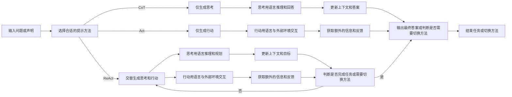

## llm的发展现状

## llm agent的典型结构

## single agent

#### persona:embodied profile

### planning:chain of thought/tree/graph

### memory:in-context/RAG/web search/knowledge bank retrieval/Knowledge graph

### action:工具使用/ReAct/Reflexion/minedojo

## multi-agent

### fixed characters: chatdev,西部小镇

### generative agents

## applications in AI4Chem

### chatcrow

### chatgpt 4 MoF

### ours

