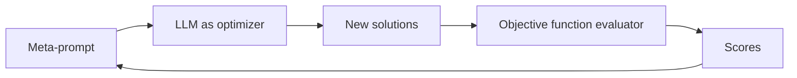

## 必应

Here is my response:

# TLDR
The paper proposes a novel approach to use large language models (LLMs) as optimizers for various tasks, where the optimization problem is described in natural language and the LLM generates new solutions based on the previous ones.

# Motivation
The paper aims to explore the potential of LLMs for optimization, which is a ubiquitous and challenging problem in many domains. The paper argues that LLMs have the advantages of understanding natural language, recognizing patterns from demonstrations, and generating diverse and creative solutions[1].

# Related Works
The paper reviews some related works on using LLMs for different tasks, such as prompting techniques, automatic prompt generation, and continuous and discrete prompt optimization. The paper also discusses some classic optimization problems, such as linear regression and traveling salesman problem, and their existing solutions[2].

# Method
The paper proposes Optimization by PROmpting (OPRO), a simple and effective approach to leverage LLMs as optimizers[3][4]. The key idea is to describe the optimization problem in natural language, then instruct the LLM to iteratively generate new solutions based on the problem description and the previously found solutions[5]. The paper defines the meta-prompt as the input to the LLM that contains the optimization problem description and the optimization trajectory[6]. The paper also addresses some optimization challenges, such as stability, exploration-exploitation trade-off, and termination criterion.

# Method Frameworks

```python
def OPRO(meta_prompt, LLM, objective_function, max_steps):
  # initialize the meta-prompt with the problem description and initial solutions
  meta_prompt.init(problem_description, initial_solutions)
  # loop until termination condition is met or maximum number of steps is reached
  for step in range(max_steps):
    # generate new solutions from the meta-prompt using the LLM[7]
    new_solutions = LLM.generate(meta_prompt)
    # evaluate the new solutions using the objective function
    scores = objective_function.evaluate(new_solutions)
    # update the meta-prompt with the new solutions and scores
    meta_prompt.update(new_solutions, scores)
    # check if termination condition is met
    if meta_prompt.is_terminated():
      break
  # return the best solution found
  return meta_prompt.get_best_solution()
```

# Experiment Setup
The paper conducts experiments on two types of tasks: mathematical optimization and prompt optimization. For mathematical optimization, the paper uses linear regression and traveling salesman problem as case studies, and compares OPRO with different LLMs (text-bison, gpt-3.5-turbo, gpt-4) to heuristic algorithms and solvers. For prompt optimization, the paper uses GSM8K and Big-Bench Hard as benchmarks, and evaluates OPRO with different combinations of LLMs (text-bison, PaLM 2-L) as optimizer and scorer[8].

# Innovation
The paper introduces a novel way of using LLMs as optimizers for various tasks, where the optimization problem is described in natural language and the LLM generates new solutions based on the previous ones. The paper demonstrates that LLMs are able to optimize different kinds of objective functions simply through prompting, and reach the global optimum for some small-scale problems[9].

# Core Advantage
The paper shows that OPRO has several advantages over existing methods for optimization. First, OPRO can quickly adapt to different tasks by changing the problem description in the meta-prompt, without requiring formal specifications or customized algorithms. Second, OPRO can leverage the natural language understanding and generation abilities of LLMs to produce diverse and creative solutions that balance exploration and exploitation. Third, OPRO can improve the performance of prompts for natural language tasks by iteratively generating new prompts that increase the task accuracy.

# Improvements
The paper makes several improvements over previous works on using LLMs for different tasks. First, OPRO extends prompting techniques to optimization problems, where the goal is not only to produce an output given an input, but also to optimize an objective function. Second, OPRO improves automatic prompt generation methods by generating new prompts that aim to increase the task accuracy based on a trajectory of previously generated prompts, instead of editing one input prompt or requiring semantic similarity[10]. Third, OPRO enhances continuous and discrete prompt optimization approaches by making use of natural language descriptions and examples to guide the optimization process.

# Limitations
The paper also acknowledges some limitations of OPRO for optimization[11]. First, OPRO may not scale well to large-scale optimization problems due to the length limit of the LLM context window. Second, OPRO may not perform well on complex or bumpy optimization landscapes due to the sensitivity of LLM output to the prompt. Third, OPRO may not guarantee convergence or optimality due to the lack of formal guarantees or theoretical analysis.

# Future Work
The paper suggests some possible directions for future work. First, OPRO can be extended to other types of tasks that can be formulated as optimization problems, such as program synthesis, code optimization, and hyperparameter tuning. Second, OPRO can be improved by incorporating more advanced optimization techniques, such as gradient-based methods, evolutionary algorithms, and reinforcement learning. Third, OPRO can be analyzed by studying the properties and behaviors of LLMs as optimizers, such as convergence rate, optimality gap, and exploration-exploitation trade-off.

# Overlooked Details
Some subtle insights that may be easily missed by novices are:

- The paper uses different LLMs for optimization and evaluation in prompt optimization, which allows the optimizer LLM to leverage the knowledge and abilities of the scorer LLM without direct access.
- The paper uses different positions to insert the instructions in prompt optimization, which may affect the performance of the scorer LLM due to the sensitivity to the prompt format.
- The paper uses different settings of wtrue and btrue in linear regression to test the robustness of OPRO to different distances from the starting region.

# Surpassing Challenges
Some difficulties that may make it hard for others to exceed this work are:

- The paper covers a wide range of tasks and domains for optimization, which requires a comprehensive understanding and evaluation of different optimization problems and methods.
- The paper leverages the natural language understanding and generation abilities of LLMs for optimization, which requires a careful design and tuning of the meta-prompt and the sampling temperature.
- The paper demonstrates the effectiveness and potential of OPRO for optimization, which sets a high bar for future works to achieve better performance or provide formal guarantees.

# Inspiration
Some likely thought processes and motivations of the authors are:

- The authors may have been inspired by the recent advances and applications of LLMs for various tasks, and wondered if LLMs can also be used for optimization, which is a ubiquitous and challenging problem in many domains.
- The authors may have realized that LLMs have the advantages of understanding natural language, recognizing patterns from demonstrations, and generating diverse and creative solutions, which are desirable features for optimization[1].
- The authors may have decided to use natural language descriptions and examples as the meta-prompt to guide the optimization process, which allows quick adaptation to different tasks without requiring formal specifications or customized algorithms.

# Beyond Ideas
Some important learnings beyond core techniques are:

- The paper shows how to leverage the existing knowledge and abilities of LLMs for new tasks, which demonstrates the power and versatility of LLMs as general-purpose tools.
- The paper shows how to use natural language as a flexible and intuitive interface for optimization, which demonstrates the importance and usefulness of natural language understanding and generation for human-computer interaction.
- The paper shows how to balance exploration and exploitation in optimization, which demonstrates the trade-off and challenge of finding optimal solutions in complex search spaces[12].

# Unfamiliar Terms
Some key technical concepts that may be unfamiliar to some readers are:

- Large language models (LLMs): These are deep neural networks that are trained on large amounts of text data to learn the statistical patterns and semantic meanings of natural language. They can generate fluent and coherent texts given some inputs or prompts.
- Prompting techniques: These are methods that use natural language texts as prompts to instruct LLMs to perform different tasks. They can be categorized into zero-shot prompting (using one prompt), few-shot prompting (using multiple prompts), or chain-of-thought prompting (using multiple prompts with intermediate outputs).
- Optimization problems: These are problems that aim to find the best solution among a set of possible solutions according to some objective function. They can be classified into continuous optimization (the solution space is continuous) or discrete optimization (the solution space is discrete).
