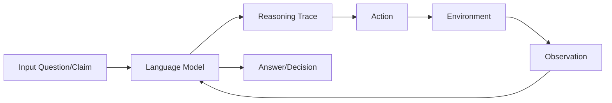

## 必应

Here are the summaries of the key aspects of the paper:

- TLDR: A novel paradigm to combine reasoning and acting with language models for general task solving.
- Motivation: To explore the use of large language models to generate both reasoning traces and task-specific actions in an interleaved manner, allowing for greater synergy between the two[1].
- Related Works: Previous works on using language models for reasoning or acting tasks, such as chain-of-thought reasoning, web-based question answering, text-based games, and web navigation.
- Method: ReAct prompts language models to generate both verbal reasoning traces and actions pertaining to a task in an interleaved manner, using few-shot in-context examples as prompts. The reasoning traces help the model create, maintain, and adjust high-level plans for acting, while the actions allow it to interact with external environments to incorporate additional information into reasoning[1].
- Method Frameworks: The following mermaid diagram illustrates the ReAct framework:



- Describe main algorithm in python-like pseudo-code:

```python
# Input: a question or a claim q
# Output: an answer or a decision a
# Parameters: a language model LM, a set of in-context examples E, a maximum number of steps T

# Initialize context c with q and E
c = q + E

# Initialize step counter t
t = 0

# Loop until answer or decision is found or maximum steps reached
while not is_answer(c) and t < T:
  # Generate a reasoning trace r using LM conditioned on c
  r = LM.generate_reasoning_trace(c)
  
  # Append r to c
  c = c + r
  
  # Generate an action x using LM conditioned on c
  x = LM.generate_action(c)
  
  # Append x to c
  c = c + x
  
  # Execute x on the environment and get an observation o
  o = environment.execute(x)
  
  # Append o to c
  c = c + o
  
  # Increment t
  t = t + 1

# Return the final answer or decision a from c
a = get_answer(c)

return a
```

- Experiment Setup: The authors evaluate ReAct on four diverse benchmarks: question answering (HotPotQA), fact verification (Fever), text-based game (ALFWorld), and webpage navigation (WebShop)[2]. They compare ReAct with several baselines that perform either reasoning or action generation in isolation, such as chain-of-thought reasoning, acting-only prompt, and imitation or reinforcement learning methods. They also propose some ways to combine ReAct with chain-of-thought reasoning to leverage both internal and external knowledge. They use PaLM-540B as the base language model for prompting, and also experiment with finetuning smaller language models (PaLM-8/62B) with bootstrapped data generated by ReAct.
- Innovation: ReAct is a novel paradigm to synergize reasoning and acting with language models for general task solving[3]. It demonstrates that large language models can generate both verbal reasoning traces and task-specific actions in an interleaved manner, which allows for greater flexibility, robustness, and interpretability than previous approaches that perform either reasoning or acting alone.
- Core Advantage: ReAct has several advantages over existing methods for reasoning and acting tasks. First, it is general and flexible, as it can work for diverse tasks with distinct action spaces and reasoning needs[4]. Second, it is performant and robust, as it shows strong generalization to new task instances while learning solely from few-shot in-context examples[5]. Third, it is human aligned and controllable, as it promises an interpretable sequential decision making and reasoning process where humans can easily inspect reasoning and factual correctness, as well as control or correct the agent behavior on the go by thought editing[6].
- Improvements: ReAct improves over previous research by combining reasoning and acting in a synergistic manner. For knowledge-intensive reasoning tasks like question answering and fact verification, ReAct overcomes prevalent issues of hallucination and error propagation in chain-of-thought reasoning by interacting with a Wikipedia API, and generating human-like task-solving trajectories that are more interpretable than baselines without reasoning traces[7]. For interactive decision making tasks like text-based game and web navigation, ReAct outperforms imitation and reinforcement learning methods by a large margin, while being prompted with only one or two in-context examples.
- Limitations: ReAct also has some limitations that need to be addressed in future work. First, it relies on manually annotated in-context examples to prompt the language model, which can be costly and challenging to scale up. Second, it uses a simple Wikipedia API as the external environment for knowledge retrieval, which can be limited in terms of coverage and expressiveness. Third, it does not explicitly model the uncertainty or confidence of the reasoning and acting process, which can affect the robustness and trustworthiness of the agent.
- Future Work: The authors suggest some possible directions for future work to extend and improve ReAct. First, they propose to use more advanced external environments, such as knowledge graphs or web browsers, to enable more complex and diverse reasoning and acting scenarios. Second, they propose to use reinforcement learning or self-play to fine-tune the language model with more data and feedback, and to explore different reward functions or objectives for reasoning and acting. Third, they propose to incorporate uncertainty estimation or confidence calibration into ReAct, to allow the agent to handle ambiguous or noisy situations more gracefully.
- Overlooked Details: Some subtle insights that are easily missed by novices are: (1) the use of mermaid diagrams to illustrate the ReAct framework and the task-solving trajectories, which can help readers visualize the reasoning and acting process more clearly; (2) the use of pseudo-code to describe the main algorithm of ReAct, which can help readers understand the logic and implementation details more easily; (3) the use of ablation studies and controlled experiments to analyze the importance of reasoning and acting in different tasks, which can help readers appreciate the value and contribution of ReAct.
- Surpassing Challenges: Some difficulties for others to exceed this work are: (1) designing effective prompts for different tasks and domains, which requires domain knowledge and linguistic skills; (2) generating high-quality reasoning traces and actions that are factual, coherent, and relevant, which requires strong language priors and generalization abilities; (3) evaluating and analyzing the performance and behavior of ReAct, which requires rigorous experimental setup and human evaluation.
- Inspiration: The likely thought process and motivations of the authors are: (1) they observed that large language models have shown impressive capabilities for both reasoning and acting tasks, but these two aspects have been mostly studied separately; (2) they wondered if there is a way to combine reasoning and acting in a synergistic manner, such that reasoning can guide acting and vice versa; (3) they came up with the idea of ReAct, a general paradigm to prompt language models to generate both reasoning traces and actions in an interleaved manner; (4) they applied ReAct to a diverse set of tasks and domains, and compared it with various baselines that perform either reasoning or acting alone; (5) they demonstrated the effectiveness, robustness, and interpretability of ReAct, as well as its limitations and future directions.
- Beyond Ideas: Some important learnings beyond core techniques are: (1) how to design simple yet powerful prompts for language models to perform complex tasks; (2) how to leverage both internal and external knowledge sources for reasoning and acting; (3) how to make reasoning and acting processes more human aligned and controllable; (4) how to evaluate and analyze reasoning and acting behaviors in a systematic way.
- Unfamiliar Terms: Some clear explanations of top-3 key technical concepts are:
    - Large language models (LLMs): These are neural network models that are trained on large amounts of text data, such as Wikipedia or web pages. They can learn general patterns and representations of natural language, such as syntax, semantics, and commonsense. They can also generate fluent and diverse texts for various tasks, such as question answering, summarization, or dialogue.
    - Reasoning traces: These are verbal expressions of the thought process or logic behind a task solving or decision making process. They can help explain how a problem is decomposed, what information is used or needed, what conclusions are drawn or actions are taken, etc. They can also help track progress, handle exceptions, or adjust plans.
    - Actions: These are domain-specific commands or instructions that can be executed on an external environment, such as a knowledge base or a web browser. They can help interact with the environment to gather additional information or achieve certain goals. They can also be influenced by or influence the reasoning traces.
- Critical References: The most top-3 influential cited works and their relevance in this work are:
    - Brown et al., 2020: This paper introduces GPT-3, one of the largest language models ever trained. It shows that GPT-3 can perform various natural language understanding and generation tasks across domains with few-shot learning. It also discusses some limitations and challenges of large language models. This work serves as a motivation and a baseline for ReAct.
    - Wei et al., 2022: This paper proposes chain-of-thought reasoning (CoT), a paradigm to prompt large language models to generate multi-step reasoning traces for question answering tasks[8]. It shows that CoT can outperform standard prompting methods on several datasets. It also analyzes some issues of CoT such as hallucination and error propagation. This work serves as a related work and a baseline for ReAct.
    - Shridhar et al., 2020b: This paper introduces AL
