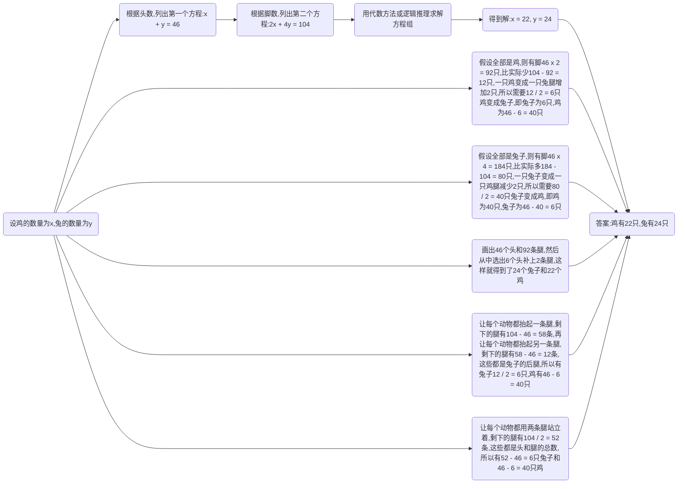
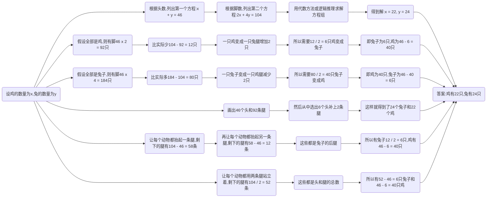
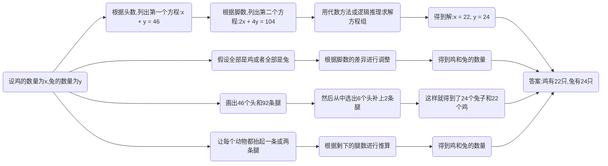
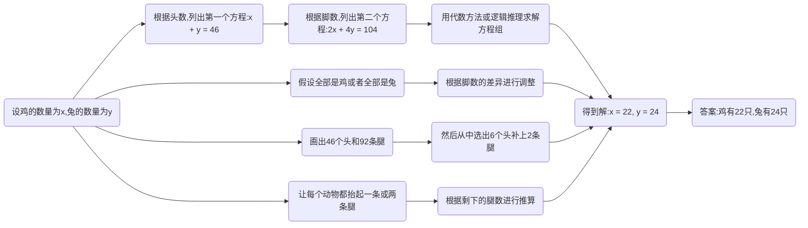
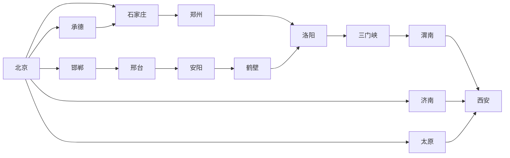

好的，我为你列出了一些解决鸡兔同笼问题的不同思路，你可以参考一下：

|思路|方法|优点|缺点|
|---|---|---|---|
|方程法|用方程组表示鸡和兔的数量和头数、脚数的关系，然后用代数方法或逻辑推理求解方程组|通用，适用于任何鸡兔同笼问题|需要一定的代数知识和技巧|
|画图法|画出头和腿的图形，然后用直观的方式找出鸡和兔的区别|直观，容易理解|不够精确，可能有多种情况|
|假设法|假设全部是鸡或者全部是兔，然后根据脚数的差异进行调整|简单，容易操作|不够普遍，可能有无解或多解的情况|
|金鸡独立法|让每个动物都抬起一条腿，然后根据剩下的腿数进行推算|巧妙，有趣|不够直观，需要一定的想象力|
|吹哨法|让每个动物都用两条腿站立着，然后根据剩下的腿数进行推算|巧妙，有趣|不够直观，需要一定的想象力|

希望这个表格能帮助你理解这个问题的不同思路。如果你还有其他问题，欢迎继续提问。😊

## 必应

好的，我为你绘制了一个包含这些方法的流程图，你可以参考一下：

希望这个流程图能帮助你理解这个问题的不同解法。如果你还有其他问题，欢迎继续提问。😊

## 必应

好的，我为你细化了一些流程图节点，你可以参考一下：

希望这个流程图能帮助你理解这个问题的不同解法。如果你还有其他问题，欢迎继续提问。😊

## 必应

好的，我为你归并了一些重复或者近似的流程节点，你可以参考一下：

希望这个流程图能帮助你理解这个问题的不同解法。如果你还有其他问题，欢迎继续提问。😊

好的，我尝试用markdown的mermaid表述经过的城市的流程图。请看下面的代码块。

