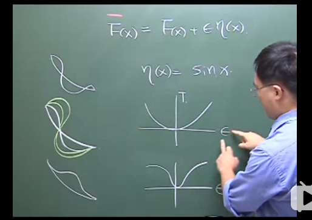

# 变分法

[TOC]

## 引理

$
\int_{a}^{b} M(x) h(x) d x=0 \\
h(a), h(b)=0, \Rightarrow M(x)=0 \\
设 \quad h(x)=-M(x)(x-a)(x-b) \\
M \cdot h=M^{2}(-(x-a)(x-b))
$

$\because (-(x-a)(x-b) ≠ 0，\therefore M = 0$

$\begin{aligned}
&\int_{a}^{b}[M(x) \eta(x)+N(x) \xi(x)] d x\\
&\text { Let } \eta(x)=-M(x)(x-a)(x-b)\\&\xi(x)=-N(x)(x-a)(x-b)\\
&\left(M^{2}+N^{2}\right) \underbrace{[-(x-a)(x-b)]}_{+}
\end{aligned}$

$\therefore M = 0$

## 变分法基本方法

$\bar{F}$是从点1到点2的所有曲线集合

利用$\epsilon$可以把F(x)固定下来,把变数放在$\eta$上.

## Euler方程式