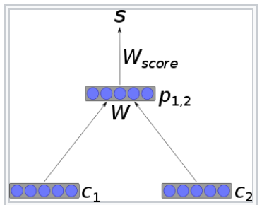
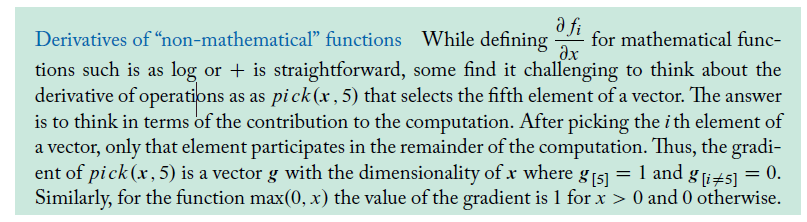

## Recursive neural network

In the most simple architecture, nodes are combined into parents using a weight matrix that is shared across the whole network, and a non-linearity such as *[tanh](https://en.wikipedia.org/wiki/Tanh)*. If *c*1 and *c*2 are *n*-dimensional vector representation of nodes, their parent will also be an *n*-dimensional vector, calculated as

${\displaystyle p_{1,2}=\tanh \left(W[c_{1};c_{2}]\right)}p1,2=tanh(W[c1;c2])p1,2=tanh⁡(W[c1;c2])$

Where *W* is a learned ${\displaystyle n\times 2n} $weight matrix.

This architecture, with a few improvements, has been used for successfully parsing natural scenes and for syntactic parsing of natural language sentences.[[4\]](https://en.wikipedia.org/wiki/Recursive_neural_network#cite_note-4)

# Recurrent neural network

A **recurrent neural network** (**RNN**) is a class of [artificial neural networks](https://en.wikipedia.org/wiki/Artificial_neural_network) where connections between nodes form a [directed graph](https://en.wikipedia.org/wiki/Directed_graph) along a temporal sequence. This allows it to exhibit temporal dynamic behavior. Derived from [feedforward neural networks](https://en.wikipedia.org/wiki/Feedforward_neural_networks), RNNs can use their internal state (memory) to process variable length sequences of inputs.[[1\]](https://en.wikipedia.org/wiki/Recurrent_neural_network#cite_note-1) This makes them applicable to tasks such as unsegmented, connected [handwriting recognition](https://en.wikipedia.org/wiki/Handwriting_recognition)[[2\]](https://en.wikipedia.org/wiki/Recurrent_neural_network#cite_note-2) or [speech recognition](https://en.wikipedia.org/wiki/Speech_recognition).[[3\]](https://en.wikipedia.org/wiki/Recurrent_neural_network#cite_note-sak2014-3)[[4\]](https://en.wikipedia.org/wiki/Recurrent_neural_network#cite_note-liwu2015-4)

