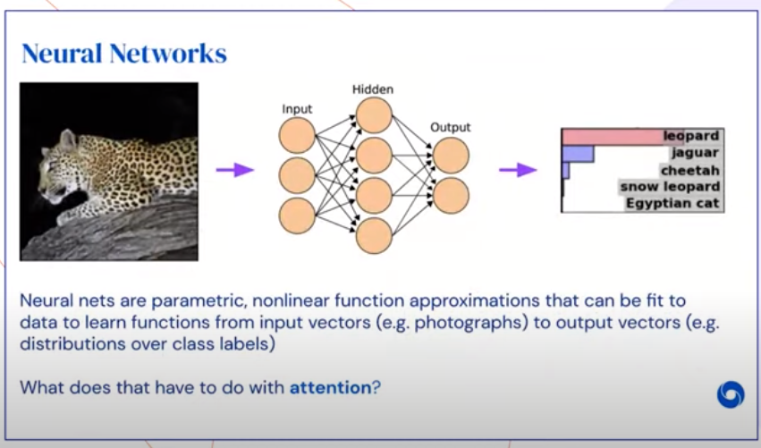
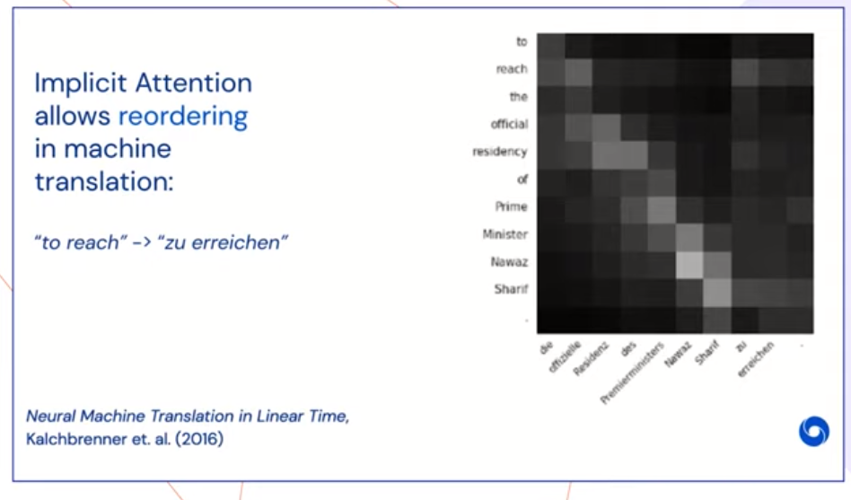

# DeepMind x UCL | Deep Learning Lectures | 8/12 | Attention and Memory in Deep Learning（机翻讲稿）

您好，欢迎来到UCLX DeepMind讲座系列。
我叫亚历克斯·格雷夫斯。

我是DeepMind的研究科学家。
今天，我将与您讨论深度学习中的注意力和记忆力。
因此，您可能听说过人们谈论神经网络中的注意力，的确，它在过去几年中作为深度学习工具包中一个令人兴奋的新组件而出现。
在我看来，这是其中之一，这是我们工具箱中添加的最新内容之一。
因此，在本讲座中，我们将说明注意力在深度学习中的作用。
我们还将讨论内存的链接概念。
因此，您可以在某种意义上将记忆视为经过时间的关注。
因此，我们将讨论一系列注意机制，这些注意机制隐式存在于任何深度网络中以及更明确定义的注意。
然后，我们将讨论外部存储器，以及当您注意外部存储器时会发生什么以及它如何为您提供选择性的回忆。
然后，我们将讨论变压器和变量计算时间。

因此，我认为关于注意力的第一件事是，它不是什么东西，它不仅对深度学习有用，而且在人类认知中起着至关重要的作用。

因此，专注于一件事而忽略另一件事的能力至关重要。
因此，我们可以在日常生活中看到这一点。
我们不断受到来自各个方向的感官信息的轰炸，我们需要能够挑选出该信号的某些元素，以便能够专注于它们。

因此，一个经典的例子就是鸡尾酒会问题，当人们参加嘈杂的聚会并同时听很多其他人讲话时，我们仍然能够轻松地挑选出一个特定的发言人，并让其他人淡出进入背景，这就是我们听到他们在说什么的原因。
但是，还有一种内省或内部关注的形式，它使我们能够一次关注一个思想，记住一个事件而不是所有事件。
而且我认为，我要您完成的关键事情，我要您摆脱的关键想法是，注意力全都放在忽略事情上，而不是将更多信息放入神经网络，实际上是在删除一些信息。信息，以便可以专注于特定部分。
现在我知道你们都听说过神经网络及其工作原理，乍一看似乎没有什么神经网络与这种关注概念特别相关。
因此，我们知道，这个大的非线性函数逼近器将向量引入并给出向量，因此在这种范式示例中，您先进入图像，对其进行处理，然后得出分类决策。

这张图片中是豹子，美洲虎或猎豹吗？乍一看，这似乎与注意力没有太大关系，整个图像都呈现给网络，然后做出一个决定。
但是，如果您查看神经网络内部并分析它们实际上对数据所做的操作，实际上可以发现，它们已经学习了一种隐式注意力形式，这意味着它们对数据的某些部分的响应比其他部分更强。
这确实至关重要。
因此，如果您想将豹子与老虎或类似的东西区分开，那么您需要重点关注的部分就是豹子皮毛上的斑点，并且需要这样做，您需要集中精力在这些部分上，而忽略了背景中无关紧要的细节。

首先，我们可以通过研究网络雅可比矩阵来研究隐式注意力的使用。
因此，雅可比行列式基本上是网络输出相对于输入的灵敏度。
因此，从数学上讲，它实际上只是一个偏导数矩阵，其中每个元素Jᵢⱼ是某个输出单位i相对于某个输入单位j的偏导数，您可以使用普通的反向运算来计算该东西。
因此，基本上可以将用于梯度下降的反向传播计算重新用于分析网络的灵敏度。
您要做的就是自己，而不是通过一些损失函数传递错误，而是将错误设置为等于输出激活本身，然后执行反向传播。
通过这样做，我们可以了解网络，网络真正关注的是哪些信息，为解决特定任务而使用的信息。
因此，通过说明的方式，这是一个神经网络，称为“决斗网络”。

这来自2015年提出的用于强化学习的架构。
现在，这是一个用于玩Atari游戏的网络，因此输入是视频序列，在这种情况下，输出是双向的。
一个人试图预测状态的值，这对于强化学习和深度强化学习来说是正常的。
另一头试图预测动作优势。
因此，这基本上是给定特定操作的值与总体预期值之间的差。
或更简单地说，它试图猜测执行一个特定的动作是否会使它的值更高或更低。

因此，如果我们看这里的视频，则左侧的图像代表了雅可比矩阵，并且涉及到价值预测以及此处显示的内容，因此我们看到的是输入视频本身，这是一个赛车游戏，目标是为了尽可能多地超车而不会撞车和覆盖，我们看到这种红色的热图突然散发出来，这就是雅可比行列，因此以红色显示的位置是网络敏感的位置。
因此，如果我们专注于该视频的左侧，我们可以看到网络真正感兴趣的一些内容。

因此，其中之一是它倾向于关注地平线。
您知道这辆车正出现在屏幕上。
当然，这些对于预测网络在不久的将来可能获得多少得分非常重要，因为通过超越这些汽车可以得到积分。
它也一直专注于汽车本身，这显然很重要，因为需要知道其自身状态才能预测其价值。
有趣的是，它还有另一个需要持续关注的领域，那就是最低分。
因此，因为正是要尝试预测分数的分数才是这些游戏的价值，所以知道当前分数是非常重要的。
这就是它指示该值累积速度的指标。
如果我们看右图，这也是雅可比图，但这次是该动作优势的雅可比图，因此，任何一个特定动作比预期的其他动作更好或更坏的程度，我们会看到一个非常不同的图片。
首先，我们看到总体上灵敏度较低。
雅可比行列式的这些红色敏感区域的流行度要低得多，当我们出现时，当它们出现时，它们往往会出现在不同的位置。
他们没有太多关注地平线，没有太多关注分数，他们倾向于在行驶中的汽车前张开喇叭。
这样做的原因是，需要决定向右走还是向左走最好的信息实际上是与之非常接近的汽车的信息。
这就是重点。
只有当它靠近另一辆汽车时，它才决定要向右还是向左行驶。
因此，我试图通过本视频讲解的是，即使对于相同的数据，您也会根据要执行的任务获得非常不同的灵敏度模式。
因此，这种隐式注意力机制允许它以两种截然不同的方式处理相同的数据，即使从相同的数据中呈现出来，它实际上也可以看到不同的事物，看到这些不同的事物才可以执行不同的任务。
因此，关于注意力的全部要点及其重要的全部原因再次是，它使您可以忽略数据的某些部分，而将注意力集中在其他部分。

同样的概念也适用于递归神经网络，我想您已经在较早的讲座中介绍了递归神经网络，这里的想法是，您的讲座基本上是将输入序列作为输入，将序列作为输入，并产生序列作为输出。
真正使循环神经网络有趣的是，它们具有这些反馈连接，从而使它们对以前的输入有某种记忆。
正如我在讲座开始时所说的那样，我们真正想知道的是，记忆可以看作是随着时间的流逝而引起的关注。
因此，我们真正想知道的关于递归神经网络的知识是它们如何使用内存来解决任务？再一次，我们可以呼吁雅可比主义者尝试衡量这种记忆的使用，过去信息或周围环境的使用。
在这种情况下，我倾向于将其称为`顺序雅可比矩阵`，因为您现在真正在做什么，而不是获得偏导数的二维矩阵，而是查看一个三维矩阵，其中第三维是通过时间。
您最关心的是网络的敏感性。
网络在一个特定时间做出的决策对其他输入的敏感性如何。
换句话说，为了解决任务，它必须记住序列的哪一部分，必须记住它的一部分。
可以，然后呢。
为了更具体一点，我们得到了顺序雅可比行列式，它是一个网络输出的一组导数，因此相对于所有输入，一个输出在一个特定的时间点。
因此，存在一个时间序列，这些二维Jacobian矩阵的序列。
而且可以做的是，您可以使用此顺序雅可比行列式分析的是网络如何响应相关顺序中的输入，从某种意义上说，它们需要一起才能解决任务的特定方面，但是不一定在输入序列中在一起，相邻或彼此接近，它们可能会广泛分开。

因此，在我到达的示例中，这是我几年前工作的一个网络，该网络经过训练可以进行在线手写识别。
因此，在线手写识别意味着，在这种情况下，某人正在用笔在白板上书写，该笔具有红外跟踪器，该跟踪器可以跟踪笔的位置并因此能够记录笔位置的轨迹。
它还记录了笔从白板上提起时的特殊笔划结束标记。
因此，底部的文本表明该人写的单词是“曾经拥有”，然后从下往上显示的下一个图形表示该信息是如何实际呈现给网络的，从而该网络实际上是什么看到了一系列这些坐标（X和Y坐标）以及这些笔尖峰的末端。
然后，在此之上，对不起，在此之上，我们拥有的是顺序雅可比矩阵，现在我真正在这里看到的是我真正感兴趣的是顺序雅可比矩阵的大小，所有这些矩阵随时间推移，我真正感兴趣的本质是矩阵的大小，网络响应的大小，特别是一个特定网络输出相对于特定时间的输入的响应大小。
因此，我选择的网络输出很重要，所以我应该说，这里的任务是让网络抄录这些笔迹，这些在线笔的位置，并某种程度地识别出该人写的是什么，并且看到那里此输出序列在此处发出标签决策“ o”，“ n”，“ c”，“ e”，然后是空格字符，并且在没有完全分类或转录的情况下会漏掉“ v”图像正确。
但是我们要看的是它决定在“ having”中输出字母“ i”的点，真正有趣的是，如果我们看一下连续的雅可比行列式，我们可以看到这里的敏感度达到峰值，大致对应于输入序列中笔画（实际上是字母“ i”的主体）的位置。
因此，这里有一个敏感度峰值是有道理的。
但是，我们可以看到灵敏度在序列中也进一步延伸。
它不会在序列中延伸得很远。
因此，灵敏度主要是到最后。
我相信这样做的原因是后缀“ ing”，“ having”末尾的“ ing”是很常见的。
因此，能够识别出整个后缀可以帮助您消除字母“ i”的歧义，例如，它可以告诉您那里不是“ l”。
真正有趣的是这个峰值，最后这个非常尖锐的峰值，与之相对应的是作家将笔从页面上抬下，从白板上抬起并回到点“ i”的点。
因此，他们在草书上写下了整个单词“具有”作为连续笔画，然后将笔从页面上抬起，并在此处放了一个小点。
当然，该点对于识别“ i”至关重要，对吗？那才是真正区分“ i”和“ l”的东西。
因此，再次说明网络对这一点特别敏感，但是很高兴看到，通过分析顺序雅可比行列式，您可以真正了解其使用特定信息的程度。
再一次，我想强调一点，这里真正关键的是这意味着它忽略了其他信息。
它专注于序列中相关的部分，而忽略了不相关的部分。
而且您知道，我们可以看到它确实非常强大。
它能够桥接输入序列中相关但实际上可能相距甚远的事物。
这里的另一个例子来自机器翻译。

现在，机器翻译的一个主要挑战是单词可能会以不同的语言以完全不同的顺序出现，因此我们在这里有一个简单的示例，在将英语句子翻译为以下内容时，我们可以用这种不定式的“到达”德语。
但是在德语中，相应的动词出现在句子的末尾。
因此，为了正确翻译此信息，网络需要能够对信息进行重新排序，并且从2016年的这篇论文中可以看出，该网络只是一个非常深的网络，没有任何特定的机制来进行重新排列或引起注意，该网络能够利用其隐含的注意力进行这种重新排列。
因此，我们在右侧的热力图中再次看到的是灵敏度的概念，它是目标序列中特定点的输出的灵敏度图，因此在德文序列中，相对于输入英文序列。
而且您几乎可以看到一条对角线，因为在这种特殊情况下，大多数序列中，大多数单词或多或少都具有直接的一对一翻译。
但是在序列的末尾有这部分，德语的最后两个单词对英语开头的单词特别敏感。
因此，“到达”一词的含义是，从序列末尾开始有一个敏感度峰值。
当然，这再次表明，网络能够使用这种隐式的注意，它在某种意义上是自由的，只是成为一个非常深的网络，成为一个非常丰富的函数逼近器，它就能使用专注于序列的特定部分而忽略序列的其余部分。
嗯，您知道，隐式注意力很棒，但是仍然有理由相信拥有明确的注意力机制可能是一件好事。

因此，我所说的显式注意力机制是您实际上决定只向网络呈现某些数据，并且知道完全删除数据的其他部分的机制。
当然，这可能是首选的原因之一是计算效率。
因此，您不再需要处理所有数据，也根本不需要将其馈送到网络，因此可以节省一些计算量。
有一个可伸缩性的概念。
因此，举例来说，如果您有固定的尺寸（我称之为“瞥眼(glimpse)”）或像凹点foveation一样，您将图像的固定尺寸部分放入其中，则可以缩放到任何尺寸的图像，以便输入的分辨率不必改变网络的架构。
有一种静态数据顺序处理的概念，我认为这是一个有趣的话题。
再说一次，如果您看一个视觉示例，如果我们有一个中央凹注视围绕静态图像移动，那么我们得到的是一系列感官输入。
当然，这就是将图像呈现给人眼的方式。
实际上，即使数据是静态的，我们也始终是作为一个序列实际接收它。
并且有理由相信这样做可以提高系统的健壮性。
因此，例如，最近有一篇论文表明，具有一目了然的或集中的静态数据注意机制的网络，与对抗性示例相比，比普通的卷积网络一眼就能看到整个图像的鲁棒性更高。
最后但并非最不重要的一点是，在可解释性方面，这里有一个很大的优势。
因此，由于明确的注意力需要做出艰难的决定并选择要查看的数据的一部分，因此您可以更清楚地分析网络实际使用的内容。
因此，您知道，在没有引起任何注意的情况下，我们已经将Jacobian视为网络正在查看的内容的指南，但这实际上只是一个指南。
这不是真实的，不一定表示网络正在使用什么以及正在忽略什么，这是一个完全可靠的信号，而正如我们将看到的那样，通过显式的关注机制，您可以更清楚地指示网络所处的数据部分实际上专注于。
好的。

因此，我将要称为神经注意力模型的基本框架是，您像往常一样具有一个神经网络，该神经网络将一如既往地生成输出矢量，但它还会生成用于参数化注意力模型的额外输出矢量。
因此，它提供了输入到此注意力模型中的一些参数，我们将在稍后描述，然后该模型将对某些数据进行操作，无论是您正在查看的图像，音频，文本还是其他内容是，并为您提供了我所说的瞥见向量。
这是非标准术语，我只是在使用它，因为我认为它有助于某种程度上统一这些不同的模型。
然后，该瞥见向量将在下一个时间步作为输入传递到网络。
这样就发生了这样的循环，网络在该循环上决定了它要趋向于什么，然后影响了下一步实际接收的数据。
这意味着即使网络本身是前馈，整个系统也是循环的。
它包含一个循环。
好的。

因此，您知道，该模型通常的工作方式是，在给定一些关注输出的情况下，我们对数据“ x”的瞥见“ g”定义概率分布。
因此，我将注意力向量设置为“ a”，并将其用于参数化，例如给定“ a”时瞥见“ g”的可能性。
因此，这里最简单的情况是，我们将图像分成多个图块，在此右侧的图像中，您可以看到存在九个可能的图块，而“ a”只是通过一组隐含的瞥见将概率分配给每个这些图块正在使用这些图块之一。
因此，这里的softmax函数只是一种很好的老式函数，其中softmax输出是拾取每个图块的概率。
因此，我们可以看到，如果我们有一个使用此分布的网络，它将要做的是，在这九个图块上输出一些分布，然后在每个时间点接收一个分布瓷砖作为输入。
因此，它不会一次接收全部输入，而是会继续一次查看一个图块（tile）。
当然，与此有关的一个问题是，这是一个艰难的决定。
我的艰难决定是指不再存在，就网络所做的事情而言，我们不再具有完全的梯度。
基本上，我们所采取的是一种随机策略，即强化学习术语，我们从中抽取了样本，以便了解一下。
我们可以使用REINFORCE之类的东西来训练它。

$\begin{array}{c} \pi_{\mathbf{a}}=\operatorname{Pr}\left(\mathbf{g}_{k} \mid \mathbf{a}\right) \\ R=\mathbb{E}_{\mathbf{g} \sim \pi_{\mathbf{a}}}\left[\log \pi_{\mathbf{a}} L(\mathbf{g})\right] \\ \nabla_{\mathbf{a}} R=\mathbb{E}_{\mathbf{g} \sim \pi_{\mathbf{a}}}\left[\nabla_{\mathbf{a}} \log \pi_{\mathbf{a}} L(\mathbf{g})\right] \end{array}$

因此，我已经为您提供了一种简单的标准数学，它是关于您如何使用REINFORCE获得关于某种随机离散样本的梯度。
这是这里的一般技巧。
我们可以使用这些我称之为RL方法的方法，我所说的RL方法实际上是指旨在通过谨慎策略获取训练信号的方法，对于诸如图像分类之类的监督任务，我们可以依靠这些方法。任何时候都可以处理一个不可微分的模块。
我们不能做的只是普通的端到端反向传播。

到目前为止，这是使用我已经描述的那种硬注意力与使用神经网络中始终存在的这种隐式注意力之间的重大区别。
因此，总的来说，我们想要做的事情要比平铺上的softmax更为复杂。

我已经提到了一个中心凹模型的概念，其中您具有一种多分辨率输入，可以查看图像，并以高分辨率获取图像的一部分，因此，在这种情况下，此处的中心是以高分辨率记录的，基本上是一对一映射的。
下一个方形也以较低的分辨率呈现给网络。
因此，您可以看到实际的图像，它所占用的像素可能是中间像素的两倍，然后再将其采样到像素数目相同的像素。
然后，第三个方框将查看此处的整个图像，从而将这种压缩后的低分辨率版本提供给网络。
想法是，您正在模仿人眼的效果，即人眼在凝视的中心具有较高的分辨率，高分辨率，而在外围具有较低的分辨率，其想法是外围的信息足以提醒您一些应密切注意的事项。
您应该直接查看以获得更高分辨率的视图。
我们可以看到一个适用于图像分类的示例。

这是从2014年的一篇论文中获得的，该网络为网络提供了杂乱的MNIST数据，其中这些MNIST，这些熟悉的MNIST手写数字基本上被丢弃在具有视觉混乱的图像中。
这里的想法是，为了对图像进行分类，网络必须发现混乱中的数字。

再一次，这是关于能够忽略干扰物，能够忽略噪音的问题。
绿色的路径显示了这个中心凹模型在图像分类时给出的这种六点轨迹上在图像中的运动。
我们可以看到，例如，在上一行的示例中，它从底角的此处开始，那里的信息不多，但随后迅速移至图像中的数字，然后进行了一些扫描数字。
在右边的图片中，我们可以看到实际呈现给网络的信息。
基本上，您知道，它始于一些关于图像的信息很少的信息，但是这里有些模糊，表明可能有些有用的信息。
然后它移到那里。
通过四处移动图像，它可以建立一张图片，该图片包含需要分类的所有数字。
我们在这里有一个类似的示例，用于字母8，它会围绕数字的外围移动以对其进行分类。
如此类似，所以您可能会问，为什么您可以在直接将整个图像馈入网络时又烦恼呢？因此，我前面提到的一个问题是可伸缩性这一思想，而顺序瞥见分布更具可伸缩性的一种方法是您可以使用它来表示多个对象。

在2014年的另一篇论文中对此进行了非凡的探索，例如，在街道视图中，房屋编号数据集在每个图像中都有来自人们街道地址的多个编号。
您想要对所有这些数字进行扫描，以便顺序识别它们，而不仅仅是一次查看图像，尽管它也可以应用于此处显示的更常规的图像分类。
再一次，为了对图像进行分类，网络会将注意力转移到图像的真正重要部分。
这为您提供了指示，它使您可以查看图像中进行分类所必需的内容。
因此，到目前为止，我们已经研究了隐式和显式注意力，但是我们所观察的显式注意力涉及对看什么和忽略什么做出艰难的决定，这导致需要使用以下方法来训练网络类RL机制。
这使得不可能使用反向传播技术来端到端地训练整个事情。

##软注意力

因此，在本节中我们将要讨论的是有时被称为软注意力或可微分注意力的方法，它可以使您获得明确的注意力，但可以进行端到端的培训。

因此，尽管在前面的示例中，我们有这些固定大小的关注窗口，但我们已经明确地在图像周围移动，但是现在，我们来看一下操作有些不同的事物。
而且，您必须了解，如果我们正在考虑使用机器人或某些必须实际控制摄像机以吸引注意力的事情，那么从某种意义上说，您必须付出辛勤的注意力，因为您必须决定是向左看还是向右看。
但是对于本次讲座中我们主要关注的系统类型，事实并非如此。
我们拥有所有数据，我们只需要决定要关注什么和不关注什么即可。
因此，我们实际上不需要对注意力做出艰难的决定。
我们希望更多地关注某些区域，而不再关注其他区域，其方式与我证明我们已经对神经网络进行隐式处理的方式大致相同。
但是，通过定义这些软注意力中的一种，即可以端到端训练的这些不同的注意力机制，我们可以比隐性注意力更进一步。
而且它们实际上非常简单。
有一个非常基本的模板。

因此，如果我们回想一下瞥见分布，那么在我们拥有网络参数以在瞥见上找到某种分布之前，我就已经谈到过。
然后，我们所做的就是从该分布中抽取一个样本，这是因为我们在挑选这些样本时需要考虑使用强化学习技术来训练网络。
因此，我们可以做的是类似平均场方法。
我们期望所有可能的瞥见而不是样本。
因此，就是这个加权总和，我们将所有瞥见向量都乘以它们，并乘以给定关注参数的那个瞥见向量的概率，然后将所有内容相加。
而且由于这是一个加权和而不是样本，因此只要注意分布本身是可区分的（通常是可区分的），就注意参数“ a”而言，这整个事情可以直接进行区分。
因此，现在我们不再拥有REINFORCE或某些强化学习算法。
我们真的只有普通的反向传播器。

实际上，由于我们正在执行此加权和，因此从技术上讲，我们实际上根本不需要概率分布。
我们需要的只是这里的一组权重。
因此，我们有一组权重，然后将它们乘以注意值，将它们乘以一组值，这些值是这些瞥见，而这两件事的加权总和为我们提供了注意读数。
现在，我在幻灯片上说的是一个星号：是的，我们实际上并不需要适当的概率分布，但这通常是一件好事。
因此，即使我们确保权重都在零和一之间，并且它们的总和为一，则所有事物都趋于保持很好的归一化，有时就训练网络而言似乎是一件好事。
但是无论如何，如果我们看一下这个加权总和，这个注意力读数“ v”，这就是现在，如果我们认为，不要再考虑概率项，而只需考虑我们的“ i”乘以一些权重“ i”并乘以一些向量“ i”，这对您来说应该很熟悉，它实际上只是一个普通的求和，一个Sigma网络，一个来自普通神经网络的Sigma单位。
实际上，这些权重“wᵢ”看起来像网络权重。
因此，我们已经从网络定义的瞥见概率转变为看起来更像网络权重的事物。
实际上，我们通常可以将注意力认为是定义一些东西，例如依赖数据的动态权重或有时已知的快速权重。
而且它们之所以快，是因为它们响应数据而动态变化，因此它们可以在处理序列的中间进行变化，而普通权重变化缓慢。
随着时间的推移，它们随着梯度下降而逐渐变化。
因此，要看一下我在左侧看到的这两种图，我们会遇到普通ConvNet的情况，这将是一个一维卷积网络，其中您具有一组权重。这里使用不同的颜色来定义内核，这些内核映射到箭头所指向的输入中。

但关键是这些权重将保持不变。
他们是固定的。
将在同一图像上扫描同一内核，并且这些权重在同一序列上，在这种情况下，它是一维的。
而且这些权重只是随着时间而逐渐变化。
而且当然，因为这是一个卷积，所以内核的大小是固定的。
因此，我们已经预先确定了要输入到此内核中的输入数量。
有了注意，我们在右边的情况就更加类似了，因此我们拥有这组权重，这些权重首先在原则上可以扩展到整个序列。
其次，至关重要的是，这些权重取决于数据。
它们之所以是一个函数，是因为它们是由网络发出的，注意，它们是由网络发出的注意力参数确定的，而注意力参数本身是网络接收到的输入的函数。
因此，这些权重正在响应他们收到的输入。
因此，他们使我们能够动态定义网络。
这就是使注意力如此强大的原因。
好的。

因此，我对神经网络的第一次关注是对神经网络的软注意力，这是我几年前开发的系统，我认为是七年前，我使用递归神经网络进行手写合成。
因此，笔迹合成与我之前提到的笔迹识别网络不同，这里的任务是截取类似这样的文本，即左侧的“笔迹”，并将其转换为草书。
基本上，这种工作方式是网络输出，它接受文本序列并输出序列，笔位置的轨迹，并且这些位置定义字母的运动或字母的实际书写。
因此，您可以将其视为一种序列到序列问题，但是具有挑战性的是，文本和书写之间的对齐方式未知。
因此，我在研究递归神经网络的问题时发现，如果我只是将整个文本序列作为输入，然后试图产生输出，那么它根本就不起作用。
我需要的是在对输出序列做出特定决策时能够处理输入序列的特定部分的东西。
因此，例如，我想要一种可以在输入序列中查看字母“ h”并将其用作条件信号的条件，以便在绘制字母“ h”并移至字母“ a”等时继续使用。
因此，我再次需要一种能够挑选出输入序列中某些元素而忽略其他元素的东西。
而这是通过软注意力实现的。
因此，基本上，解决方案是在网络做出每个预测笔迹轨迹中的每个点之前，它使用软注意力机制决定在文本序列中查找的位置。
因此，这里的机制与我们稍后将讨论的神经网络中的正常注意力机制有些不同，这里的机制是，网络明确决定了滑动高斯窗口的距离在文本序列上。
因此，我认为它是一种软性阅读网络。

因此，这里显示了权重，网络发出的用于确定高斯集合的参数，高斯函数（这些函数在此处通过这些彩色曲线显示）以及这些函数具有特定的中心，这些中心确定了它们的聚焦位置在输入序列上，它还可以参数化高斯的宽度，因此它可以确定输入序列中要查找的字母数。
我应该在这里说输入向量的序列，我已经显示为一系列单项向量，这是如何将它们呈现给网络的，但实际上对应的是字母。
因此，您可以将其视为此处的“ h”和此处的“ a”，依此类推，然后网络决定将这些高斯放置在哪里，这意味着一旦我们在此处的顶部执行此求和，就意味着注意权重，我们应该看一下文本序列的哪一部分，以生成输出的分布。
这样，网络就可以产生非常逼真的笔迹。

这些都是生成的示例，您可以看到它还生成了不同的样式，并且能够清晰地编写特定的文本序列。
当然，这样做的原因是，它是在一个由人际网络组成的数据库中进行训练的，对不起，这是一个以不同风格书写的人的笔迹数据库。
因此，它了解到，为了生成逼真的序列，必须选择一种特定的样式并坚持下去。
因此，我在这张幻灯片上声称，真实的人写得不好。
也许这并非完全正确，但是您可以知道，至少可以看到这是一个系统，在该系统中，注意力被网络允许选择重要信息，并利用该信息生成了非常现实的信息。
因此，正如我所说，使用注意力的一个好处是，它可以为您提供这种可解释性，可以让您查看网络并说，做出特定决定时您在关注什么？因此，这里的热图显示的是网络在书写沿底部显示的字母时，因此，如果此处书写的是此处的手写体是水平轴，则垂直轴是文本本身。

您会看到此热图显示的是网络真正在生成文本时，在预测笔轨迹的特定部分时真正关注的文本部分。
您会看到大约有一条对角线，因为您当然知道，这里的文本和它所写的字母之间确实存在一对一的对应关系。
但是这条线不是很直。
因此，关键是有些字母可能占25或30点，甚至更多字母可能少得多。
因此，这种对齐方式的整个问题尚不清楚，在这种情况下，注意力能够解决。

因此，这是一个示例，这是现在基于位置的注意力的早期示例。
因此，注意力实际上是关于应该沿着输入序列看多远的地方。
因此，重要的是，这里有趣的是，看看如果您将注意力机制移开会发生什么。
并且只允许网络无条件生成手写内容。
这与我第一次尝试将此任务视为更常规的序列学习问题时获得的结果非常相似，序列学习问题是将整个文本序列立即馈送到网络。
发生的事情是，它生成的东西看起来像单词，看起来像字母，但意义不大。
当然，这很明显的原因是调节信号没有到达网络，因为它没有这种关注机制，无法让它选择在特定时间应该写哪个字母。
好的，那是带有软注意力的神经网络的早期例子。

但是，我实际上将注意力转移到了一种形式上，即您现在在神经网络中随处可见的一种形式，即我认为是联想或基于内容的注意力。
因此，与其根据某些信息序列中的位置选择要看的地方，不如做的是关注您要看的内容。
这样看来，工作方式就是网络，网络发出的注意力参数是关键向量。
然后使用一些相似性函数将该关键向量与输入数据中的所有元素进行比较。
因此，通常您会遇到余弦相似度之类的东西，或者涉及在键与数据中所有元素之间取点积的事情。
然后通常将其标准化为诸如softmax函数之类的东西，并为您提供注意权重。
因此，您知道，您在做的工作是隐式地输出某些关键向量，您正在浏览数据中的所有内容，以查看数据中哪些部分与该关键向量最匹配，然后返回向量，注意力向量，将注意力更集中于与关键向量更接近，更接近，更接近的位置。
这是一种非常自然的搜索方式。
您实际上可以定义，可以做，实际上可以仅使用基于内容的查找来完成计算所需的一切。
真正有趣的是，特别是使用这种余弦相似性度量，它为您提供了基于多维特征的查找。
因此，您可以放置一组与此关键向量的特定元素相对应的特征，并找到与这些特征匹配的内容，而忽略向量的其他部分。
因此，只需将向量的其他部分设置为零，您将获得与特定特征匹配的东西，而不必担心其他特征。
因此，它提供了这种多维，非常自然的搜索方式。
因此，例如，您可能想说一遍，告诉我一个较早的视频帧，其中出现了红色。
您可以通过在关键向量的表示中指定红色元素的种类来做到这一点。
然后联想注意力机制将挑选出红色的东西。

因此，通常将这些权重赋予现在要做的事情，然后可以执行我之前提到的期望，即对数据进行求和，计算这种加权总和并获得意图读数。
您还可以做，并且我认为这已经在基于注意力的网络中变得越来越流行，您可以将数据拆分为键值对，并使用键来定义注意权重，并使用值来定义读数。
因此，现在用于查找数据的内容与读取数据后实际要取回的内容之间是有区别的。
正如我所说，这已经被使用了，这实际上已经成为深度学习的基本组成部分。

从2014年起，它首次在神经机器翻译中得到应用。
再一次，与我在上一张幻灯片中向您展示的热点图类似，它引起了潜在的关注，在这里，我们可以看到一些东西，它显示了网络在这种情况下的翻译，我相信它是从英语翻译成法语或可能是法语到英语，您可以在这里看到什么有趣的东西，首先，如果将其与我为隐式关注而显示的较早的热图进行比较，那么很明显，决策更加清晰，因此您可以在这里，人们对网络正在干什么和正在忽略什么的感觉要强得多。
其次，在这种情况下，英语单词和法语单词之间或多或少地存在一对一的对应关系，除了“欧洲经济区”这一短语在法语中是相反的。
您可以在图像中通过这种与线的其余部分的对角线相对的线看到这种反转。
就像我们将要看到的那样，这是一种非常强大的通用方法，它允许网络以可区分的端到端可训练方式来允许网络挑选输入数据的特定元素。
这是一个使用中的类似网络的示例。
在这里，任务是确定此已删除符号在数据中的含义。
因此，如果我们看一下左侧的示例，我应该说这里的专有名称已被带编号的实体代替，这在语言处理任务中是很标准的事情，因为专有名称很难处理。
而我们要完成的任务是，实体1到9，将已故的水手标识为X，而网络要做的就是填写X，您可以从此处的热图中看到尝试填写此内容时要使用的单词。 X。
您会看到它主要集中在这个实体23上，这大概是它做出的决定，而且确实是正确的。
据说周四他被确认为特种作战人员23。
通常，它始终将重点放在整个实体上，因为它可以说出这些是为了回答这些问题而需要查看的实体。
同样，X将秋季时装秀献给了妈妈们。
您可以在此处看到它非常专注于此特定实体，这有助于它做出此决定。
在这里真正关键的是，本文中有很多文本，有很多文本被忽略，但是它正在使用基于内容的注意力机制来挑选特定的元素。
可以这样理解，即注意力机制，这种具有注意力的递归神经网络的组合可以更广泛地使用。
例如，它已应用于语音识别。
在这里，我们看到了一个图，与我为您显示的用于手写合成的图没有什么不同，在这里我们发现了以频谱图形式显示的音频数据与网络输出的文本序列之间的对齐方式，以及所使用的字符。转录这些数据。
因此，例如，开始时有这么长时间的停顿，什么也没发生，网络通常忽略了这一点。
它知道在必须开始发出例如句子开头的“ st”字时，它非常专注于开头处与语音信号中的那些噪声相对应的这些声音。
因此，基本上，这种关注机制是专注于数据特定部分的非常通用的技术。
这一切都是通过基于内容的注意力来完成的，而且大部分都是通过基于内容的注意力完成的。
好的，这是另一种形式，因此存在大量可能的注意力机制，在本次演讲中我们仅提及其中一些。
我想让您留下的一个想法是，这里有一个非常通用的框架。
定义了为您提供加权总和的注意模板之后，您可以使用许多不同的运算符来获得这些注意权重。
2015年，一个名为DRAW的网络提出了一个非常有趣的想法，该想法是确定一种明显的视觉形式的软注意力。
因此，这有点像我们之前看过的中央凹模型，而不是关于在图像周围移动该中央凹的明确的硬性决定，而是有一组应用于图像的高斯滤波器。
这些所做的是，它们具有类似的效果，能够专注于图像的特定部分而忽略其他部分，但是它们都是端到端可区分的，因为到处都有一个滤镜可以为您提供这些关注权重。
这个过滤器是什么样的？好吧，如果您看一下右侧的这三张图片，我们会发现，对于高斯滤镜的参数设置不同，滤镜变体实际上就是滤镜的宽度，中心，步幅，此处显示了将滤镜应用到整个图像中的方法，以及强度的最后一个参数，通过掩埋这些，我们得到了同一字母5的不同视图。
因此，这里的这个非常关注图像的这一中心部分。
这里的这个对象更多地查看了整个图像，并且这样做的方差很小。
因此，该图像的清晰度很高。
底部的这个图像越来越模糊，就像整个图像的清晰度降低一样。
这样我们就可以看到DRAW网络的视频。
我们在这里看到的是，这些绿色框的移动显示了网络的关注。
我只是要再次播放，很快。
网络的注意力，因为它看着一个MNIST数字，所以您可以看到它开始时会关注整个图像，然后非常迅速地放大数字并在数字周围移动框以进行读取。
当它开始生成数据时，它也会做类似的事情。
它会使用它，因此此红色框显示生成数据时应注意的地方。
再一次，它开始是生成整个图像的这种模糊的视图，然后着眼于特定区域和特定区域，它的行为看起来很像，实际上是在绘制图像，实际上是在使用注意机制以找出数字笔划。
再说一遍，这是件好事，所以我们有了一些东西，可以将静态任务转换为顺序任务，在这种情况下，关联决策的顺序是抱歉，数据。
这样做的好处是，我们可以得到这种概括，因此我们现在就可以生成图像，因为它可以一次生成一部分图像，因此可以将其扩展到生成多个数字的对象，例如，在同一图像中。
这是一种通用性，我认为是引擎机制所指的可伸缩性这种通用性的例证。
到目前为止，我们已经讨论的是将注意力集中在输入到网络的输入数据上。
但是正如我在演讲开始时提到的那样，我认为还有另一种内省的关注，即内省性或内向性关注，我们作为人们使用我们的那种，使用一种认知性的关注来挑选某些思想或记忆，在本节中，我将讨论如何将这种关注引入神经网络。
因此，正如我所说，在上一张幻灯片中，我们所关注的是对外部数据的关注。
因此，确定要在文本序列中查看的位置，要查看图像的哪个部分等等。
但是，如果我们将这种注意机制某种程度地应用于网络的内部状态或内存，那么我们就会产生内省注意的概念。
正如我已经说过的，我想想的方式是记忆是随着时间的流逝而引起的关注。
这是一种选择可能在某个时间点发生的特定事件并忽略其他事件的方法。
再一次，我们只想回到这个观点，即注意力全都在于忽略事物，而这全都是关于您不看的东西。
因此，内部信息和外部信息之间存在一个重要区别，那就是我们实际上可以修改内部信息，因此我们可以选择性地进行写入和读取，从而使网络可以将注意力用于迭代地修改其内部状态。
我和DeepMind的同事在2014年开发的架构正是做到了这一点。
我们之所以将其称为神经图灵机，是因为我们想要的是类似于图灵机的动作，它通过使用神经网络通过注意力，一套注意力机制对磁带进行读写的能力。
我将更详细地讨论该体系结构，因为它显示了它，它使您可以很好地了解使用注意力机制可以实现的各种功能。
它显示了如何真正显示注意力和记忆之间的联系。
因此，在这种情况下，控制器是神经网络。
它可以是周期性的，也可以是前馈的。
再一次，即使前馈，合并的系统也是循环的，因为注意力机制之间存在这个循环。
然后，我们将被网络参数化的注意力模块称为“头部”。
因此，这与图灵机的类比（磁带的类比）保持一致。
但这是我一般认为的东西。
人们经常谈论关注头。
而且，您知道，这些负责人是注意力机制，是我们之前讨论过的同一模板中的软注意力机制。
它们的目的是选择部分存储器。
内存就是这个实值矩阵。
这只是网络可以访问的庞大数字网格。
而且不同的关键是，除了能够选择要从这些磁头读取的部分存储器之外，还可以选择性地将其写入存储器。
是的，这再次是关于选择性注意的。
我们必须，我们不想一次性修改整个内存。
也许您知道，我在这里要强调的是，神经图灵机背后的设计决策的关键部分是以与普通数字计算机相同的方式从内存中分离计算，我们不想，因此对于正常的递归神经网络，例如，为了给系统更多的内存，您必须使隐藏状态更大，这增加了网络执行的计算量并为其提供了更多的内存。
因此，计算和内存在普通网络中本质上是捆绑在一起的，我们希望将它们分开。
我们希望潜在的小型控制器可以访问非常大的内存矩阵。
就像数字计算机中的小型处理器可以访问大量RAM或磁盘或其他形式的内存一样。
因此，这是关键，如果您从这种角度来看的话，关键是它不会立即处理整个内存。
如果这个东西很大，它需要有选择地专注于其中的某些部分进行读写。
因此，我们基本上使用与我前面提到的用于软注意的相似，相同的模板来执行此操作，控制器，神经网络输出的参数基本上将这称为参数，即我们所谓的分布或对内存中行的加权矩阵。
但是，此加权实际上与我们之前讨论的关注加权相同。
我们有两个主要的注意机制。
因此，我在上一节中提到，我在神经网络中进行软注意力的第一个经验是围绕基于位置的注意力进行的，就像应用于手写合成网络一样，这实际上是神经图灵机的灵感来源。
因此，在意识到手写合成网络可以选择性地从输入序列中读取信息之后，我开始思考：好吧，如果它也可以写入该序列会发生什么？然后，它会不会开始像神经图灵机一样？但是，除了手写合成网络中考虑的基于位置的内容之外，这还包含基于内容的注意力，正如我已经说过的那样，这是神经网络中一种卓越的注意力形式。
因此，按内容寻址看起来很像其他基于内容的网络。
控制器发出一个密钥向量，并将其与每个内存位置的内容进行比较。
因此，将内存中的每一行都当作向量。
然后，我们使用相似性度量（实际上是余弦相似性）将密钥与该向量进行比较，然后使用softmax对其进行归一化。
我们还引入了一个通常不用于基于内容的注意力的额外参数，我们将其称为“清晰度”，该参数用于选择性地缩小注意力焦点的范围，以便可以真正将注意力集中在记忆。
但是我们也包括了按位置寻址的概念。
这种工作方式是，网络查看先前的权重并输出一个移位内核，该移位内核只是加号和减号“ n”之间的数字的softmax。
然后，我们基本上将其与权重，前一权重，前一时间步长的权重进行卷积，以产生移位的权重。
因此，基本上，这里的数学非常简单，如下所示。
这样做的本质是将注意力转移到整个存储矩阵上。
它下移了它。
因此，如果您从这里开始并输出大约五个步骤左右的shift内核，那么您将得到一个看起来像这样的注意力分布。
因此，这种寻址机制的组合，其背后的思想是允许控制器具有与内存交互的不同模式。
并且我们认为这些模式对应于在某种常规编程语言中使用的数据结构和访问器。
因此，只要单独使用内容，就可以像在字典或关联映射中那样访问内存。
并不是严格地像字典一样，因为尽管您可以定义它，但我们并没有关注此网络的关键价值。
相反，它更像是一个关联数组。
通过内容和位置的组合，我们可以做的是使用基于内容的键在内存中定位诸如连续矢量数组之类的东西，然后使用该位置移入该数组，以移入索引一定距离的对象。数组。
当网络只使用基于位置的注意力时，本质上它就像一个迭代器，它只是从最后一个焦点移开了。
因此，它实际上可以按顺序读取输入序列。
因此，正如我们已经说过的那样，基本上，阅读是该网络使用注意力来读取和读取内存，阅读是非常标准的注意力，是一种软注意力模板。
我们得到了一组权重，在存储矩阵中得到了一组行，网络知道这些行。
然后我们计算这个加权和。
因此，我们将指标中的每一行乘以权重，这样就可以使人们更加关注网络对特定角色的参与程度。
因此，这非常多，这就像我之前描述的软注意力模板一样，只是将其应用于此存储矩阵，而不是应用于某些外部数据。
新颖而与众不同的部分是书写头，这是神经图灵机使用的书写注意机制。
因此，在这种情况下，我们受到长期短期记忆LSTM具有忘记和输入门的方式的启发，这些门能够修改存储器的内容，其内部状态的内容，因此我们定义了擦除向量“ e”，其作用类似于长期短期存储器中的“忘记日期”，其作用类似于输入门。
本质上发生的是，一旦写头确定了它要处理的矩阵中的哪些行，然后根据“ e”有选择地擦除这些行的内容。我应该在这里说：因此，“ e”基本上是一组介于零和一之间的数字。
因此，基本上，如果擦除的向量的某一部分变为1，则意味着擦除存储矩阵中当时的任何内容，并将其设置为零。
并且，如果将“ e”设置为零，则存储矩阵保持原样。
因此，再次有一种本质上是谨慎行为（决定是否删除）的平滑或可区分的类比。
它只是说：加法更简单：好吧，取内存中的任何东西，然后在此加法向量'a'中加上任何东西，再乘以写权重。
因此，基本上，如果写入权重很高并且您正在大力关注矩阵中特定行中的特定区域，那么您将本质上将此添加向量中的任何内容添加到该行。
如果是写向量，那么这里重要的是，如果矩阵'w [i]'的所有行的'w [i]'都很低，则什么也不会发生，什么也不会发生变化，所以如果不关注内存中的该部分，您也不会对其进行修改。
那么这在实践中如何工作？因此，我们真正看过的东西很好，这台神经图灵机是否可以学习某种原始算法，就如我们认为应用于普通计算机的算法一样，并且您知道，特别是通过将处理与内存分开就可以做到这一点学习比我们更复杂的算法，例如使用递归神经网络？我们发现它确实能够学习，这是一个非常简单的算法。
因此，我们看过的最简单的事情是复制任务。
因此，基本上，一系列随机的二进制向量被馈送到网络，如此处所示，在序列的开始，然后网络只需要复制所有这些二进制向量，然后通过输出向量将它们输出即可。
它要做的就是将此处的内容完全复制到此处的内容。
因此，这是一个非常琐碎的算法，您会非常无趣的。
作为算法本身并不有趣。
但是令人惊讶的是，普通的神经网络很难做到这一点。
因此，神经网络通常非常擅长模式识别。
他们不太擅长完全记住，存储和回忆事物。
而这正是我们希望通过包含对此内存矩阵的访问来添加的内容。
因此，在右侧给出了它使用的一种伪代码版本的算法，但是我们也可以通过查看注意力的使用以及在此任务期间它对内存中特定位置的处理方式来对其进行分析。 。
因此，这两个在底部显示的热图再次是热图，显示了网络对内存的特定部分的关注程度。
因此，当它是黑色时，它会被忽略；当它是白色时，它会聚焦，您会看到这里有一个非常清晰的焦点，这是我们想要的，因为它基本上实现了从根本上说是一种谨慎的算法。
因此，为了完成此复制任务，它要做的是在内存中选择一个此处给出的位置，然后开始写入输入的任何矢量，本质上只是将其复制到一行内存中，然后使用基于位置的迭代器，这是基于位置的关注点，它只需要向前移动到下一行内存，然后复制下一个输入，依此类推，直到完成全部复制。
然后，当它具有输出时，它将使用基于内容的查找来定位序列的最开始，然后进行迭代，直到将所有剩余的内容都复制出来。
因此，您再次知道，这里真正有趣的是能够通过神经网络获得一种像这样的算法结构，您知道神经网络完全对它进行了参数化，完全学会了端到端的知识，网络中没有任何东西可以使它适应这种算法行为。
因此，真正的问题是，实际上一个正常的递归神经网络，一个LSTM模型（例如LSTM网络）可以执行此任务。
您输入一系列输入，并要求其将它们作为输出重现，就像序列学习问题的序列一样。
但是您发现的是，在一定距离内它都可以正常工作，但不会超出此范围。
因此，如果您训练它复制长度最大为10的序列，然后要求它对长度最大的序列进行泛化，您会发现，一百个序列，您会发现它的效果并不理想。
而使用神经图灵机，我们发现它确实运行良好。
因此，在这里的这些热图中，我们正在显示目标和输出。
因此，基本上这是给网络的复制顺序，如果一切正常，则顶部的每个块都与底部的每个块完全匹配。
您会发现它并不完美，例如随着序列变得更长，会出现一些错误。
因此，这是针对序列的，例如10、20、40等短序列。
但是您仍然可以看到，大多数序列仍然保留着。
像大多数目标一样，网络的输出仍与之匹配。
那是因为它只是基本执行此算法，并使用它来泛化较长的序列。
因此，这是一个示例，在该示例中，注意力的集中并能够有选择地挑选信息的某些部分，而忽略其他部分，可以为您提供更强大的概括形式。
因此，我们在神经图灵机上看到的这种形式的概括不会发生在普通的LSTM模型上，例如，从本质上讲，它学会了最多复制10个，然后复制10个，然后完全复制糟糕
它开始输出某种随机糊状食物。
这确实表明它还没有学习算法，它本身是一种硬编码，它是在内部学习的，将这10件事存储在其内存中的某个特定位置，并且不知道在超出范围时该怎么做。那。
因此，换句话说，由于它缺乏网络和内存之间的这种关注机制，因此无法从内存中分离出计算，这是进行这种归纳的必要条件。
因此，这可以扩展。
我们要看其他任务，一个非常简单的任务就是学习类似于for循环的东西。
因此，如果给网络一次随机序列，然后再给它一个指示符，告诉它应该重现该输出序列多少次。
然后只需要输出整个序列N次，复制N次即可。
因此，基本上，它所做的只是使用与以前相同的算法，只是现在它必须跟踪整个序列输出了多少次。
因此，它只是继续使用基于内容的位置跳转到基于内容的数组的开头，您知道使用基于内容的位置到内存中的特定行，然后一次迭代一个步骤，到达末尾再返回。
同时，它具有这种内部变量，可以跟踪到目前为止已完成的步骤数。
您知道，内存的另一个示例是此N-Gram推理任务。
因此，这里的任务是使用一组随机的N-Gram转移概率生成序列。
所以基本上说，给定某种二进制序列，给定最后三个或四个输入，有一组概率告诉您，下一个输入将是零还是一个。
这些概率是随机确定的，然后您从中生成一个序列。
随着序列的进行，您可以做什么，就可以推断出概率是多少。
您知道，有一种贝叶斯算法可以最佳地做到这一点。
但是，还有什么有趣的事，神经网络如何做到这一点呢？它的性能如何，有点像一个元学习问题，它必须查看序列的第一部分，弄清楚概率是什么，然后根据这些概率开始进行预测。
我们发现，是的，LSTM可以再次做到这一点，但是它做不到，这会犯很多错误。
我在这里用红色箭头指示了其中的几个，哦，不，对不起，对不起。
我认为这些红色箭头实际上表示神经图灵机所犯的错误。
但总的来说，神经图灵机能够更好地执行此任务。
之所以能够做到这一点，是因为它使用了内存，它使用特定的内存位置来存储变量，这些变量保留了特定N克的发生次数。
因此，例如，如果它看到零零一，它将使用它来定义一个密钥来查找内存中的位置，可能是这里的位置，然后在下次看到零零一时将能够递增那基本上就是一种说法，好吧，如果我知道零零一是常见的过渡，那就意味着两个零后跟一个零的概率一定很高。
因此，从根本上讲，它学会了计算这些出现的次数，而这正是最佳贝叶斯算法的作用。
而且它可以通过选择内存中特定的特定区域并将其用作计数器来做到这一点。
好的。
因此，这里有一段视频展示了该系统的运行情况。
因此，这是重复执行N次的任务，因此在网络快速运行的起点，我们可以看到培训期间发生的情况。
然后我们有了系统，这一切都变慢了，您知道，经过训练的网络版本会发生什么，输入数据就输入了。
当输入数据进入时，我们在这里看到了这个蓝色箭头，该箭头表示一次将输入数据写入网络存储器。
因此它将输入序列存储在内存中，然后开始写任务。
一旦开始书写任务，我们将看到这个红色箭头，代表书写权重，即用于书写的注意参数。
我们可以看到，它们非常紧密地专注于网络中的一个特定角色，该角色在任何时间点作为输出发出，然后一次遍历此数组。
但是，随着视频的继续播放，您还可以看到，抱歉，圆圈的大小，圆圈的大小和颜色表示此存储矩阵中变量的大小。
我记得我记得那种热色是正面的，而冷色是负面的。
但是，随着网络不断循环运行，哎呀，正在循环运行几次。
只需再次播放该视频，我们就可以在培训过程中看到，您知道，起初这些注意力，这些读写权重并不是很集中。
他们被模糊了。
因此，稍后将重点介绍这种情况。
一旦网络完成了整个序列的编写，它就会逐渐变大，您会看到这些变量在后台变大了。
这是因为它使用这些来计数经过此复制操作的次数，重复此复制操作的次数。
然后最后，它更改此最终结果（位于底部的该行），这表明网络该任务已完成。
因此，它使用此内存在此处执行某种算法。
很快，我要提一提的是，在神经图灵机之后，我们介绍了它的扩展版本，即后继体系结构，我们称其为“差异神经计算机”，并且引入了许多新的注意力机制来提供内存访问。
我将不进行详细介绍，而只是说一种，而不是着眼于具有这种架构更新版本的算法，我们真正感兴趣的是看图，因为众所周知，虽然递归神经网络是专门为序列设计的，但许多类型的数据更自然地表示为节点和节点之间链接的图形。
由于具有将信息存储在内存中以及以类似于随机访问的方式进行存储和调用的能力，网络有可能在内存中存储相当大的复杂图形，然后对其执行操作。
因此，我们在系统训练期间所做的工作是查看随机连接的图，然后在测试时，查看图的特定示例。
因此，其中一个是代表伦敦地下一层的图形。
我们能够提出问题，例如，您能找到Moorgate和Piccadilly Circus之间的最短路径吗？或者，当您从牛津广场开始并沿中线和圆线等等行驶时，可以执行遍历。
之所以能够做到这一点，是因为他们可以将图形存储在内存中，然后有选择地选择图形的召回元素。
同样，我们向它询问了一些有关家谱的问题，在这种情况下，它必须确定诸如“大叔母”之类的复杂关系。
为此，它必须跟踪图中的所有链接。
因此，在本讲座的其余部分中，我们将研究注意力和深度学习方面的其他主题。
因此，最近引起广泛关注的一种深度网络称为Transformer网络。
从本讲座的角度来看，众所周知，关于变形金刚的真正有趣之处在于它们确实是逻辑上的极限。
他们基本上摆脱了其他类似深度网络中可能存在的所有其他组件的所有其他问题，例如循环神经网络中存在的循环状态，卷积，外部存储器（如我们在上一节中讨论的那样），并且它们只是使用注意力重复转换数据序列。
因此，引入Transformers的论文被称为“注意力就是你所需要的”，这实际上是其背后的基本思想是，这种注意力机制如此强大，可以基本上替代深度网络中的所有其他内容。
因此，Transformers使用的注意力形式有点集中，在数学上与我们之前看过的注意力相同，但是在网络中实现的方式略有不同。
因此，例如，它没有像神经图灵机那样存在控制器网络，而是发出了一些注意力参数，这些注意力参数被视为查询，相反，您所拥有的是序列中的每个向量都发出了自己的查询并相互比较。
有时我认为这是一种新兴的或无政府主义的关注，其中关注不是由某种中央控制机制决定的，而是直接由数据引起的。
因此，在实践中，这意味着您与先前讨论过的基于内容的注意力（具有在向量之间计算出的余弦相似性）的注意力机制非常相似，而其注意力计算机制却非常相似。
但关键是要针对序列中的每个向量都发出一个单独的密钥，并将其相互比较。
就像使用NTM和DNC一样，使用了多个关注头，因此，实际上，输入序列中的每个点都不仅提供一组，而且不只是要与序列中其余部分进行比较的关注键，而是几个。
因此，我将不涉及变压器工作原理的细节。
尽管注意力机制很简单，但是实际的架构本身却相当复杂。
实际上，我向那些想更详细地了解它的人推荐此博文，“带注释的变压器”。
但是，如果我们看一下系统中出现的各种操作，则非常有趣。
因此，正如我已经说过的，就是要定义一系列注意机制，因此我应该说变形金刚在自然语言处理方面特别成功。
而且我认为其原因以及将注意力集中的递归神经网络也首先应用于语言的原因特别重要，在这种语言中，这种语言能够处理输入中广泛分离的事物。
因此，在开始理解该段落后面的内容时，该段落开头的一个单词可能非常重要。
而且，例如，如果您尝试提取特定文本的情感，则可能会有一些很好的单词，这些单词间隔很远才能使之有意义。
所以这有点像，它很自然地适合基于注意力的模型。
因此，在本文的这个特定示例中，我们看到，当网络处理完毕后，就为输入序列中的每个元素创建了键和矢量，然后，创建了一个序列，即一个序列嵌入的数量等于原始序列的长度。
然后在下一个更高级别重复此过程。
因此，网络现在基本上在序列的每个点上定义了另一组关键向量对。
然后将这些关键向量对与原始嵌入进行比较，以创建这些注意掩码。
因此，对于这个“制作”一词，我们正在观察中，虽然这个词正在处理中，但我忘记了这里的确切任务，但是在处理这个“制作”一词时，却遇到了许多不同的问题。单词：“法律”，“ 2009”，“制作”一词本身，但在序列末尾也使用“更困难”一词。
因此，所有这些事情都与在句子中使用“ make”一词的语义有关。
通常，您发现的是，您得到的这些不同，正如我所说的，为序列中的每个点定义了多个注意力向量，并且您得到的是出现了不同的注意力模式。
因此，例如，在此示例中，这显示了所有人都注意的那种。
因此，在一个级别上与句子中每个单词相对应的嵌入如何在另一个级别上参与所有嵌入。
而且我们看到这是一件非常复杂的事情。
似乎是在寻找短语，所以“什么”，“什么”一词趋于“这就是什么”。 “法律”，“法律”一词代表着“法律”和“它是”等。
因此，您知道有些复杂的信息集成正在进行中。
而在这里，这是同一网络的另一种注意面具，我们看到它的作用要简单得多，它只是关注附近的单词。
因此，访问所有这些关注机制的总体效果是网络可以学习到非常丰富的数据转换集。
他们在Transformer网络中认识到的是，只需多次重复此过程，他们就可以得到非常非常强大的模型，尤其是语言数据。
因此，从原始论文来看，他们已经表明，变压器已经从机器翻译中获得了最新技术成果。
从那时起，它变得越来越强大：现在它提供了语言建模的最新技术。
除语言外，它还用于其他数据类型：它已用于语音识别，已用于二维数据（例如图像）。
但是从这篇博客文章中，这是OpenAI在2019年发布的，我们可以看到基于Transformer的语言模型有多么强大。
因此，在语言建模中，本质上仅意味着预测，迭代预测一段文本中的下一个单词或下一个子单词符号。
因此，在这种情况下，一旦对语言模型进行了训练，就可以得到一个人工提示，然后您可以通过要求它预测接下来会想到的单词来从中生成提示。
然后输入该单词，并重复整个基于Transformer的网络，该网络可以处理数据中的所有先前上下文。
相对于过去由语言模型生成的文本而言，此文本真正有趣的是，它设法保持话题不变，是在相对较长的一段文本中，它使上下文保持完整。
因此，从谈论一群生活在安第斯山脉未开发的山谷中的独角兽开始，它继续谈论独角兽，一直到继续，它使安第斯山脉的环境保持不变，你知道，它发明了生物学家拉巴斯大学。
例如，一旦完成了这些发明，就被命名为生物学家，它将保持该名称不变。
因此，一旦将其命名为Pérez，它就会知道始终将其称为Pérez。
之所以能够做到这一点，是因为它具有对上下文的真正强大的使用，这是因为它具有处理到目前为止的所有内容的能力。
因此，这里真正要注意的是允许它跨越很长的划分，很长的数据分隔。
而且，即使在引入关注之前，您也知道，即使是功能最强大的递归神经网络（例如LSTM）也难以做到，因为它们必须将所有内容存储在网络的内部状态中，而该内部状态不断被其覆盖。新数据。
因此，在第一次引入Pérez到最后一次之间，可能已经进行了数百次网络更新，而有关Pérez的信息在这些更新期间会减弱。
但是注意可以让您消除这种衰减，允许您弥合这些非常长的差距，而这实际上是其强大功能的秘诀，尤其是对于语言建模而言。
因此，一个有趣的扩展；所以我应该说，对Transformer网络有很多扩展，而且，它们在某种程度上变得越来越强大，尤其是在语言建模方面。
我想在本讲座中看到的一个扩展，我觉得很有趣，被称为通用变压器。
因此，这里的想法是，基本上，每个变换都绑定了Transformer的权重。
因此，这里的变换，如果我们在这里看这个模型，如果我们沿x轴具有随时间变化的输入序列，那么，此Transformer的作用就是在沿序列。
然后，与这些点关联的所有嵌入都将在下一个级别上再次转换，依此类推。
现在，在普通的Transformer上，这些参数发生了，自注意力操作的参数在每个变换的每个点，在y轴的每个级别上都不同。
这意味着正在执行的转换的功能形式在每个步骤都不同。
因此，将这些权重捆绑在堆栈中，就可以像深度循环神经网络那样工作。
因此，您所拥有的就像是递归转换。
有趣的是，您开始拥有一些可以在算法上表现得更多的东西，这不仅对语言有好处，而且还善于学习各种功能，我讲过的算法行为关于“神经图灵机”部分。
因此，这可以从通用变压器的一些结果中看出，例如将其应用于bAbI任务，bAbI任务是使用语法生成的一组玩具语言任务。
与这个想法相关的话题，因此这里有一个递归转换的想法；哦，我要说的另一件事是，由于权重是捆绑在一起的，这意味着您可以执行此变换多次，并且使用与通过可变长度序列运行RNN相同的方式。
因此，现在我们有了一些东西，其中花费在转换数据的每个部分上的时间量可以变为可变的，并且可以变得与数据相关。
因此，这与我在2016年所做的工作有关，我称之为“自适应计算时间”。
自适应计算时间的想法已经改变，因此，在普通的递归神经网络中，输入步骤和输出步骤之间存在一对一的对应关系。
每次有输入进入网络，都会允许输出。
从某种意义上讲，问题在于联系，它将计算时间与我们可以称为数据时间的联系联系在一起。
数据中的每一步都需要进行一次计算。
现在，您可以通过在彼此之上堆叠许多层来缓解这种情况，因此现在您可以对输入序列中的每个点进行多次计算。
但是“自适应计算时间”的想法是，也许我们可以允许网络了解做出每个决定需要考虑的时间。
我们称其为思考每个决策所花费的时间，因此，该想法是某个网络，在时间步x₁出现了一些输入，该网络接收到一个隐藏状态，该状态来自上一时间步的隐藏状态与循环神经网络一样，然后在做出决定之前先考虑可变数量的步骤。
而此可变的步骤数由停止概率决定。
因此，您可以看到这些数字0.1、0.3、0.8，其想法是，当该概率超过阈值1时，即网络，当这些可能性之和超过阈值1时，网络已准备好发出输出并移动转到下一个时间步。
因此，该机制与本讲义的其余部分（在更明确的注意机制上）的相关性是，从某种意义上说，一个人甚至神经网络花在思考某个特定决策上的时间量它所做的与它参与的程度密切相关。
因此，我的意思是，已经与人们进行了认知实验，您可以通过测量他们回答特定问题所花费的时间，来衡量他们需要给予该问题的关注程度。
因此，如果我们具体地看一看，如果我们看一下自适应计算时间会发生什么，如果将其应用于递归神经网络，则这是一个普通的LSTM网络，该语言将应用于语言建模，在本例中为下一个步长字符预测，此图显示的是y轴，表示网络停止思考的步数。
现在，这个步骤的数量实际上不是，它不是整数，因为存在一个问题，它可以稍微超出一个完整的步骤，但这并不是很重要。
这里重要的是，对于每个预测，都要进行可变数量的计算，您可以立即看到一种模式。
因此，例如，单词之间有空格时，思考时间就会增加。
这样做的原因是，在单词的开始处，我们需要花费最长的思考时间，因为从根本上讲，一旦您完成了单词的大部分操作，就很容易预测到结尾。
一旦看到“ p”，“ e”，“ o”，“ p”，“ l”，就很容易预测到“ e”将要出现。
一旦您在“ e”后面看到一个空格，它就会变得更加困难。
现在您必须思考，“还有很多人”，接下来会出现什么词？因此，这需要更多的思考，然后趋向于再次下降，并且在涉及更大的分隔符（如句号，逗号）时会进一步上升。
因此，如果我们回想一下，回想一下我在本课开始时向您展示的情节，那就是与隐式关注有关，其中我们看到了深度网络或递归神经网络将在某种意义上集中或会对序列的某些部分做出更强烈的反应，我们有种类似的看法，即当我们给它可变的时间来思考序列中发生的事情时，该模式又会再次出现。
这里有一些有趣的后果。
因此，例如，只有网络是一个问题，因为这是进行特定预测需要花费多长时间的问题，并且该工作仅对可预测数据感兴趣。
因此，例如，如果您看到这些ID标记，则来自Wikipedia数据，其中也包含XML标记，我们可以看到网络不存在，关于这些ID的思考时间不会出现高峰数字。
这很有趣，因为这些ID号很难预测。
因此，这不仅是网络在发现难以预测的事物时会思考更长的时间，而且在认为更长时间的思考可能会更好地进行预测时，会思考更长的时间。 。
使其能够更好地进行预测的原因是，它可以使其花费更多时间来处理该预测所基于的上下文。
因此，这种情况又回到了我们在《变形金刚》中讨论的想法，即将这些重复的上下文处理步骤视为构建网络进行预测所需的信息的事物。
因此，这种自适应计算时间的思想与这些Universal Transformer模型很好地结合在一起，因此在这种情况下，我们从bAbI数据集中得到了一个任务，该任务中有一系列句子，因此沿x轴显示的这些句子是就像是网络的输入，或者这些是网络需要了解的上下文，然后它会被问到问题。
这里的问题是：“卫生间前的苹果在哪里？”而且，如果您经过所有这些句子，并且我想我已经裁剪了这张图，所以它没有全部，但您可以看到苹果正在发生这种情况：“约翰丢下了苹果”，“约翰抢了苹果“约翰去了办公室”，所以我们认为此时苹果可能在办公室。
“约翰去了洗手间”，好吧，也许现在已经去洗手间了。
但是在这两件事之间有一些不相关的信息：例如，“桑德拉喝了牛奶”。
“约翰去了办公室”，我们又回到了办公室。
因此，这里有一个令人困惑的问题，那就是网络必须确定苹果到底在哪里。
当然，序列的某些部分对该难题很重要，而某些部分则不重要。
“约翰在那儿丢了苹果”，这当然很重要。
基本上所有提到约翰重要的方面都是重要的，通常这些都是网络花费较长时间思考的方面。
因此，通过这种自适应计算时间和这种Transformer模型，我们有点类似，在该过程中，您知道在每个时间点上，此序列中的每个点都与所有其他点有关。
但是，从某种意义上讲，我们建立了与讲座开始时相似的画面，在该画面中，我们可以看到网络学会了更多地关注序列的某些部分。
再次，这就是关注的全部内容，是关于忽略事物并保持选择性。
总结一下，我有选择性。
因此，总而言之，我认为我想在本讲座中讲到的重点是，选择性注意对于深度学习和对人一样有用。
正如我们在讲座开始时所看到的那样，隐含注意力在神经网络中总是存在一定程度的关注，因为它们已经学会对数据的某些部分变得比对其他部分更敏感。
但是，我们还可以在此之上添加显式的注意力机制，这样做似乎非常有益。
这些机制可以是随机的，即所谓的“硬注意力”，我们可以通过强化学习进行训练，也可以是可区分的，所谓的“软注意力”，可以通过普通的反向学习和端到端学习进行训练。
而且我们可以集中精力处理内存或网络的某些内部状态以及数据。
已经定义了很多类型的注意力机制，我应该说，即使我在本讲座中介绍的注意力机制也仅涵盖了该领域中考虑的一小部分，并且可以定义更多种类。
而且我认为，过去几年来非常明显的是，您可以真正获得出色的结果，只需使用注意力，使用本质上摆脱了所有障碍的变压器，就可以在序列学习中获得最先进的结果。深度网络具有的其他机制可用于处理远程上下文。
到此为止，这是关于深度学习中的注意力和记忆力的讲座的结尾。
非常感谢您的关注（双关：注意力）。

Hello and welcome to the UCLX DeepMind lecture series.
My name is Alex Graves.
I'm a research scientist at DeepMind.
And I'm going to be talking to you today about attention and memory in deep learning.
So you may have heard people talk about attention in neural networks and it's really, it's emerged over the last few years as a really exciting new component in the deep learning toolkit.
It's one of the, in my opinion, it's one of the last new things that's been added to our toolbox.
So in this lecture we're going to explain how attention works in deep learning.
And we're also going to talk about the linked concept of memory.
And so you can think of memory in some sense as attention through time.
And so we're going to talk about a range of attention mechanisms, those that are implicitly present in any deep network as well as more explicitly defined attention.
And then we'll talk about external memory and what happens when you have attention to that and how that provides you with selective recall.
And then we'll talk about Transformers and Variable Computation Time.
So I think the first thing to say about attention is that it is not something, it's not only something that's useful for deep learning, it plays a vital part in human cognition.
So the ability to focus on one thing and ignore others is really vital.
And so we can see this in our everyday lives.
We're constantly bombarded with sensory information coming from all directions and we need to be able to pick out certain elements of that signal in order to be able to concentrate on them.
So a classical example of this is known as the cocktail party problem when people are attending a noisy party and listening to lots of other people talking at once, we're still able to easily pick out one particular speaker and kind of let the others fade into the background and this is what allows us to hear what they're saying.
But there's also a kind of, a form of introspective or internal attention that allows us to attend to one thought at a time, to remember one event rather than all events.
And I think that the crucial thing that I want you to, the crucial idea that I want you to take away from this is that attention is all about ignoring things, it's not about putting more information into a neural network, it's actually about removing some of the information so that it's possible to focus on specific parts.
Now I know you've all heard about neural networks and how they work and it might seem at first glance that there's nothing about a neural network that is particularly related to this notion of attention.
So we have this, you know, this big non-linear function approximator that takes vectors in and gives vectors out and so in this kind of paradigmatic example, you have an image coming in, being processed and then a classification decision coming out.
Is it a leopard or a jaguar or a cheetah in this image? And this doesn't appear to have much to do with attention at first glance, the whole image is presented to the network and then a single decision is made.
But, what you can actually find if you look inside neural networks and analyse what they're actually doing with the data is that they already learn a form of implicit attention, meaning that they respond more strongly to some parts of the data than others.
And this is really crucial.
So if you want to distinguish, you know, a leopard, for example, from a tiger or something like that, part of what you need to focus on are the spots in the leopards fur and you need to do that, you need to focus on these parts while ignoring perhaps irrelevant detail in the background.
And to a first approximation we can study this use of implicit attention by looking at the network Jacobian.
So the Jacobian is basically the sensitivity of the network outputs with respect to the inputs.
So mathematically it's really just a matrix of partial derivatives where each element Jᵢⱼ is the partial derivative of some output unit, i, with respect to some input unit, j, and you can compute this thing with ordinary backprop.
So basically the backprop calculation that's used for gradient descent can be repurposed to analyse the sensitivity of the network.
All you do is you, instead of passing through the errors with respect to some loss function, you set the errors equal to the output activations themselves and then you perform backprop.
And by doing this, we get a feel for what the network, what pieces of information the network is really focusing on, what it's using in order to solve a particular task.
So by way of illustration, here's a neural network that's, it's known as the Dueling Network.
This is from an architecture presented in 2015, that was used for reinforcement learning.
Now it's, a network that was applied to playing Atari games and so the input is a video sequence and the output in this case, the network has a two headed output.
One head attempts to predict the value of the state, as is kind of normal for reinforcement learning, for deep reinforcement learning.
The other head attempts to predict the action advantage.
So which is basically the differential between the value given a particular action and the expected value overall.
Or to put it in simpler terms, it tries to guess whether performing a particular action will make its value higher or lower.
And so if we look at the video here, this image on the left represents the Jacobian and with respect to the value prediction and what's being shown here, so we're seeing the input video itself, this is a racing game where the goal is to try and overtake as many cars as possible without crashing and overlaid on that, this red heatmap that we see flaring up, this is the Jacobian so the places that are appearing in red are the places that the network is sensitive to.
So if we concentrate on the left side of this video we can see some things that the network is really interested in.
So one of them is it tends to focus on the horizon.
The car is appearing, you know, just appearing on the screen.
And of course these are very important as a predictor of how much score the network is likely to obtain in the near future because it's by overtaking these cars that it gets points.
It's also continually focused on the car itself and obviously that's important cause because needs to know its own state in order to predict its value.
And interestingly, it has another area of, kind of, continual focus, which is the score at the bottom.
So because it's the score that it's attempting to predict the score is the value for these games, it kind of makes sense that knowing what the current score is is very important.
That's what gives it an indicator of how fast the value is accumulating.
If we look at the image on the right, which is also a Jacobian plot, but this time it's the Jacobian of this action advantage, so the degree to which any one particular action's better or worse than the expectation over other actions, we see a very different picture.
First of all, we see that there's less sensitivity overall.
The Jacobian, these reds areas of sensitivity are a lot less prevalent and when we do show up, when they do show up, they tend to show up in different places.
They're not looking so much at the horizon, they're not looking at the score very much, they tend to flare up just in front of the car that's driving.
And the reason for that is that the information that needs to decide whether it's better to go right or left is really the information about the cars that are very close to it.
So that's the point.
It's only really when it comes close to another car that it has this critical decision about whether it should go right or left.
And so what I'm trying to get across with this video, is that even for the same data, you get a very different sensitivity pattern depending on which task you're trying to perform.
And so this implicit attention mechanism is allowing it to process the same data in two very different ways, it's seeing essentially, even though it's being presented with the same data, it's effectively seeing different things and seeing these different things is what allows it to perform different tasks.
So once again, the whole point about attention and the whole reason it's so important is that it allows you to ignore some parts of the data and focus on others.
And this same concept also applies to recurrent neural networks, I think you've covered recurrent neural networks in an earlier lecture, and the idea here is that you've got a lecture that basically takes an input sequence, to take sequences as inputs, and produces sequences as outputs.
And what really makes recurrent neural networks interesting is that they have these feedback connections that give them some kind of memory of previous inputs.
And what we really want to know, as I said at the start of the lecture, memory can be thought of as attention through time.
So what we really want to know about recurrent neural networks is how are they using the memory to solve the task? And once again, we can appeal to the Jacobian to try to measure this use of memory, this use of past information or surrounding context.
And in this case, I tend to refer to it as a sequential Jacobian because what you're really doing now, instead of getting a two dimensional matrix of partial derivatives, you're really looking at a three dimensional matrix where the third dimension is through time.
And what you care about mostly is how sensitive is the network.
How sensitive are the decisions made by the network at one particular time to those inputs over other times.
In other words, what part of the sequence does it have to remember, does it have to recall, in order to solve the task.
Okay, so.
To make that a little bit more concrete, we've got the sequential Jacobian it's a set of derivatives of one network output, so one output at one particular point in time with respect to all the inputs over time.
So there's a time series, there's a sequence of these 2D Jacobian matrices.
And what it can, what you can use this sequential Jacobian to analyse is how the network responds to inputs that in the sequence that are related, in the sense that they are needed together in order to solve a particular aspect of the task, but are not necessarily together or contiguous or close to one another in the input sequence, they may be widely separated.
And so in the example I've got here, this was from a network that I worked on some years ago that was trained to do online handwriting recognition.
So online handwriting recognition means that someone is, in this case, writing on a white board with a pen that has an infrared tracker that keeps a track of the location of the pen and is therefore able to record a trajectory of pen positions.
And it also records special end of stroke markers for when the pen is lifted off the whiteboard.
And so, this text at the bottom shows that the words that the person wrote were 'once having', and then the sort of this next graph up from the bottom shows how the information was actually presented to the network so that what the network actually saw was a series of these coordinates, X and Y coordinates, with these end of stroke spikes.
And then above that, excuse me, above that what we have is the sequential Jacobian and now what I've really looked at here, what I'm really interested here, is the magnitude of the sequential Jacobians, all these matrices over time, and what I'm really interested in is essentially the magnitude of the matrix, the magnitude of the response of the network, so of that particular, of one particular network output with respect to the inputs at a particular time.
And so the network output that I've chosen is the point, so I should say, the task here is for the network to transcribe this, these online pen positions and to kind of to recognise what it was that the person wrote and see there's this output sequence here where it's emitting label decisions, 'o', 'n', 'c', 'e', then the space character and it misses out the 'v' in this case it doesn't entirely classify or transcribe this image correctly.
But the point that we are looking at is the point where it decides to output the letter 'i' in 'having', and what's really interesting, if we look at the sequential Jacobian, we can see that there's a peak of sensitivity around here, which roughly corresponds to the point in the input sequence where the stroke, the main body of the letter 'i' was actually written.
So it makes sense that there's a peak of sensitivity here.
However, we can see that the sensitivity also extends further on in the sequence.
It doesn't extend so far back in the sequence only very slightly.
So the sensitivity is mostly to the end.
And I believe the reason for this is that this suffix, 'ing', the 'ing' at the end of 'having' is a very common one.
And so being able to identify that whole suffix helps you to disambiguate the letter, 'i', it helps to tell you, for example, that it's not an 'l' in there.
And what's really interesting is this peak, this very sharp peak right at the end, and what that corresponds to is the point when the writer lifted the pen off the page, off the white board, and went back to dot the 'i'.
So they wrote this entire word 'having' as one continuous stroke in their cursive handwriting and then they lifted the pen off the page and put a little dot there.
And of course that dot is crucial to recognising an 'i', right? That's the thing that really distinguishes an 'i' from an 'l'.
So again, it makes sense that the network is particularly sensitive to that point, but it's nice to see that by analysing the sequential Jacobian you can really get a sort of quantifiable sense of the degree to which it's using particular pieces of information.
And once again, I want to stress what's really critical here is that means it's ignoring other pieces of information.
It's focusing on those parts of the sequence that are relevant and ignoring those that are irrelevant.
And you know, we can see that this is really quite powerful.
It's able to bridge things that are related in the input sequence but may actually be quite far apart.
Another example here comes from machine translation.
Now, a major challenge in machine translation is that words may appear in a completely different order in a different language and so we have a simple example here where we have this infinitive 'to reach' at the start of an English sentence that's being translated into German.
But in German, the corresponding verb appears at the end of the sentence.
And so in order to correctly translate this, the network needs to be able to reorder the information and from this paper in 2016, what it showed was just with a very deep network without any kind of specific mechanism for rearrangement or for attention, the network was able to use its implicit attention to perform this rearrangement.
And so what we're seeing in the heat map on the right here is again, this idea of sensitivity, it's a sensitivity map of the outputs at particular points in the target sequence, so in the German sequence, with respect to the inputs in the English sequence.
And you can see mostly there's a kind of diagonal line because in this particular case, most of the sequence, most of the words have a more or less direct sort of one-to-one translation.
But there's this part at the end of the sequence for the final two words in German are particularly sensitive to the words at the start in English.
So this word 'reach' is, there's a peak of sensitivity from the end of the sequence.
And of course this is once again showing that the network is able to use this implicit attention that it gets in some sense for free just by being a very deep network, by being a very, you know, rich function approximator, it's able to use that to focus in on a particular part of the sequence and to ignore the rest of the sequence.
Well, you know, implicit attention is great, but there are still reasons to believe that having an explicit attention mechanism might be a good thing.
So what I mean by an explicit attention mechanism is one where you actually decide to only present some of the data to the network and you know, completely remove other parts of the data.
And one reason this might be preferred, of course, is computational efficiencies.
So you no longer have to process all of the data, you don't have to feed it to the network at all, so you can save some compute.
There's a notion of scalability.
So for example, if you've got a fixed size, what I'll call a 'glimpse' or like a foveation, where you take in a fixed size part of an image, then you can scale to any sized image so that the resolution of the input doesn't have to sort of alter the architecture of the network.
There's this notion of sequential processing of static data, which I think is an interesting topic.
So again, if you go look at a kind of visual example, if we have a foveal gaze moving around a static image, then what we get is a sequence of sensory input.
And of course this is how images are presented to the human eye.
We're always actually, even if the data is static, we're always actually receiving it as a sequence.
And there's reasons to believe that doing this can improve the robustness of systems.
So, for example, there was a recent paper that showed that networks with sequences of glimpse or foveal attention mechanisms for static data were more robust to adversarial examples than ordinary convolutional networks that looked at the entire image in one go.
Last but not least, there's a big advantage here in terms of interpretability.
So because explicit attention requires, you know, making a hard decision and choosing some part of the data to look at, you can analyse a little bit more clearly what it is that the network is actually using.
So, you know, with implicit attention we've looked at the Jacobian as a guide to what the network is looking at, but it really is only a guide.
It's not real, it's not necessarily an entirely reliable signal as to what the network is using and what it's ignoring whereas with explicit attention mechanisms, as we'll see, you get a much clearer indication of the parts of the data that the network is actually focusing on.
Okay.
So the basic framework for what I'm going to call neural attention models is that you have a neural network as usual that is producing an output vector as always, but it's also producing an extra output vector that is used to parameterise an attention model.
So it gives some set of parameters that are fed into this attention model, which we'll describe in a minute, and that model then operates on some data, whether that's an image that you're looking at or audio or text or whatever it is and gives you what I'm going to call a glimpse vector.
And this is non-standard terminology, I'm just using it because I think it helps to kind of unify these different models.
That glimpse vector's then passed to the network as input at the next timestep.
And so there's this kind of loop going on where the network makes a decision about what it wants to tend to, and that then influences the data it actually receives at the next step.
And what that means is that even if the network itself is feed forward, the complete system is recurrent.
It contains a loop.
Okay.
So the, you know, the way this model usually works is that we define a probability distribution over glimpses, 'g', of the data, 'x', given some set of attention outputs.
So I've set this attention vector 'a' and that's used to parameterise something like the probability of glimpse 'g' given 'a'.
So the simplest case here is we just split the image into tiles and this image on the right here you can see there's nine possible tiles and 'a' just assigns probabilities through a set of discreet glimpses as in to a set of, to each of these tiles that's using one of these tiles.
So it's just a kind of good old fashioned softmax function here where the softmax outputs are the probabilities of picking each tile.
And so we can see that having done that, if we have a network that is using this distribution, what it's going to do is, you know, output some distribution over these nine tiles and then at each point in time it's going to receive one of the tiles as input.
So rather than receiving the whole input at once, it's going to keep on looking at one tile at a time.
Now one issue with this of course, is that it's a hard decision.
And what I mean by hard decision is it's no longer, we no longer have a complete gradient with respect to what the network has done.
Basically what we've got is a stochastic policy in reinforcement learning terms that we're sampling from in order to get the glimpses.
And we can train this with something like REINFORCE.
So I've kind of given that, you know, the simple kind of standard mathematics here for how you get a gradient with respect to some stochastic sort of discreet sample using REINFORCE.
And this is a sort of general trick here.
We can use these sorts of what I'm going to call RL methods, by which I really just mean methods that are designed for getting a training signal through a discreet policy and we can sort of fall back on these for supervised tasks like image classification anytime there's a non-differentiable module in there.
And what we can't do is just ordinary end-to-end backprop.
And this is a significant difference between using kind of hard attention as I've described it so far versus using this implicit attention that's always present in neural networks.
So generally we want to do something a little bit more complex than just a softmax over tiles.
One example that I've kind of already alluded to is this notion of a foveal model where you have a kind of multiresolution input that looks at the image, takes part of the image at high resolution, so in this case, the square in the centre here is kind of recorded at high resolution, it's basically just mapped at one-to-one.
This next square out is also presented to the network but at a lower resolution.
So you can see the actual, it's taking something that maybe has twice as many pixels as the one in the middle and subsampling it down to something with the same number of pixels.
And then the third square out looks at the entire image here that gives this very kind of squashed down low resolution version of it to the network.
And the idea is that you're mimicking the effect of the human eye where it has high kind of, high resolution in the centre of your gaze and much lower resolution in the periphery with the idea being that the information at the periphery is sufficient to alert you to something that you should attend to more closely.
You should look at directly in order to get a higher resolution view of it.
And we can see an example of this apply to image classification.
This is from a 2014 paper where the network was given the cluttered MNIST data where these MNIST, these familiar MNIST handwritten digits are basically dropped in an image that has some visual clutter.
And the idea here is that in order to classify the image, the network has to discover the digit within the clutter.
Again, once again, it's about being able to ignore distractors, being able to ignore the noise.
And the green path here shows the movement of this foveal model through the image over this kind of six point trajectory that it's given while it classifies the image.
And we can see, for example, in this, on the example on the top row, it starts down here in the bottom corner where there isn't much information but then rapidly moves towards the digit in the image and then kind of scans around the digit.
And in the pictures to the right, we can see the information that's actually presented to the network.
Basically, you know, it starts off with something where there's very little information about the image, but there's a blur over here that suggests there might be something useful.
And then it moves over to there.
And by moving around the image, it can build up a picture of, you know, everything that's in the digit that it needs to classify.
And we have a similar example here for the letter eight where it kind of moves around the periphery of the digit in order to classify it.
So a similar, and so you might ask, you know, why would you bother doing that when you can feed the whole image into the network directly? And so one issue I mentioned earlier is this idea of scalability and one way in which a sequential glimpse distribution is more scalable is that you can use it, for example, to represent multiple objects.
This was extraordinary explored in another paper in 2014 where there were, so for example, in the street view, house numbers dataset there are multiple numbers from people's street addresses present in each image.
And you want to kind of scan through all of those numbers in order to recognise them in order rather than just looking at the image in a single go, although it can also be applied to more conventional image classification as shown here.
And once again, in order to classify the image, the network will move its attention around the really important parts of the image.
And this gives you an indication, it allows you to see what it is in the image that is necessary in order to make the classification.
So, so far we've looked at both implicit and explicit attention, but the explicit attention we've looked at has involved making hard decisions about what to look at and what to ignore, and this leads to the need to train the network using RL-like mechanisms.
It makes it impossible to train the whole thing end-to-end with backprop.
So what we're going to look at in this section is what's sometimes known as soft or differentiable attention, which makes, gives you explicit attention but makes end-to-end training possible.
So whereas in the previous examples we had these fixed size attention windows that we were kind of explicitly moving around the image, now we're going to look at something that operates a little bit differently.
And, you know, it's important to realise that, you know, if we're thinking about a robot or something where you have to actually direct a camera in order to direct your attention, then in some sense you have to use hard attention because you have to make a decision about whether to look left or right.
But for the kinds of systems we're mostly focusing on in this lecture, that isn't really the case.
We've got all the data and we just need to make a decision about what to focus on and what not to focus on.
And so we don't actually need to make a hard decision about attention.
We want to focus more on some regions and less on others in much the same way that I showed that we already implicitly do with a neural network.
But we can take this one step further than implicit attention by defining one of these soft attention, these differentiable attention mechanisms that we can train end-to-end.
And they're actually pretty simple.
There's a very basic template.
So if we think back to the glimpse distribution I talked about before where we have the parameters of the network to finding some distribution over glimpses.
And what we did then was take a sample from that distribution and it was because we were picking these samples that we needed to think in terms of training the network with reinforcement learning techniques.
So what we can do instead is something like a mean field approach.
We take an expectation over all possible glimpses instead of a sample.
So it's just this weighted sum where we take all of the glimpse vectors and multiply them by the probability of that glimpse vector given the attention parameters and sum the whole thing up.
And because it's a weighted sum and not a sample, this whole thing is straightforwardly differentiable with respect to the attention parameters, 'a', as long as the glimpse distribution itself is differentiable, which it usually is.
So now we no longer have, you know, REINFORCE or some reinforcement learning algorithm.
We really just have ordinary backprop.
And in actual fact, because we're doing this weighted sum, we don't really technically need a probability distribution at all.
All we need is a set of weights here.
So we have a set of weights and we're multiplying them by an attention, we're multiplying them by some set of values, which are these glimpses, and the weighted sum of these two things gives us the attention readout.
Now there's, I've got a little asterisk here on the slide where I'm saying: yes, we don't actually need a proper probability distribution here, but it's usually a nice thing to have.
So just if we make sure the weights are all between zero and one and that they sum to one then everything tends to stay nicely normalised and sometimes it seems to be a good thing as far as training the network goes.
But anyway, if we look at this weighted sum, this attention readout 'v', which is just now if we think, stop thinking probabilistic terms and just think of sum of our 'i' times some weights 'i', times some vectors 'i', this should look familiar to you, it's really just an ordinary summation, a Sigma network, a Sigma unit from an ordinary neural network.
And in fact, where these weights, 'wᵢ', look like network weights.
So we've gone from, you know, glimpse probabilities defined by the network to something that looks more like network weights.
And actually we can think of attention in general as defining something like data dependent dynamic weights or fast weights as they're sometimes known.
And they're fast because they change dynamically in response to the data so they can change in the middle of processing a sequence, whereas ordinary weights change slowly.
They change gradually over time with gradient descent.
And so to look at these two sort of diagrams I've got here on the left, we have the situation with an ordinary ConvNet, where this would be sort of a one dimensional convolutional network where you have a set of weights that are given in different colours here that are used to define a kernel that is mapping into this input that the arrows are pointing into.
But the point is those weights are going to stay fixed.
They're fixed.
The same kernel is going to be scanned over the same image and those weights are over the same sequence, in this case it's one dimensional.
And those weights are only gradually changing over time.
And in addition of course, because it's a convolution, there's a fixed size to the kernel.
So we've decided in advance how many inputs that are going to be, that are fed into this kernel.
With attention we have something more like the situation on the right, so we have this set of weights that first of all extends, can in principle extend, over the whole sequence.
And secondly, critically, those weights are data dependent.
They're, a function because they're emitted, you know, they're determined by the attention parameters that are emitted by the network, which is itself a function of the inputs received by the network.
So these weights are responding to the input they've received.
So they're giving us this ability to kind of define a network on the fly.
And this is what makes attention so powerful.
Okay.
So my first experience of attention with neural networks of soft attention with neural networks was a system I developed, some years ago now, I think seven years ago, to do handwriting synthesis with recurrent neural networks.
So handwriting synthesis, unlike the handwriting recognition networks I mentioned earlier, here the task is to take some piece of text like this, the word 'handwriting' on the left, and to transform that into something that looks like cursive handwriting.
And basically the way this works is the network outputs, it takes in a text sequence and outputs a sequence, a trajectory of pen positions and these positions define the movement of, or define the actual writing of the letters.
So you can think of this as a kind of sequence to sequence problem but the challenging thing about it is that the alignment between the text and the writing is unknown.
And so I was studying this problem with recurrent neural networks and I found that if I just fed the entire text sequence in as input and then attempted to produce the output, it didn't work at all.
What I needed was something that was able to attend to a particular part of the input sequence when it was making particular decisions about the output sequence.
So for example, I wanted something that would look at the letter 'h' in the input sequence and use that as the conditioning signal for when it was drawing a letter 'h' and move on to the letter 'a' and so forth.
So once again, I needed something that was able to pick out certain elements of the input sequence and ignore others.
And this was achieved with soft attention.
So basically the solution was that before the network made each, predicted each point in the handwriting trajectory, it decided where to look in the text sequence using a soft attention mechanism.
And so the mechanism here, which is a little bit different from the normal attention mechanisms that you see in neural networks that we'll talk about later, the mechanism here was, the network explicitly decided how far along to slide a Gaussian window it had over the text sequence.
So there was a kind of, I thought of it as a soft reading network.
And so the weights, the parameters emitted by the network to determine the set of Gaussians, these are shown here, Gaussian functions, whose, these are shown here by these coloured curves, and those functions had a particular centre which determined where they were focused on the input sequence, and also it was also able to parameterise the width of the Gaussian so it kind of determined how many of the letters in the input sequence it was looking at.
And I should say the sequence of input vectors here, what I've shown as a series of one-hot vectors, which is how they're presented to the network, but what these actually correspond to is letters.
So you can think of this as an 'h' here and an 'a' here and so forth and then what the network is deciding is where to put these Gaussians, which implicitly means once we perform this summation at the top here that gives us the attention weights, what part of the text sequence should we look at in order to generate the output's distribution.
And so doing this, the network was able to produce remarkably realistic looking handwriting.
These are all generated samples and you can see that it also generates, as well as being able to legibly write particular text sequences, it writes in different styles.
And the reason it does this of course, is that it's trained on a database of networks of people who, sorry, a database of handwriting from people writing in different styles.
And so it kind of learns that in order to generate realistic sequences, it has to pick a particular style and stick with it.
So I'm claiming on this slide that real people write this badly.
Maybe that's not quite strictly true, but you can, you know, you can see at least that here was a system where attention was allowing the network to pick out the salient information and using that to generate something quite realistic.
And so, as I said, one advantage of this use of attention is that it gives you this interpretability, it allows you to look into the network and say, what were you attending to when you made a particular decision? And so this heat map here, what it shows is while the network was writing the letters shown along the bottom, so if the writing here is that the handwriting here is a horizontal axis, the vertical axis is the text itself.
And you can see what this heat map shows is what part of the text was the network really focusing on when it was producing a particular, when it was predicting a particular part of the pen trajectory.
And you can see that there's this roughly diagonal line because of course, you know, there is here a one, really a one-to-one correspondence between the text and the letters that it writes.
But this line isn't perfectly straight.
So the point is that some, well some letters might take, you know, have 25 or 30 points in them or even more others letters might have much fewer.
And so this is, the whole issue of the alignment being unknown that attention was able to solve in this instance.
And so this is an example, an early example of what's now kind of thought of as location-based attention.
So the attention is really about just where, how far along the input sequence you should look.
And so, it's important, what's kind of interesting here is to see what happens if you take that attention mechanism away.
And just allow the network to generate handwriting unconditionally.
And this was very similar to the result I obtained when I first tried to treat this task as a more conventional sequence to sequence learning problem where the entire text sequence was fed to the network at once.
And what happens is it generates things that kind of look like words that kind of look like letters but don't make much sense.
And of course it's obvious the reason for this is that the conditioning signal isn't reaching the network because it doesn't have this attention mechanism that allows it to pick out which letter it should write at a particular time.
Okay, so, that was sort of an early example of a neural network with soft attention.
But the form of attention that's really kind of taken over, the one that you'll see everywhere in neural networks now, is what I think of as associative or content-based attention.
So instead of choosing where to look according to the position within a sequence of some piece of information, what you can do instead is attend to the content that you want to look at.
And so the way this looks is that, works is that the network, the attention parameter emitted by the network is a key vector.
And that key vector is then compared to all the elements in the input data using some similarity functions.
So typically you have something like cosine similarity or something that involves taking a dot product between the key and all the elements in the data.
And then typically this is then normalised as something like a softmax function and that gives you the attention weights.
So, you know, implicitly what you're doing is you're outputting some key, you're looking through everything in the data to see which parts of the data most closely match to that key and you're getting back a vector, an attention vector that focuses more strongly on the places that are more, that are closer, that correspond more closely to the key.
And this is a really natural way to search.
You can actually define, you can do, you can essentially do everything you need to do computationally just by using a content-based lookup.
And what's really interesting about it is that especially with this sort of cosine similarity measure, it gives you this multidimensional feature-based lookup.
So you can put a set of features corresponding to particular elements of this key vector and find something that matches along those features and ignore other parts of the vectors.
So just by setting other parts of the vector to zero, you'll get something that matches on particular features and doesn't worry about others.
So it has, it gives this multidimensional, very natural way of searching.
So for example, you might want to say, well, show me an earlier frame of video in which something red appeared.
And you can do that by specifying the kind of red element in your, the representation of your key vector.
And then the associative attention mechanism will pick out the red things.
So typically what's done now is given these weights, you can then perform this expectation that I mentioned earlier where you sum up over the data, you compute this kind of, this weighted sum and you get an intention readout.
What you can also do, and this has become I think increasingly popular with attention-based networks, is you can split the data into key value pairs and use the keys to define the attention weights and the values to define the readout.
So there's now a separation between what you use to look up the data and what you're actually going to get back when you read it out.
And this has been used, I mean, as I said, this is now really a fundamental building block of deep learning.
And it was first applied in this paper from 2014 for neural machine translation.
And once again, so similar to the heat map I showed you in a previous slide for implicit attention, we have something here that shows what the network is attending to when it translates in this case from, I believe it's translating from English to French or it might be from French to English, and what's kind of interesting here you can see, first of all, if we compare this to the earlier heat map I showed for implicit attention, it's clear that the decisions are much sharper, so you get a much stronger sense here of exactly what the network is attending to and what it's ignoring.
Secondly, in this case, there's a more or less, one-to-one correspondence between the English words and the French words, apart from this phrase, 'European Economic Area', that is reversed in French.
And you can see this reversal here in the image by this kind of, line that goes sort of against the diagonal of the rest of the sequence.
And so this is a very, as we'll see, this is a very powerful general way of allowing the network in a differentiable end-to-end trainable way allowing the network to pick out particular elements of the input data.
Here's an example of a similar network in use.
Here, the task is to determine what this removed symbol is in the data.
So if we look at the example on the left, we have, I should say the proper names have been replaced by numbered entities here, which is quite a standard thing to do in language processing tasks because proper names are very difficult to deal with otherwise.
And we have this task where entity one one nine, identifies deceased sailor as X and what the network has to do is to fill in X, and you can see from this heat map here which words it's attending to when it attempts to fill in this X.
And you can see it's mostly particularly focused on this entity 23, which was presumably the decision it made and which is indeed correct.
It says he was identified Thursday as special warfare operator entity 23.
In general it's focusing on the entities throughout because it can kind of tell that those are the ones that it needs to look at in order to answer these questions.
Similarly, X dedicated their fall fashion show to moms.
You can see it's very focused on this particular entity here that's helping it make this decision.
And what's really crucial here is that there's a lot of text in this piece, there's a lot of text that it's ignoring, but it's using this content-based attention mechanism to pick out specific elements.
And this can be taken, this, you know, attention mechanism, this combination typically of a recurrent neural network with attention can be used much more broadly.
It's been applied to speech recognition for example.
And here we see a plot, not dissimilar to the one I showed you for handwriting synthesis where we have an alignment being discovered between the audio data here presented as a spectrogram and the text sequence that the network is outputting, the characters that it's using to transcribe this data.
And so for example, there was this long pause at the start when nothing happens, the network mostly ignores that.
It knows that when it has to start emitting, for example, the 'st' at the start of the sentence, it's very focused on these sounds at the beginning corresponding to those noises in the speech signal.
So basically this attention mechanism is a very general purpose technique for focusing in on particular parts of the data.
And this is all done with, well mostly all done with content-based attention.
Okay so, another form of, so there are a huge number of possible attention mechanisms and we're only going to mention a few of them in this talk.
And one idea I want to leave you with is that there's a very general framework here.
Having defined this attention template that gives you this weighted sum, there's lots of different operators you could use to get those attention weights.
And one very interesting idea from a network known as DRAW from 2015, the idea was to determine an explicitly visual kind of soft attention.
So this is kind of similar to the foveal models we looked at earlier only instead of an explicit kind of hard decision about where to move this fovea around the image, rather there was a set of Gaussian filters that were applied to the image.
And what these did is they have a similar effect of being able to focus in on particular parts of the image and ignore other parts but it's all differentiable end-to-end because there's a filter that is being applied everywhere that gives you these attention weights.
And what does this filter look like? Well if you look at these three images on the right, we show that for different settings of the parameters for the Gaussian filters, the filter variants, essentially the, you know, the width of the filter, the centre, the stride, as we've shown here with which the filter is applied throughout the image, and also this last parameter for intensity, by burying these we get different views of this same letter five.
So this one here is quite focused in on this central part of the image.
This one here is looking more at the image as a whole and it's doing so with quite low variance.
So it's getting quite a sharp picture of this image.
This one on the bottom here is getting a more kind of blurred, like less distinct view of the entire image.
And so we can see a video of a DRAW network in action.
What we're seeing here, the movement of these green boxes shows the attention of the network.
I'm just going to play that again, it's rather quick.
The attention of the network, as it looks at an MNIST digit and you can see that it starts off kind of attending to the whole image and then very quickly zooms in on the digit and moves the box around the digit in order to read it.
And it does a similar thing when it starts to do generate data.
It uses, so this red box shows where it's attention is as it's generating the data.
And once again, it starts off kind of generating this kind of blurred out view of the whole image and then focuses down on a specific area and kind of, it does something that looks a lot like, it's actually drawing the image, it's actually using the attention mechanism to trace out the strokes of the digit.
And so again, what's nice about this, so we have something that's kind of, transforming, excuse me, transforming a kind of static task into a sequential one where there's this sequence of association decisions being, sorry, this sequence of glimpses or views of the data.
And what's nice about that is that we'd get this generalisation so we can now generate, because it generates these images kind of one part of the time, it can be extended to something that generates multiple digits, for example, within the same image.
And this is a sort of a general, an illustration of this general property of, I think, scalability that are referred to for engine mechanisms.
So far what we've talked about is attention applied to the input data being fed to the network.
But as I mentioned at the start of the lecture, there's another kind of attention which I think of as introspective or kind of inward attention where we as people use our kind of, use a kind of cognitive attention to pick out certain thoughts or memories and in this section I'm going to discuss how this kind of attention can be introduced to neural networks.
So as I've said, in the previous slides, what we were looking at was attention to external data.
So deciding where in a text sequence to look, which part of an image to look at and so forth.
But if we sort of apply this attention mechanism to the network's internal state or memory then we have this notion of introspective attention.
And as I've said, the way I like to think about is that memory is attention through time.
It's a way of picking out a particular event that may have happened at some point in time and ignoring others.
And once again, just want to come back to this idea that attention is all about ignoring things, it's all about what you don't look at.
And so there's an important difference here between internal information and external information, which is that we can actually modify the internal information so we can do selective writing as well as reading, allowing the network to use attention to iteratively modify its internal state.
And an architecture that I and colleagues at DeepMind developed in 2014 did exactly this.
We called it a Neural Turing Machine because we, what we wanted was something that resembled the action of a Turing machine, its ability to read from and write to a tape, using a neural network by an attention, a set of attention mechanisms.
And I'm going to talk about this architecture in some detail because it shows, it gives you a sort of nice insight into the variety of things that can be achieved with attention mechanisms.
And it shows how, it really shows this link between attention and memory.
So the controller in this case is a neural network.
It can be recurrent or it can be feed forward.
Once again, even if it's feed forward, the combined system is recurrent because there's this loop through the attention mechanisms.
And then we have, we referred to the attention modules that are parameterised by the network as 'heads'.
And so this was in keeping with the Turing machine analogy, the tape analogy.
But this is something that I think has been picked up in general.
People often talk about attention heads.
And, you know, these heads are attention mechanisms, are soft attention mechanisms in the same kind of template that we've discussed before.
And their purpose is to select portions of the memory.
The memory is just this real-valued matrix.
It's just the big grid of numbers that the network has access to.
And the key thing that's different is that as well as being able to select portions of the memory to read from these heads can also selectively write to the memory.
So yeah, once again, this is all about selective attention.
We have to, we don't want to modify the whole memory in one go.
Maybe, you know, I should stress here that a key part of the kind of design decision underlying the Neural Turing Machine was to separate out computation from memory in the same way as is done in a normal digital computer, we didn't want, so for a normal recurrent neural network, for example, in order to give the system more memory, you have to make the hidden state larger, which increases the amount of computation done by the network as well as giving it more memory.
So computation and memory are kind of inherently bound up in an ordinary network and we wanted to separate them out.
We wanted potentially quite a small controller that can have access to a very large memory matrix.
In the same way that a small processor in a digital computer can have access to, you know, a large amount of RAM or disc or other forms of memory.
And so it's key, you know, if you look at it from that perspective, it's key that it's not processing the entire memory at once.
If this thing's going to be large, it needs to selectively focus on parts of it to read and write.
And so we do this basically using a similar, the same template as I mentioned before for soft attention, the controller, the neural networks, outputs parameters that basically parameterise this what we're calling a distribution or a weighting over the rows in the memory matrix.
But this weighting is really just the same attention weights that we discussed before.
And we have two main attention mechanisms.
So I've mentioned in the previous section that my first experience of soft attention in neural networks was around location-based attention as was applied for this handwriting synthesis network, which was in fact the inspiration for the Neural Turing Machine.
So having realised that the handwriting synthesis network could selectively read from an input sequence, I started to think: well, what would happen if it could write to that sequence as well? And wouldn't it then start to resemble a neural, a Turing Machine? But as well as the location-based content that was considered in the handwriting synthesis network, this also incorporates content-based attention, which as I've said, is the kind of the preeminent form of attention as used in neural networks.
So addressing by content looks a lot like it does with other content-based networks.
There's a key vector emitted by the controller that is compared to the content of each memory location.
So take each row in memory and treat that as a vector.
And then we compare the key to that vector using the similarity measure, which was indeed cosine similarity, which we then normalise with a softmax.
We also introduced an extra parameter which isn't usually there for content-based attention, which we called 'sharpness', and this was used to sort of selectively narrow the focus of attention so that it could really focus down on individual rows in the memory.
But we also included this notion of addressing by location.
And the way this worked was that the network looked at the previous weighting and output a shift kernel which was just a, sort of, a softmax of numbers between plus and minus 'n'.
And we then essentially convolve that with the weighting, with the previous weighting, the weighting from the previous timestep to produce a shifted weighting.
So basically the maths here, very simple, are shown below.
And what this did is it just essentially shifted attention through the memory matrix.
It shifted it down.
So if you started here and output a shift kernel focused around maybe five steps or so, then you'd end up with an attention distribution that would look like this.
And so this combination of addressing mechanisms, the idea behind this was to allow the controller to have different modes of interacting with the memory.
And we thought about these modes as corresponding to data structures and accessors as are used in sort of conventional programming languages.
So as long as the content is being used on its own, then memory is kind of being accessed the way it would be in something like a dictionary or an associative map.
Well not strictly like a dictionary because we didn't have key value attention for this network although you could define it.
Rather it would be more like an associative array.
Through a combination of content and location, what we could do is use the content-based key to locate something like an array of contiguous vectors in memory and then use the location to shift into that array, to shift to index a certain distance into the array.
And when the network only used the location-based attention, essentially it acted like an iterator, it just moved on from the last focus.
So it could essentially read a sequence of inputs in order.
So, basically reading, as we've said, this network uses attention to both read from and right to the memory, reading is very much the standard attention, sort of soft attention template.
We get a set of weights, we got a set of rows in the memory matrix to which those, you know, that are, to which the network is attending.
And we compute this weighted sum.
So we take each row in the metrics and multiply it by the weight, which gives the sharpness of attention to the degree to which the network is attending to that particular role.
So this is just very much, this is exactly like the soft attention template I described before only it's being applied to this memory matrix rather than being applied to some external piece of data.
The part that was kind of novel and unusual was the write head, the writing attention mechanism used by Neural Turing Machines.
And so in this case we kind of, inspired by the way long short term memory LSTM has sort of forget and input gates that are able to modify the contents of memory, the contents of its own internal state, we defined a combined operation of an erase vector, 'e', which behaves sort of analogously and equivalently to the forget date in long short term memory and an add vector which behaves like the input gate.
And essentially what happened is that once the write head had determined which rows in the matrix it was attending to, the contents of those rows were then selectively erased according to 'e'; and I should say here: so 'e' is basically a set of numbers between zero and one.
So basically if some part of the erased vector goes to one, that means whatever was in the memory matrix at that point is now wiped, it's set to zero.
And if 'e' is set to zero, then the memory matrix is left as it is.
So once again, there's this kind of smooth or differentiable analogue of what is essentially a discreet behaviour, the decision of whether or not to erase.
And adding is more straightforward, it just says: well, take whatever's in memory and add whatever's in this add vector, 'a', multiplied by the write weights.
So basically if the write weight is high and you're strongly attending to a particular area in a particular row in the matrix, then you are going to essentially add whatever is in this add vector to that row.
And if the write vector, the important thing here is if this 'w[i]' for all the rows in the matrix for which this 'w[i]' is very low, nothing happens, nothing changes, so if you're not attending to that part in the memory, you're not modifying it either.
So how does this work in practice? So what we really looked at was well, can this Neural Turing Machine learn some kind of primitive algorithms in the sense that we think of algorithms as applied on a normal computer and you know, in particular does having the separation between processing and memory enable it to learn something more algorithmic than we could do, for example, with a recurrent neural network? And we found that it was indeed able to learn, it's a very simple algorithm.
So the simplest thing we looked at was a copy task.
So basically a series of random binary vectors were fed to the network, that's shown here, at the start of the sequence, and then the network just has to copy all of those and output them through the output vectors.
And all it has to do is just exactly copy what was in here to what's over here.
So it's an entirely trivial algorithm that would be, you know, very uninteresting.
It's not interesting in its own right as an algorithm.
But what's surprising about it is that it's difficult for an ordinary neural network to do this.
So neural networks generally are very good at pattern recognition.
They're not very good at exactly sort of remembering, storing and recalling things.
And that was exactly what we hoped to add by including this access to this memory matrix.
And so the algorithm that it uses, well, a kind of pseudocode version for it here is given on the right but we can also analyse it by looking at the use of attention and the way it attends to particular places in the memory during this task.
And so these two heat maps that are shown here at the bottom are again heat maps showing the degree to which the network is attending to that particular part of the memory.
So when it's black, it's being ignored, when it's white, it's focusing and you can see that there's a very sharp focus here, which is what we want because it's basically implementing something that is really fundamentally a discreet algorithm.
And so what it does in order to complete this copy task is it picks a location in memory, given here, and then starts to write whatever input vector comes in, essentially just copies that to a row of memory and then uses the location-based iterator, this location-based attention, to just move on one step to the next row of memory and then it copies the next input and so forth until it's finished copying them all.
And then when it has the output it uses it's content-based lookup to locate the very start of the sequence and then just iterates through until it's copied out everything remaining.
And so, you know, just once again, what was really interesting here was to be able to get a kind of, an algorithmic structure like this going through a neural network that, you know, it was completely parameterised by neural network and it was completely learned end-to-end and there was nothing sort of built into the network to adapt it towards this sort of algorithmic behaviour.
And so the real issue is, and actually a normal recurrent neural network, an LSTM model, LSTM network for example, can perform this task.
You feed in a sequence of inputs and ask it to reproduce them as outputs just as a sequence to sequence learning problem.
But what you find is it will work reasonably well up to a certain distance, but it won't generalise beyond that.
So if you train it to copy sequences up to length 10, and then ask it to generalise the sequences up to length, you know, a hundred, you'll find it doesn't work very well as we'll see.
Whereas with the Neural Turing Machine, we found that it did work quite well.
So in these heat maps here, we're showing the targets and the outputs.
So basically this is the copy sequence given to the network, if it's doing everything right, each block at the top exactly matches each block at the bottom.
And you can see that it's not perfect, like there's some mistakes creeping in as the sequences get longer.
So this is for sequences, you know, short sequences like 10, 20, 40, so on.
But you can still see that most of the sequence is still kind of retained.
Like most of the targets are still being matched by the outputs of the network.
And that's because it's just basically performing this algorithm and using that to generalise the longer sequences.
So this is an example of where attention and being able to selectively pick out certain parts of information and ignore others gives you a stronger form of generalisation.
And so this form of, this kind of generalisation that we see with Neural Turing Machines does not happen with, you know, a normal LSTM model, for example, essentially it learns to copy up to 10 and then after 10, it just goes completely awry.
It starts to output sort of random mush.
And this really shows that it hasn't learned an algorithm, it's rather kind of hard-coded itself, it's learned internally to store these 10 things in some particular place in its memory and it doesn't know what to do when it goes beyond that.
So in other words, because it lacks this attention mechanism between the network and the memory, it's not able to kind of separate out computation from memory, which is what's necessary to have this kind of generalisation.
And so this can be extended.
We look at other tasks, well, one very simple one was to learn something akin to a for-loop.
So if the network is given a random sequence once it's then also given an indicator telling it how many times it should reproduce that output sequence.
And then it just has to output the whole sequence N times, to copy N times.
And so basically what it does is just uses the same algorithm as before except now it has to keep track of how many times it's output the whole sequence.
So it just keeps on jumping to the start of the array with content-based, you know, to a particular row in memory using content-based location, then iterates one step at a time, gets to the end and jumps back.
And meanwhile it has this sort of internal variable that keeps track of the number of steps that it's done so far.
Another example of, you know, what it could do with memory was this N-Gram inference task.
So here the task is that a sequence is generated using some random set of N-Gram transition probability.
So basically saying, given sort of some binary sequence, given the last three or four inputs, there's a set of probabilities telling you, you know, whether the next input will be a zero or a one.
And those probabilities are sort of randomly determined and then you generate a sequence from them.
And what you can do as the sequence goes on, you can infer what the probabilities are.
And there's a, you know, a sort of, a Bayesian algorithm for doing this optimally.
But what was sort of interesting as well, how well does a neural network manage to do this? How well does it, sort of, it's kind of like a meta-learning problem where it has to look at the first part of the sequence, work out what the probabilities are, and then start making predictions in accordance with those probabilities.
And what we found was that yes, once again, LSTM can kind of do this, but it doesn't do it in a very kind of, it makes quite a lot of mistakes.
I've indicated a couple of them with red arrows here, Oh no, sorry, excuse me.
Those red arrows I think actually indicate mistakes made by the Neural Turing Machine.
But in general, the Neural Turing Machine was able to sort of perform this task much better.
And the reason it was able to do that is that it used its memory, it used specific memory locations to store variables that kept count of the occurrences of particular N-Grams.
So if it had seen zero zero one for example, it would use that to define a key to look up a place in memory, it might be this place here, and then the next time it saw zero zero one it would be able to increment that, which is basically a way of saying, okay, if I've learned that zero zero one is a common transition, that means that the probability of two zeros followed by one must be really high.
So basically it learns to count these occurrences which is exactly what the optimal Bayesian algorithm does.
And it uses, it is able to do this by being able to pick out selective, specific areas in its memory and use those as counters.
Okay.
So here's a little video kind of showing the system in action.
So this is being performed, this repeat N times task, so at the start here where the network is going quickly we see what happens during training.
Then we have the system, everything slows down here and we have, you know, what happens with a trained version of the network, the input data comes in.
While the input data was coming in, we saw this blue arrow here, which showed the input data being written to the network memory one step at a time.
So it stored this input sequence in memory and then the writing task begins.
Once the writing task begins, we see this red arrow which represents the write weights, the attention parameters used for writing.
And we can see that these are, you know, very tightly focused on one particular role in the network, the one that it's emitting as output at any one point in time and it's then iterating through this array one step at a time.
But what you can also see as this video goes on is that the, sorry, the size of the circle, the size and colours of the circles here represent the magnitude of the variables within this memory matrix.
I believe the sort of the hot colours are positive and the cold colours are negative as I remember.
But as, what's happening as the network is looping through this, whoops, is running through this loop several times.
Just run that video again and we can see during training that, you know, at first these attention, these read and write weights are not sharply focused.
They're blurred out.
So this sharp focus kind of comes later on.
Once the network has finished writing the whole sequence, it then sort of, you see these variables in the background become larger.
That's because it's using those to keep count of how many times it's been through the, how many times it's repeated this copy operation.
And then at the end it changes this final, this row at the bottom, which is an indicator to the network that the task is complete.
So it's using this memory to kind of perform an algorithm here.
And so quickly, I'm just going to mention we, following the Neural Turing Machine, we introduced the kind of extended version of it, a successor architecture, which we called Differentiable Neural Computers and we introduced a bunch of new attention mechanisms to provide memory access.
And I'm not going to go through that in detail but just to say, one of the, rather than looking at algorithms with this sort of updated version of the architecture, what we were really interested in was looking at graphs because, so you know, while recurrent neural networks are designed for sequences in particular, many types of data are more naturally expressed as a graph of, you know, nodes and links between nodes.
And because of this ability to store information in memory and to store and recall with kind of something akin to random access, it's possible for the network to store quite a large and complex graph in memory and then perform operations on it.
And so what we did during training of the system is we looked at randomly connected graphs and then when we tested it, we looked at specific examples of graphs.
So one of them was a graph representing the, sort of, zone one of the London underground.
And we were able to ask questions like, well, can you find the shortest path between Moorgate and Piccadilly Circus? Or can you perform a traversal when you start at Oxford Circus and follow the Central line and the Circle line and so forth.
And it was able to do this because they could store the graph in memory and then selectively kind of recall elements of the graph.
And similarly, we asked it some questions about a family tree where it had to determine complex relationships like Maternal Great Uncle.
In order to do that, it had to keep track of all the links in the graph.
So for the remainder of the lecture, we're going to look at some further topics in attention and deep learning.
So one type of deep network that's got a lot of attention recently is known as Transformer networks.
And what's really interesting about Transformers, as they're often known, from the point of view of this lecture is that they are, they really take attention to the logical extreme.
They basically get rid of everything else that all of the other components that could have been present in similar deep networks such as the recurrent state present in recurrent neural networks, convolutions, external memory like we discussed in the previous section, and they just use attention to repeatedly transform a data sequence.
So it's a, the idea that the paper that introduced Transformers was called 'Attention Is All You Need', and that's really the fundamental idea behind them is that this attention mechanism is so powerful it can essentially replace everything else in a deep network.
And so the attention, the form of attention used by Transformers is a little, it's mathematically the same as the attention we've looked at before but the way it's implemented in the network is a little bit different.
So instead of there being a controller network as there was in the Neural Turing Machine, for example, that emits some set of attention parameters that are treated as a query, rather, what you have is that every vector in the sequence emits its own query and compares itself with every other.
And sometimes I think of this as a sort of emergent or anarchist attention where the attention is not being dictated by some central control mechanism, but it's rather arising directly from the data.
And so in practice, you know, what this means is you have quite a similar calculation to quite a similar attention mechanism to the content-based attention we've discussed previously where there's a cosine similarity calculated between a set of vectors.
But the point is that there's a separate key being emitted for every vector in the sequence that's compared with every other.
And like as with NTM and DNC, there are multiple attention heads that are used, so in fact, every point in the input sequence gives not just one set of, not just one attention key to be compared with the rest of the sequence but several.
So I'm not going to go very much into the details of, you know, how Transformers work.
Although the attention mechanism is straightforward, the actual architecture itself is fairly complex.
And actually I recommend this blog post, 'The Annotated Transformer', for those of you who want to understand it in more detail.
But if we look at the kinds of operations that emerged from the system is very intriguing.
So, as I've said, there's this, the idea is that a series of attention mechanisms are defined, so Transformers I should say are particularly successful for natural language processing.
And I think the reason for that and the reason that recurrent neural networks for attention were also first applied to languages that in language this idea of being able to attend to things that are widely separated in the input is particularly important.
So this one word at the start of the paragraph might be very important when it comes to understanding something much later on in the paragraph.
And there may be, if you're trying to extract, for example, the sentiment of a particular piece of text, there may be several words that are very well, that are very spaced out that are required in order to make sense of it.
So it's a sort of a, it's a natural fit for attention-based models.
So in this particular example here from the paper we see that when the, so the network has processed, has created keys and vectors for each element in the input sequence and then, and this creates a, you know, a sequence that, a sequence of embeddings equal to length of the original sequence.
And then this process is repeated at the next level up.
So the network basically now defines another set of key vector pairs at every point along the sequence.
And those key vector pairs are then compared with the original embeddings to create these attention masks.
And so we see for this word 'making' here this is being, while this word is being processed, I forget what the exact task was here, but while this word 'making' was being processed, it was attending to a bunch of different words: 'laws', '2009', the word 'making' itself, but also this phrase 'more difficult' here in the end of the sequence.
And so all of these things are tied up with the semantics of how this word 'making' is used in the sentence.
And generally what you find is you get these different, as I said, there are multiple attention vectors being defined for each point in the sequence, and what you get are different patterns of attention emerging.
So, for example, in this example here, and this is showing the kind of the all to all attention.
So how the embedding corresponding to each word in the sentence at one level is attending to all of the embeddings at another level.
And we see that this one is doing something quite complex.
It seems to be looking for phrases so 'what', the word 'what' is kind of is tending to 'this is what'; 'the law', the word 'law' is attending to 'the law' and 'it's' and so forth.
So there's some kind of, you know, complicated integrating of information going on.
Whereas here, another one of the sort of attention masks for the same network, we see that it's doing something much simpler, which is it's just attending to nearby words.
And so the overall effect of having access to all of these attention mechanisms is that the network can learn a really rich set of transforms for the data.
And what they realise with the Transformer network is that just by repeating this process many times they could get a very, very powerful model in particular of language data.
And so from the original paper, they already showed that, you know, the transformer was achieving state-of-the-art results from machine translation.
Since then it's kind of gone from strength to strength: it now provides state-of-the-arts for language modeling.
It's also been used for other data types besides language: it's been used for speech recognition, it's been used for two dimensional data such as images.
But from this blog post here, this was posted by OpenAI in 2019, we can see just how powerful a Transformer-based language model can be.
So in language modeling essentially just means predicting, iteratively predicting the next word in a piece of text or the next subword symbol.
And so in this case, once the language model is trained, it can be given a human prompt and then you can generate from it just by asking it to predict what word it thinks will come next.
And then feeding that word in and repeating this whole Transformer-based network that is able to attend to all of the previous context in the data.
And what's really interesting about this text relative to texts that have been generated by language models in the past is that it manages to stay on topic, it's that it manages to keep the context intact throughout a relatively long piece of text.
So having started off talking about a herd of unicorns living in an unexplored valley in the Andes, it continues to talk about unicorns, it continues to, it keeps the setting constant in the Andes Mountains, it, you know, it invents a biologist from the University of La Paz.
And once it's made these inventions, for example, once it's named the biologist, it keeps that name intact.
So having called it Pérez once, it knows to keep on calling them Pérez throughout.
And the reason it can do that is that it has this really powerful use of context that comes from having this ability to attend to everything in the sequence so far.
So what attention is really doing here is allowing it to span very long divides, very long separations in the data.
And this is something that even, you know, before attention was introduced, even the most powerful recurrent neural networks, such as LSTM, they struggled to do because they had to store everything in the internal state of the network which was constantly being overwritten by new data.
So between the first time Pérez is introduced and the last time there might've been, you know, several hundred updates of the network and this information about Pérez would attenuate during these updates.
But attention allows you to kind of remove this attenuation, allows you to bridge these very long gaps and that's really the secret to its power, particularly for language modeling.
And so, one interesting extension to; and so I should say there've been many, many extensions to Transformer networks and they have, kind of, you know, gone from strength to strength, particularly with language modeling.
One extension that I'd like to look at in this lecture, which I find very interesting, is known as Universal Transformers.
So the idea here is that basically the weights of the Transformer are tied across each transform.
So the transforms here, if we look at this model here, if we have the input sequence over time along the x-axis, then this, the effect of the Transformer is to generate a set of self-attention masks at each point along the sequence.
And then all of the embeddings associated with these points are then transformed again the next level up and so on.
Now on an ordinary Transformer these parameters that happen, the parameters of the self-attention operations are different at each point going up at each transform, at each level going up on the y-axis.
And this means that the functional form of the transform that's being enacted is different at each step.
So tying these weights going up through the stack makes it act like a recurrent neural network in depth.
So what you have is something like a recursive transform.
And what's interesting about that is that you then start to have something that can behave a little bit more algorithmically, something that is not only very good with language, but is good at learning the sorts of functions, the sorts of algorithmic behaviours that I talked about in the Neural Turing Machine section.
And so, this could be seen from some of the results for Universal Transformers where it was applied, for example, to the bAbI tasks, which are a set of kind of toy linguistic tasks generated using a grammar.
And so a related topic to this idea, so there's this idea here of having a recursive transform and; oh and the other thing I should say is that because the weights are tied it means you can enact this transform a variable number of times and just the same way that you can run an RNN through a variable length sequence.
So now we have something where the amount of time it spends transforming each part of the data can become variable, it can become data dependent.
And so this relates to work that I did in 2016 which I called Adaptive Computation Time.
The idea of Adaptive Computation Time was to change, so with an ordinary recurrent neural network there's a one-to-one kind of, correspondence between input steps and output steps.
Every time an input comes in the network admits an output.
And the problem with this in some sense is that ties, it ties Computation Time to what we could call Data Time.
There's one tick of computation for every step in the data.
And now you can alleviate this by stacking lots of layers on top of each other so now you have multiple ticks of computation for each point in the input sequence.
But the idea of Adaptive Computation Time was that maybe we could allow the network to learn how long it needed to think in order to make each decision.
And we called this the amount of time it spent pondering each decision so the idea is some network, some input comes in at timestep x₁, the network receives a hidden state that, its hidden state from the previous timestep as usual for a recurrent neural network, and it then thinks for a variable number of steps before making a decision.
And this variable number of steps is determined by a Halting Probability.
So you can see these numbers 0.1, 0.3, 0.8, the idea is that when that probability passes a threshold of one, the network, when the sum of these possibilities passes the threshold of one, the network is ready to emit an output and move on to the next timestep.
And so what's sort of the relevance of this mechanism to the rest of this lecture, which has been about more explicit attention mechanisms, is that, in some sense, the amount of time a person or even a neural network spends thinking about a particular decision that it makes is strongly related to the degree to which it attends to it.
So, I mean, there have been cognitive experiments done with people where you can by measuring the amount of time it takes them to answer a particular question, you can sort of measure the amount of attention that they're needing to give to that question.
And so if we look at this concretely, if we look at what happens with this Adaptive Computation Time, if we apply this to a recurrent neural network, this is an ordinary LSTM network, that is being applied to language modeling, in this case next step character prediction, and what this graph is showing is the y-axis shows the number of steps that the network stopped to think for.
Now, this number of steps is actually not, it's not integer because there's this question where it can slightly overrun a complete step, but that's not really important.
What's important here is that there's a variable amount of computation going on for each of these predictions that it has to make and you can immediately see a pattern.
So for example, the amount of ponder time goes up when there's a space between words.
And the reason for this is that it's at the start of words that we need to spend the longest thinking because it's basically, it's easier once you've gone most of the way through a word, it's easy to predict the ending.
Once you've seen 'p', 'e', 'o', 'p', 'l', it's pretty easy to predict that 'e' is going to come next.
Once you see a space after that 'e' then it becomes harder.
Now you have to think, well, 'and the many people', what word could come next? So this takes a little bit more thought and then it tends to drop down again and it spikes up even further when it comes to a kind of larger divider, like a full stop, like a comma.
So there's this very close, if we think about, if we think back to the plots I showed you at the very start of this lecture were to do with implicit attention where we saw that a deep network or recurrent neural network will concentrate in some sense or will respond more strongly to certain parts of the sequence, we kind of see that same pattern emerge again when we give it a variable amount of time to think about what's going on in the sequence.
And there's some interesting consequences here.
So for example, one is that the network is only, because this is a question of how long it needs to take in order to make a particular prediction, and that work is only interested in predictable data.
So, for example, if you see these ID tags, this is from Wikipedia data which contains you know, XML tags as well, we can see that the network does not, there's no spike in sort of thinking time when it comes to these ID numbers.
And this is kind of interesting because these ID numbers are hard to predict.
So it isn't simply that the network thinks longer whenever it finds something that's harder to predict, it thinks longer when it sort of believes that there's a benefit to thinking longer, when thinking longer is likely to make it better able to make a prediction.
And the reason it would be better able to make it a prediction is that it allows it to spend more time processing the context on which that prediction is based.
So this kind of goes back again to the idea we talked about in Transformers of having these repeated steps of contextual processing as being the thing that builds up the information the network needs to make a prediction.
And so there's a nice combination of this idea of Adaptive Computation Time with these Universal Transformer models and so in this case here, we have a task from the bAbI dataset where there's a series of sentences, so these sentences presented along the x-axis are kind of like the input for the network then, or these are the context that the network needs to know about, and then it gets asked the question.
The question here was: 'where was the apple before the bathroom?' And if you go through all of these sentences, and I think I've cropped this graph so it doesn't have all of them, but you can see that things are happening with the apple: 'John dropped the apple', 'John grabbed the apple'; 'John went to the office', so we think the apple at this point is probably in the office.
'John journeyed to the bathroom', well, maybe now it's gone to the bathroom.
But in between those two things were some pieces of information that weren't relevant: 'Sandra took the milk', for example.
'John traveled to the office', we're back in the office again.
So there's a little puzzle here that the network has to work out as to where the apple has ended up.
And of course some parts of the sequence are important for that puzzle and some parts aren't.
'John discarded the apple there', well of course that's very important.
Basically all of the ones that mentioned where John is are important and generally those are the ones that the network spends longer thinking about.
So we're kind of, via this Adaptive Computation Time and via this Transformer model where, you know, at every step in time, each point along this sequence is attending to all of the others.
But we build up a similar picture in some sense to the one we had at the start of the lecture where we can see that the network has learned to focus more on some parts of the sequence than others.
And so once again, this is what attention is all about, it's about ignoring things and being selective.
And so to conclude, I selective.
And so to conclude, I think the main point I would like to get across in this lecture is that selective attention appears to be as useful for deep learning as it is for people.
As we saw at the start of the lecture, implicit attention is always present to some degree in neural networks just because they've learned to become more sensitive to certain parts of the data than to others.
But we can also add explicit attention mechanisms on top of that and it seems to be very beneficial to do so.
These mechanisms can be stochastic, so-called hard attention, that we can train with reinforcement learning or they can be differentiable, so-called soft attention, which can be trained with ordinary backprop and end-to-end learning.
And we can use attention to attend to memory or to some internal state of the network as well as to data.
So many types of attention mechanism have been defined and I should say that even the ones I've covered in this lecture only cover a small fraction of what's being considered in the field and many more could be defined.
And I think, and what's become very clear over the last few years is that you can really get excellent results, state-of-the-art results in sequence learning by just using attention, by using Transformers that essentially get rid of all of the other mechanisms that deep networks have for attending to long range contexts.
And that is the end of this lecture on attention and memory in deep learning.
Thank you very much for your attention.