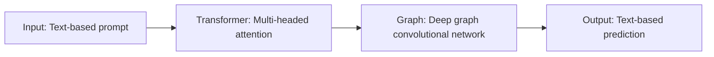

## 必应

Here is my summary of the paper in Markdown format:

# TLDR
- The paper presents a language-model based deep learning strategy for protein modeling and design, using a transformer-graph architecture that integrates attention and graph convolutional networks.

# Motivation
- Protein modeling and design are challenging problems that require multiscale understanding of the structure, function, and interactions of proteins.
- Existing methods are either limited by the availability of labeled data, the complexity of the tasks, or the generality of the models.
- The paper aims to develop a flexible and generalizable model that can solve both forward and inverse problems in protein modeling and design, using a text-based representation of proteins and tasks.

# Related Works
- The paper reviews some of the recent advances in protein modeling and design using machine learning and deep learning approaches, such as:
    - Transformer models for protein structure prediction and generation (e.g., AlphaFold2, trRosetta, etc.)
    - Generative models for protein design based on secondary structure constraints (e.g., diffusion models, variational autoencoders, etc.)
    - Graph neural networks for protein property prediction and interaction modeling (e.g., graph attention networks, graph convolutional networks, etc.)

# Method
- The paper proposes a novel model called MaterioFormer, which combines an autoregressive transformer model with a graph convolutional neural network within each attention head.
- The model uses byte-level tokenization to encode both protein sequences and tasks as text inputs, allowing for flexible and multimodal information processing.
- The model is trained in three stages: pre-training on unlabeled protein sequences, fine-tuning on forward tasks (such as secondary structure prediction, solubility prediction, etc.), and further fine-tuning on inverse tasks (such as protein design based on secondary structure content or solubility).
- The model uses Gumbel softmax sampling during inference to generate diverse and novel protein sequences that meet the design objectives.

# Method Frameworks



```python
# Pseudo-code for MaterioFormer model

def MaterioFormer(input):
  # input is a text-based prompt that contains a task and optionally a sequence
  # output is a text-based prediction that contains a sequence or a property

  # initialize start token T and end token E
  T = "~"
  E = "$"

  # tokenize input using byte-level tokenizer
  input_ids = tokenizer(input)

  # add start token to input_ids
  input_ids = [T] + input_ids

  # initialize output_ids as empty list
  output_ids = []

  # loop until end token is generated or maximum length is reached
  while E not in output_ids and len(output_ids) < max_length:

    # pass input_ids to transformer model
    logits = transformer(input_ids)

    # get logits for the last token
    last_logits = logits[-1]

    # apply Gumbel softmax sampling with temperature T and threshold thres
    sampled_token = gumbel_softmax(last_logits, T, thres)

    # append sampled_token to output_ids
    output_ids.append(sampled_token)

    # update input_ids with output_ids
    input_ids = input_ids + output_ids

  # detokenize output_ids using byte-level tokenizer
  output = tokenizer.detokenize(output_ids)

  # return output
  return output
```

# Experiment Setup
- The paper uses various datasets for pre-training and fine-tuning the model, such as:
    - AlphaFold2 database for pre-training on unlabeled protein sequences from different organisms
    - SPOT-1D dataset for fine-tuning on secondary structure prediction at per-residue level and overall content level
    - DSResSol dataset for fine-tuning on solubility prediction at binary level

- The paper evaluates the performance of the model on different tasks using various metrics, such as:
    - Accuracy for solubility prediction
    - Q8 accuracy and Q3 accuracy for secondary structure prediction at per-residue level
    - Mean absolute error (MAE) for secondary structure prediction at overall content level

- The paper also compares the model with some existing methods for protein modeling and design, such as:
    - SPOT-1D+ for secondary structure prediction
    - DSResSol+ for solubility prediction
    - Diffusion model for protein design based on secondary structure content

- The paper reports the hyperparameters of the model, such as:
    - Dimension: 256
    - Number of heads: 8
    - Number of layers: 12 (transformer) x 3 (graph)
    - Feed forward multiplier: 4 (1024 channels)
    - Dropout: 0.1
    - Embedding dimension: 32

- The paper also reports the training details of the model, such as:
    - Optimizer: Adam
    - Learning rate: 0.0002
    - Warmup steps: 2000-4000
    - Decay: Exponential
    - Batch size: 32
    - Sequence length: 256

# Innovation
- The paper introduces a novel language-model based deep learning strategy for protein modeling and design, using a transformer-graph architecture that integrates attention and graph convolutional networks.
- The paper demonstrates that the model can solve both forward and inverse problems in protein modeling and design, using a text-based representation of proteins and tasks.
- The paper shows that the model can generate diverse and novel protein sequences that meet the design objectives, using Gumbel softmax sampling during inference.

# Core Advantage
- The paper's key edge over other works is the flexibility and generality of the model, which can process diverse modalities of information, such as sequence data, description of tasks, and numbers.
- The paper's model can also exploit the complex knowledge graphs generated by the attention mechanism, by performing deep graph convolutional operations on the discovered graphs.
- The paper's model can also benefit from the synergies between the training tasks, which improve the overall performance of the model beyond what would be possible by training a model on each dataset alone.

# Improvements
- The paper enhances the existing methods for protein modeling and design by using a text-based representation of proteins and tasks, which allows for easy adaptation and extension of the model.
- The paper also improves the existing methods for protein design by using Gumbel softmax sampling during inference, which allows for generating diverse and novel protein sequences that meet the design objectives.

# Limitations
- The paper acknowledges some of the limitations and open questions of the model, such as:
    - The accuracy of solubility prediction is relatively low compared with dedicated solubility models, especially for longer sequences.
    - The model sometimes fails to accurately reflect the desired length or secondary structure in the prediction, especially for complex design tasks.
    - The model does not consider other aspects of protein design, such as stability, functionality, or interactions with other molecules.

# Future Work
- The paper suggests some potential next steps for further developing the model, such as:
    - Incorporating additional prediction tasks in both forward and inverse directions, and expanding the training set to include more sequences.
    - Exploring interactions with distinct biological molecules, such as mRNA or DNA, which can be added to the task training due to the flexible byte-level tokenizer.
    - Introducing cross-attention mechanisms for more complex amalgamation of information processed in the attention and graph layers.

# Overlooked Details
- Some subtle insights easily missed by novices are:
    - The use of byte-level tokenization to encode both protein sequences and tasks as text inputs, which allows for flexible and multimodal information processing.
    - The use of graph convolutional neural network within each attention head to exploit the complex knowledge graphs generated by the attention mechanism.
    - The use of Gumbel softmax sampling during inference to generate diverse and novel protein sequences that meet the design objectives.

# Surpassing Challenges
- Some difficulties for others to exceed this work are:
    - Developing a flexible and generalizable model that can solve both forward and inverse problems in protein modeling and design, using a text-based representation of proteins and tasks.
    - Integrating attention and graph convolutional networks in a transformer-graph architecture that can capture complex emergent relationships between universal building blocks and resulting properties.
    - Generating diverse and novel protein sequences that meet the design objectives, using Gumbel softmax sampling during inference.

# Inspiration
- Likely thought process and motivations of authors are:
    - How can we develop a flexible language-model based deep learning strategy for protein modeling and design, using a text-based representation of proteins and tasks?
    - How can we integrate attention and graph convolutional networks in a transformer-graph architecture that can capture complex emergent relationships between universal building blocks and resulting properties?
    - How can we generate diverse and novel protein sequences that meet the design objectives, using Gumbel softmax sampling during inference?

# Beyond Ideas
- Important learnings beyond core techniques are:
    - How to use a multi-stage training strategy to develop a generalizable model that progressively learns first general, then increasingly targeted and complex tasks.
    - How to use a text-based representation of proteins and tasks to allow for easy adaptation and extension of the model.
    - How to use Gumbel softmax sampling during inference to generate diverse and novel protein sequences that meet the design objectives.

# Unfamiliar Terms
- Clear explanations of top-3 key technical concepts are:
    - Transformer: A type of neural network architecture that uses attention mechanisms to learn from sequential data, such as text or speech. Transformers can encode both local and global dependencies among tokens in an input sequence, without relying on recurrent or convolutional layers.
    - Graph convolutional network: A type of neural network architecture that operates on