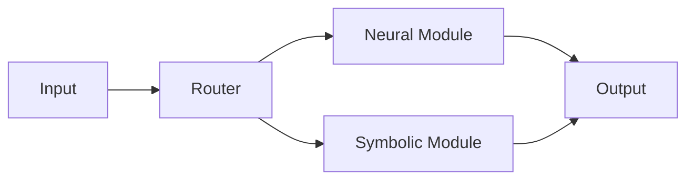
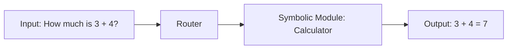

TLDR: The paper introduces MRKL, a neuro-symbolic architecture that combines large language models with external knowledge and reasoning modules[1][2].

Motivation: The paper argues that large language models have inherent limitations in accessing current and proprietary information, and performing symbolic reasoning. The paper proposes a modular system that can overcome these limitations by integrating neural and symbolic components.

Related Works: The paper reviews previous works on large language models, such as BERT, GPT-3, Jurassic-1, PaLM, and others. The paper also discusses the challenges and opportunities of foundation models, as well as the trade-offs between fine-tuning and multi-task training.

Method: The paper describes the MRKL system, which consists of a router and a set of expert modules[3]. The router is a neural network that routes natural language inputs to the most suitable module. The modules can be either neural or symbolic, depending on the type of task. The paper also explains how to cross the neuro-symbolic divide by extracting discrete parameters from text.

Method Frameworks: Here are some diagrams of the MRKL system in MERMAID:

Experiment Setup: The paper presents a case study of how to train Jurassic-X, AI21 Labs' implementation of MRKL, to handle basic arithmetic reliably. The paper uses data augmentation to generate training and test examples with different number of digits, wordings, formats, and operations. The paper evaluates Jurassic-X's performance on various aspects of generalization and robustness.

Innovation: The paper introduces a novel neuro-symbolic architecture that leverages the strengths of both neural and symbolic methods. The paper also demonstrates how to train a router to extract the right arguments for symbolic modules.

Core Advantage: The paper claims that MRKL systems have several benefits over fine-tuned multi-task models, such as safe fallback, robust extensibility, interpretability, up-to-date information, proprietary knowledge, compositionality, and scalability.

Improvements: The paper shows that Jurassic-X can achieve near-perfect performance on basic arithmetic problems by using data augmentation and prompt tuning. The paper also shows that Jurassic-X can generalize well across different number of digits, wordings, formats, and operations.

Limitations: The paper acknowledges that MRKL systems still face some challenges, such as how to intelligently route inputs among modules, how to handle complex and ambiguous inputs, how to ensure consistency and coherence across modules, and how to evaluate the quality and reliability of outputs.

Future Work: The paper suggests some possible directions for future work, such as extending MRKL systems to other domains and tasks, exploring more types of neural and symbolic modules, developing more sophisticated routing mechanisms, and studying the ethical and social implications of MRKL systems.

Overlooked Details: Some subtle insights that might be easily missed by novices are:

- The paper uses the term "language model" broadly to include models that also model knowledge from text.
- The paper distinguishes between foundation models and fine-tuned models in terms of their versatility and performance.
- The paper uses prompt tuning instead of few-shot learning to improve the extraction accuracy of the router.
- The paper uses a structured example space to generate data for training and testing[4].

Surpassing Challenges: Some difficulties that others might face in exceeding this work are:

- Designing a flexible and modular architecture that can integrate different types of modules seamlessly.
- Training a large language model that can serve as a general-purpose backbone for natural language processing.
- Developing effective data augmentation methods that can cover a wide range of variations in natural language expressions.
- Evaluating the performance and robustness of MRKL systems on diverse and realistic tasks.

Inspiration: Some likely thought processes and motivations of the authors are:

- They observed the limitations of large language models in accessing current and proprietary information, and performing symbolic reasoning.
- They wondered how to combine neural and symbolic methods in a modular way that can overcome these limitations.
- They decided to design a neuro-symbolic architecture that consists of a router and a set of expert modules.
- They chose basic arithmetic as a test case to demonstrate how to train Jurassic-X to handle it reliably.
- They experimented with different aspects of generalization and robustness to evaluate Jurassic-X's performance.

Beyond Ideas: Some important learnings beyond core techniques are:

- How to adopt a systems approach to AI development that involves knowledge and reasoning in addition to linguistic processing[5].
- How to balance between fine-tuning and multi-task training for achieving high performance and versatility.
- How to cross the neuro-symbolic divide by extracting discrete parameters from text.
- How to use data augmentation and prompt tuning to improve the extraction accuracy of the router.

Unfamiliar Terms: Some key technical concepts that might be unfamiliar to some readers are:

- Neuro-symbolic: A term that refers to the integration of neural and symbolic methods in AI. Neural methods are based on learning from data using neural networks, while symbolic methods are based on logic and rules.
- Router: A component of the MRKL system that routes natural language inputs to the most suitable module. The router is a specialized neural network that is trained to extract the right arguments for symbolic modules[6].
- Prompt tuning: A method of fine-tuning a large language model by adding a few tokens at the beginning of the input. Prompt tuning is more parameter-efficient than conventional fine-tuning, and can improve the performance of few-shot learning.

Critical References: Some of the most influential cited works and their relevance in this work are:

- BERT: A paper that introduced a pre-trained language model based on bidirectional transformers. BERT achieved state-of-the-art results on several natural language understanding tasks. BERT is one of the most widely used large language models in NLP.
- GPT-3: A paper that introduced a massive language model with 175 billion parameters. GPT-3 showed remarkable few-shot learning abilities on various natural language tasks. GPT-3 is one of the most powerful and versatile language models in NLP.
- Jurassic-1: A paper that introduced a large language model with 178 billion parameters. Jurassic-1 achieved state-of-the-art results on several natural language generation tasks. Jurassic-1 is the backbone of Jurassic-X, AI21 Labs' implementation of MRKL[7].
