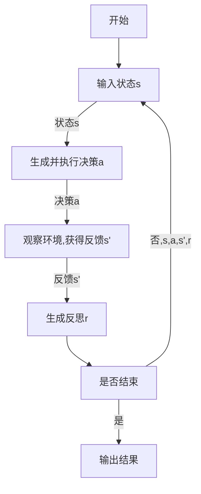

```mermaid
graph TD;
    A[开始] --> B[输入状态s];
    B -- 状态s--> C[生成并执行决策a];
    C --决策a--> D[观察环境,获得反馈s'];
    D --反馈s'--> E[生成反思r];
    E --> F[是否结束];
    F -- 是 --> G[输出结果];
    F -- 否,s,a,s',r --> B;

```

