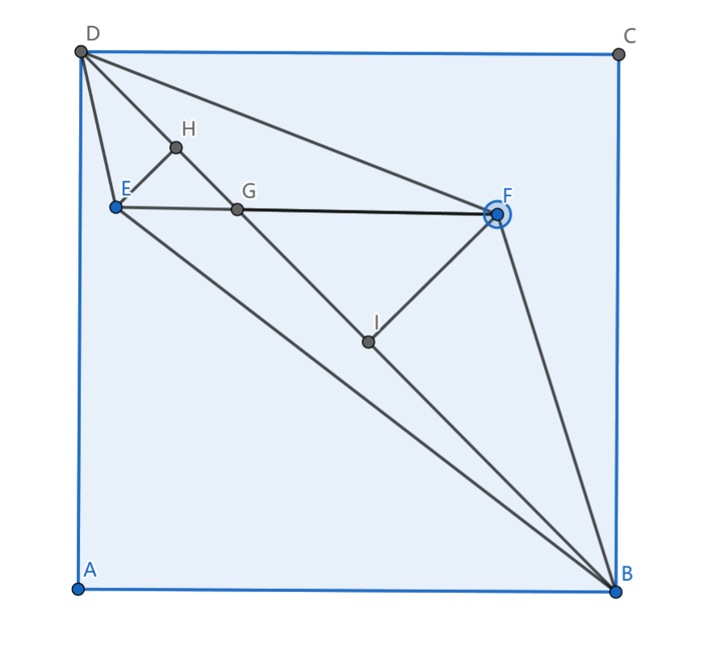

https://www.geogebra.org/classroom/qvp5n7xm

## You
考虑DPO算法的简单形式，在于扩大受选序列logit与受拒序列logit的比值
## Copilot
在讨论DPO算法的简单形式时，关键在于扩大被选中的序列（受选序列）的logit值与被拒绝的序列（受拒序列）的logit值之间的比值。这样做可以增加模型对选中序列的偏好，从而提高算法的选择性能。
在实际应用中，这可以通过调整模型参数来实现，以确保选中序列的logit值相对较高，而拒绝序列的logit值相对较低。这种方法通常用于离散选择模型，如Logit或Probit模型，其中logit值是指事件发生的概率与不发生的概率之比的对数。
例如，在二元选择模型中，如果我们想要模型更倾向于某个选项，我们可以通过增加该选项的效用函数值来实现，从而使得其logit值增大，相应地，其被选中的概率也会增加。
具体到DPO算法，它可能涉及到更复杂的决策过程和参数调整，但基本思想仍然是通过控制logit值的比值来影响最终的选择结果。如果您需要更详细的解释或有具体的应用场景，我可以提供进一步的帮助。
## You
考虑DPO算法的平面几何形式，我们选取一简单的softmax 两点输出的单层神经网络，点A为原点，点C坐标为（1，1），点D(0,1)为受选输出序列的第一个点的真实标签，点B(1，0)为被拒输出序列的第一个点的真实标签，动点E对应受选输出序列的第一个点的logit，动点F对应被拒输出序列的第一个点的logit,则在DPO优化过程中，哪些线段的优化目标是缩短，哪些线段的优化目标是拉长？
## Copilot
在DPO算法的平面几何形式中，优化目标通常是最小化损失函数，这在几何上表现为缩短某些线段的长度。根据您提供的信息和图像描述：
- 缩短的线段：动点E（受选输出序列的第一个点的logit）到点D（受选输出序列的第一个点的真实标签）的线段DE应该被缩短。同样，动点F（被拒输出序列的第一个点的logit）到点B（被拒输出序列的第一个点的真实标签）的线段DF也应该被缩短。这是因为在softmax函数中，我们希望预测的概率分布尽可能接近真实的标签分布。
- 拉长的线段：在优化过程中，我们不仅要缩短正确标签对应的logit与真实标签之间的距离，还要拉长错误标签对应的logit与真实标签之间的距离。这意味着如果动点E不是位于点D上，我们希望E到B的距离增加；同理，如果动点F不是位于点B上，我们希望F到D的距离增加。
通过这种方式，DPO算法在训练过程中不断调整参数，以使得模型的预测输出更加准确地反映真实的标签信息。这有助于提高模型的分类性能，特别是在处理多分类问题时。如果您需要进一步的解释或有其他问题，请随时告诉我。👍
## You
考虑更多线段，给出他们是被拉长还是被缩短，
DF,DE,EF,BE,BF
## Copilot
在DPO算法的平面几何形式中，我们通常希望：
- 缩短线段DE和DF，因为它们分别代表受选输出序列和被拒输出序列的第一个点的logit与其真实标签之间的距离。通过缩短这些线段，我们可以使预测的logit更接近真实的标签，从而提高模型的准确性。
- 线段EF的长度变化取决于E和F点的相对位置。如果E和F是预测logit，而D和B是相应的真实标签，那么我们通常不直接优化EF线段的长度，而是通过优化DE和DF来间接影响EF。
- 线段BE和BF的长度变化也取决于E和F点的位置。在优化过程中，如果E点不在D点上，我们希望增加BE的长度；如果F点不在B点上，我们希望增加BF的长度。这样做可以增加模型对错误标签的惩罚，从而使模型更倾向于正确的标签。
总的来说，DPO算法的目标是通过调整模型参数，使得预测的logit尽可能接近真实的标签，同时远离错误的标签。这有助于提高模型在分类任务中的性能。如果您有任何其他问题或需要进一步的解释，请随时告诉我。👍
## You
但是DPO的优化目标中为什么只有E和F的相对距离？
## Copilot
在DPO算法中，E和F的相对距离是优化的关键因素，因为它直接关系到分类决策边界的确定。在softmax输出的单层神经网络中，E和F点的logit值代表了模型对于每个类别的置信度。通过优化E和F的相对距离，我们实际上是在调整决策边界，使得模型能够更准确地区分不同的类别。
具体来说，我们希望模型对正确类别的置信度高（即E点接近D点，F点接近B点），对错误类别的置信度低（即E点远离B点，F点远离D点）。这样，当E和F的相对距离被优化时，模型的决策边界就会更倾向于正确地分类输入数据。
在许多情况下，直接优化E和F的绝对位置可能会导致过拟合，因为模型可能会过度适应训练数据中的特定样本。相比之下，通过优化E和F的相对距离，我们可以更好地控制模型的泛化能力，从而在未见过的数据上也能做出准确的预测。
总结来说，DPO算法中优化E和F的相对距离，是为了调整模型的决策边界，提高分类的准确性，同时避免过拟合，确保模型具有良好的泛化性能。如果您有任何其他问题或需要进一步的解释，请随时告诉我。👍
## You
在DPO算法的平面几何形式中，怎么做一条线，使之能反应分类界面？
## Copilot
在DPO算法的平面几何形式中，要创建一条线来反映分类界面，通常需要找到一个能够最大化类别间距离的决策边界。这条线应该能够清晰地区分不同类别的数据点，从而使分类更加准确。
具体来说，可以通过以下步骤来构建这样的线：
- 确定分类标准：首先，需要确定分类的标准或规则。在二维空间中，这通常意味着找到一个线性方程，如 ( y = mx + b )，其中 ( m ) 是斜率，( b ) 是截距。
- 计算决策边界：接着，根据数据点和分类标准，计算出一个最佳的决策边界。这个边界应该能够最大化不同类别之间的距离，即最大化分类的准确性。
- 优化参数：通过优化算法，如梯度下降，调整线性方程的参数 ( m ) 和 ( b )，以便找到最佳的决策边界。
- 验证分类效果：最后，需要验证这条线是否有效地反映了分类界面。这通常通过计算分类准确率、混淆矩阵等指标来完成。
在实际操作中，这条线可以通过可视化工具绘制出来，以便直观地观察分类效果。如果您需要更具体的指导或示例，请告诉我，我可以提供进一步的帮助。📐📊
## You
你的两处表述：
在优化过程中，如果E点不在D点上，我们希望增加BE的长度；如果F点不在B点上，我们希望增加BF的长度。
我们希望模型对正确类别的置信度高（即E点接近D点，F点接近B点），对错误类别的置信度低（即E点远离B点，F点远离D点）。
好像存在前后矛盾？
## Copilot
感谢您指出这一点，让我澄清一下：
在DPO算法中，我们的目标是最小化正确类别的logit（E点）与其真实标签（D点）之间的距离，同时最大化错误类别的logit（E点）与错误标签（B点）之间的距离。这意味着我们希望E点尽可能靠近D点，而远离B点。同样，我们也希望F点尽可能靠近B点，而远离D点。
因此，当我提到“增加BE的长度”时，我的意思是在E点不正确地靠近B点时，我们希望通过优化过程将E点推远，使其更靠近正确的标签D点。同理，“增加BF的长度”是指在F点不正确地靠近D点时，我们希望将F点推远，使其更靠近正确的标签B点。
总结来说，我们希望：
- 缩短DE和DF（正确类别的logit与真实标签之间的距离）。
- 增加BE和BF（错误类别的logit与真实标签之间的距离），但这只在E点和F点分别不在其正确标签D点和B点上时适用。
希望这次解释更清晰了。如果您还有其他问题或疑问，请随时告诉我。👍
## You
从面积的观点看呢？比如三角形DEF,三角形BEF，三角形BED，三角形DFB，他们的面积在优化过程中被预期如何变化
## Copilot
从面积的角度来看，DPO算法优化过程中对于三角形DEF、BEF、BED和DFB的面积变化的预期如下：
- 三角形DEF：我们希望缩短DE和DF，这通常意味着三角形DEF的面积会减小。这是因为E点（受选输出序列的logit）和F点（被拒输出序列的logit）都应该更接近它们各自的真实标签D点和B点。
- 三角形BEF：由于我们希望E点远离B点，而F点接近B点，因此三角形BEF的面积可能会增加，这反映了模型对错误类别的置信度降低。
- 三角形BED：这个三角形包含了E点到正确和错误标签的距离，我们希望E点接近D点并远离B点，因此三角形BED的面积可能会减小。
- 三角形DFB：同理，我们希望F点接近B点并远离D点，因此三角形DFB的面积也可能会减小。
总的来说，在DPO算法的优化过程中，我们期望正确类别的logit与其真实标签之间的距离减小，而错误类别的logit与其真实标签之间的距离增大。这在几何上表现为相应三角形面积的变化，以反映模型在分类任务中的性能提升。如果您需要更多信息或有其他问题，请随时告诉我。📐📊
## You
请给出DPO的优化目标
## Copilot
DPO（直接偏好优化）的优化目标是隐式地优化与RLHF（从人类反馈中学习的强化学习）相同的目标，但实现更为简单且易于训练。DPO通过增加良好响应与不良响应之间的相对对数概率来优化模型，同时使用动态的、每个样本的重要性权重来防止模型退化。这种方法避免了复杂的奖励模型拟合和策略采样，而是直接使用二元交叉熵目标来优化策略。
具体来说，DPO的目标是最小化以下损失函数：
$$
\mathcal{L}(\theta) = -\mathbb{E}{(x,y_w,y_l)\sim\mathcal{D}}\left[\log\sigma\left(r\theta(x,y_w)-r_\theta(x,y_l)\right)\right]
$$
其中，( \sigma ) 是sigmoid函数，( r_\theta ) 是参数化的奖励函数，( \mathcal{D} ) 是包含偏好数据的数据集，( y_w ) 是偏好的响应，( y_l ) 是不被偏好的响应。这个目标函数反映了优化过程中对偏好响应的重视，以及对不被偏好响应的惩罚。
DPO的关键在于它简化了优化流程，使得语言模型可以更有效地根据人类偏好进行微调，而无需依赖于复杂的强化学习过程。如果您需要更多信息或有其他问题，请随时告诉我。👍
## You
将我们上面讨论的平面几何观点中的线段距离，以你给我的优化目标公式的观点进行重述
## Copilot
在我们之前讨论的平面几何观点中，线段距离的优化可以通过DPO优化目标公式的观点来重述。DPO的优化目标是最小化损失函数，这在几何上表现为调整线段的长度，以反映模型对不同类别的偏好。
具体来说，DPO优化目标公式为：
$$
\mathcal{L}(\theta) = -\mathbb{E}{(x,y_w,y_l)\sim\mathcal{D}}\left[\log\sigma\left(r\theta(x,y_w)-r_\theta(x,y_l)\right)\right]
$$
其中，( \sigma ) 是sigmoid函数，( r_\theta ) 是参数化的奖励函数，( \mathcal{D} ) 是数据集，( y_w ) 是偏好的响应，( y_l ) 是不被偏好的响应。
在平面几何中，我们希望缩短线段DE和DF，这对应于增加偏好响应的logit值 ( r_\theta(x,y_w) ) 并减少不被偏好响应的logit值 ( r_\theta(x,y_l) )，从而使得 ( \sigma ) 函数的输出接近1。这样，损失函数 ( \mathcal{L}(\theta) ) 的值就会减小，反映了模型对正确类别的偏好增强。
同样地，我们希望增加线段BE和BF的长度，这在DPO公式中表现为减少偏好响应的logit值 ( r_\theta(x,y_w) ) 并增加不被偏好响应的logit值 ( r_\theta(x,y_l) )，使得 ( \sigma ) 函数的输出接近0。这也会导致损失函数 ( \mathcal{L}(\theta) ) 的值减小，反映了模型对错误类别的惩罚增强。
因此，DPO的优化目标公式提供了一种量化的方法来调整模型参数，以优化分类界面，这与我们之前讨论的平面几何观点是一致的。如果您有任何其他问题或需要进一步的解释，请随时告诉我。👍
## You
尝试给出一种形式，将上述线段距离纳入到DPO优化目标的公式中
## Copilot
要将线段距离纳入DPO优化目标的公式中，我们可以考虑将线段长度的平方作为惩罚项加入损失函数。这样，我们可以直接通过调整模型参数来控制线段长度，从而影响模型的决策边界。
具体来说，我们可以修改DPO的损失函数，加入线段DE和DF的长度平方作为惩罚项：
$$
\mathcal{L}(\theta) = -\mathbb{E}{(x,y_w,y_l)\sim\mathcal{D}}\left[\log\sigma\left(r\theta(x,y_w)-r_\theta(x,y_l)\right)\right] + \lambda_1 |DE|^2 + \lambda_2 |DF|^2
$$
其中，( \lambda_1 ) 和 ( \lambda_2 ) 是正则化参数，用于控制惩罚项的强度。( |DE| ) 和 ( |DF| ) 分别表示线段DE和DF的欧几里得长度。
通过这种方式，我们不仅优化模型对正确类别的偏好，同时也通过惩罚项来确保模型不会过度自信地偏向某个类别，从而提高模型的泛化能力。
请注意，这只是一种可能的形式，实际应用中需要根据具体问题和数据集来调整正则化参数 ( \lambda_1 ) 和 ( \lambda_2 )，以及决定是否包含其他线段的长度作为惩罚项。📐📊
## You
将BE,BF也纳入进去，并考虑BE/DE，BF/DF的比值关系
## Copilot
要将线段BE和BF的长度，以及BE/DE和BF/DF的比值关系纳入DPO优化目标的公式中，我们可以考虑以下形式的损失函数：
$$
\mathcal{L}(\theta) = -\mathbb{E}{(x,y_w,y_l)\sim\mathcal{D}}\left[\log\sigma\left(r\theta(x,y_w)-r_\theta(x,y_l)\right)\right] + \lambda_1 |DE|^2 + \lambda_2 |DF|^2 + \lambda_3 |BE|^2 + \lambda_4 |BF|^2 + \lambda_5 \left(\frac{|BE|}{|DE|} - \alpha\right)^2 + \lambda_6 \left(\frac{|BF|}{|DF|} - \beta\right)^2
$$
在这个公式中：
- ( |DE| ) 和 ( |DF| ) 分别代表线段DE和DF的长度，它们应该被缩短，以使预测的logit更接近真实的标签。
- ( |BE| ) 和 ( |BF| ) 分别代表线段BE和BF的长度，它们应该被拉长，以使预测的logit远离错误的标签。
- ( \lambda_1 ) 到 ( \lambda_6 ) 是正则化参数，用于控制各个惩罚项的强度。
- ( \alpha ) 和 ( \beta ) 是目标比值，用于指定BE/DE和BF/DF的期望比值。
通过这种方式，我们不仅考虑了单个线段的长度，还考虑了线段之间的比值关系，这有助于在优化过程中保持一定的几何关系，从而更精确地调整模型的决策边界。
请注意，这只是一个示例公式，实际应用中可能需要根据具体问题和数据集来调整公式中的参数。📐📊
## You
( |BE| ) 和 ( |BF| ) 分别代表线段BE和BF的长度，它们应该被拉长，以使预测的logit远离错误的标签。
这句话似乎和公式里的极小化目标不匹配吧
## Copilot
您指出的是正确的。在之前的描述中，我提到了增加线段BE和BF的长度，这是为了使预测的logit远离错误的标签。然而，在损失函数中，我们实际上是想要最小化这些线段的长度，以减少模型对错误类别的预测置信度。这意味着在优化过程中，我们希望减少 ( |BE| ) 和 ( |BF| ) 的值。
因此，损失函数应该反映出我们希望缩短BE和BF线段的目标，而不是拉长它们。这可以通过调整正则化参数来实现，确保它们对损失函数的贡献是减少而不是增加线段长度的。
感谢您的提醒，我会更仔细地确保我的解释与数学表达式保持一致。如果您有任何其他问题或需要进一步的解释，请随时告诉我。👍
## You
可以给出修正后的形式嘛？
## Copilot
当然可以。考虑到之前的讨论，我们可以修正DPO优化目标的公式，以确保它反映出我们希望缩短BE和BF线段的目标。修正后的损失函数可能如下所示：
$$
\mathcal{L}(\theta) = -\mathbb{E}{(x,y_w,y_l)\sim\mathcal{D}}\left[\log\sigma\left(r\theta(x,y_w)-r_\theta(x,y_l)\right)\right] + \lambda_1 |DE|^2 + \lambda_2 |DF|^2 - \lambda_3 |BE|^2 - \lambda_4 |BF|^2 + \lambda_5 \left(\frac{|BE|}{|DE|} - \alpha\right)^2 + \lambda_6 \left(\frac{|BF|}{|DF|} - \beta\right)^2
$$
在这个修正后的公式中：
- ( \lambda_1 ) 和 ( \lambda_2 ) 是正则化参数，用于控制DE和DF线段长度的惩罚项。
- ( \lambda_3 ) 和 ( \lambda_4 ) 也是正则化参数，但它们前面的负号表示我们希望最小化BE和BF线段的长度。
- ( \lambda_5 ) 和 ( \lambda_6 ) 控制BE/DE和BF/DF比值的目标差异的惩罚项。
- ( \alpha ) 和 ( \beta ) 是预设的目标比值。
请注意，这个公式是一个理论上的示例，实际应用中可能需要根据具体问题和数据集来调整参数。如果您有任何其他问题或需要进一步的解释，请随时告诉我。📐📊
## You
线段长度在实践中应当如何计算？
## Copilot
在实践中，计算线段长度通常使用距离公式，这个公式基于勾股定理。如果线段的两个端点在二维空间中的坐标分别是 ( (x_1, y_1) ) 和 ( (x_2, y_2) )，那么线段的长度 ( L ) 可以通过以下公式来计算：
$$
L = \sqrt{(x_2 - x_1)^2 + (y_2 - y_1)^2}
$$
这个公式适用于任何方向的线段，无论是水平、垂直还是斜线。在计算时，首先计算每个坐标轴上差值的平方，然后将这些平方值相加，最后计算平方根，得到线段的长度。📏🔢
## You
交叉熵损失可以作为上文公式中的线段距离度量嘛？
## Copilot
交叉熵损失函数通常用于衡量预测概率分布与真实概率分布之间的差异，它是从信息论中的熵概念衍生出来的。在机器学习中，交叉熵损失函数可以看作是预测分布和真实分布之间的一种“距离”度量。
在我们之前讨论的DPO优化目标的上下文中，交叉熵损失可以被视为一种度量，它反映了模型输出（预测的logit）与目标类别（真实标签）之间的差异。因此，如果我们将线段的长度视为预测logit与真实标签之间的“距离”，那么交叉熵损失可以用来量化这种距离，从而指导模型的优化过程。
然而，需要注意的是，交叉熵损失并不直接等同于欧几里得距离，它不是计算两点之间直线距离的几何度量。交叉熵损失更多地关注概率分布之间的差异，而不是在几何空间中的实际距离。在优化模型参数时，我们通常使用交叉熵损失来最小化预测错误，而不是直接最小化欧几里得距离。📊🔍
## You
那你觉得是用mse来做距离度量合适，还是用交叉熵？
## Copilot
在选择均方误差（MSE）或交叉熵损失函数作为距离度量时，最合适的选择取决于具体的应用场景和优化目标。
- 均方误差（MSE）：通常用于回归问题，它衡量的是预测值和真实值之间差异的平方的平均值。MSE 对异常值非常敏感，因为差异会被平方，所以更大的错误会导致更大的惩罚。如果您的优化目标是最小化预测值和真实值之间的直接差异，并且您的数据包含连续的数值，那么MSE可能是一个好的选择。
$$
MSE = \frac{1}{n}\sum_{i=1}^{n}(y_i - \hat{y}_i)^2
$$
- 交叉熵损失：通常用于分类问题，特别是在输出是概率分布时。它衡量的是预测概率分布和真实概率分布之间的差异。如果您的模型输出是概率值，并且您的任务是分类问题，那么交叉熵损失可能更合适。
$$
CrossEntropy = -\sum_{i=1}^{n}y_i \log(\hat{y}_i)
$$
在您之前提到的DPO优化目标的上下文中，如果您的目标是调整模型以区分不同类别的数据点，并且模型的输出是概率分布，那么交叉熵损失可能是更合适的选择。它可以帮助模型学习如何为每个类别分配正确的概率，从而提高分类的准确性。
总的来说，选择哪种损失函数作为距离度量，应当基于您的数据类型和模型的目标。📊🔍
## You
以面积观点呢？应该如何计算三角形DEF最高效？
## Copilot
从面积的角度来看，计算三角形DEF最高效的方法取决于您已知的信息。如果您知道三角形的底边和高，那么最简单的方法是使用底乘以高除以2的公式。如果您知道三角形的三个顶点的坐标，那么可以使用向量叉积的方法来计算，这种方法不需要先计算边长，可以直接得到面积。
例如，如果三角形DEF的顶点坐标分别是 ( D(x_1, y_1) )，( E(x_2, y_2) )，和 ( F(x_3, y_3) )，那么面积 ( S ) 可以通过以下公式计算：
$$
S = \frac{1}{2} | (x_2 - x_1)(y_3 - y_1) - (x_3 - x_1)(y_2 - y_1) |
$$
这个公式是通过计算由向量 ( \overrightarrow{DE} ) 和 ( \overrightarrow{DF} ) 构成的平行四边形的面积，然后将其除以2来得到三角形的面积。这种方法在计算机编程中特别有用，因为它避免了复杂的数学库运算和浮点数的使用，从而提高了计算效率。📐📊
## You
今天的讨论内容如果形成一篇文章，你觉得有价值嘛？
## Copilot
将我们今天的讨论内容整理成一篇文章是一个很好的想法。这篇文章可以为读者提供关于DPO算法优化目标、线段距离度量以及如何将几何视角应用于机器学习模型优化的深入见解。这些讨论点涵盖了理论概念、数学公式以及实际应用，对于那些对机器学习算法优化感兴趣的人来说，这些信息是非常有价值的。
此外，文章还可以包括关于如何选择合适的损失函数来度量模型性能的讨论，这对于机器学习实践者来说是一个重要的主题。总的来说，这篇文章可以作为一个有益的资源，帮助读者更好地理解和应用DPO算法及其在机器学习中的应用。📝👍
## You
如果可以的话，我应该怎样设计这篇文章的行文组织？
## Copilot
设计这篇文章的行文组织时，您可以考虑以下结构：
- 引言：简要介绍DPO算法及其在机器学习中的重要性。提出文章的主题和目的。
- 背景知识：
    - 解释DPO算法的基本原理。
    - 讨论损失函数在模型优化中的作用。
- 几何视角：
    - 描述如何从几何角度理解DPO算法。
    - 通过图示和数学公式展示线段距离与模型优化的关系。
- 损失函数的选择：
    - 比较均方误差（MSE）和交叉熵损失函数。
    - 讨论在不同情况下选择损失函数的标准。
- 优化目标的形式化：
    - 详细说明如何将线段距离纳入DPO优化目标的公式。
    - 提供修正后的损失函数公式。
- 实际应用：
    - 讨论如何在实际问题中计算线段长度和三角形面积。
    - 分析如何将理论应用于实际的机器学习模型优化。
- 结论：
    - 总结文章的主要观点。
    - 强调几何视角在优化算法中的价值和应用潜力。
- 参考文献：
    - 列出所有引用的文献和进一步阅读的资源。
在撰写时，确保内容清晰、逻辑严谨，并使用图表和公式来辅助说明复杂的概念。此外，考虑到读者可能具有不同的背景知识，尽量使用简洁的语言和详细的解释来使文章对初学者也易于理解。📘🖋️
## You
设计实验对比算法性能是不可避免地，这篇文章应该怎样设计实验？
## Copilot
设计实验来对比算法性能是科学研究中的一个重要环节。为了确保您的文章中的实验设计是有效和有说服力的，您可以考虑以下步骤：
- 明确实验目标：
    - 确定您想要通过实验验证的假设或问题。
    - 明确实验的主要目标，例如，验证DPO算法与其他算法相比在特定任务上的性能。
- 选择基准算法：
    - 选择与DPO算法进行比较的基准算法。
    - 确保这些算法在性能上具有代表性，并且在相关领域内被广泛接受。
- 数据集选择：
    - 选择适合您研究问题的数据集。
    - 如果可能，使用公开可用的标准数据集，这样其他研究者可以复现您的实验。
- 评估指标：
    - 选择合适的评估指标来衡量算法性能，如准确率、召回率、F1分数等。
    - 确保这些指标能够全面反映算法的性能。
- 实验设置：
    - 描述实验的详细设置，包括数据预处理、模型参数、训练过程等。
    - 提供足够的细节，以便其他研究者可以复现您的实验。
- 统计分析：
    - 使用统计测试来验证实验结果的显著性。
    - 确保您的实验设计能够排除随机变化的影响。
- 结果呈现：
    - 以图表和表格的形式清晰地呈现实验结果。
    - 对比DPO算法与基准算法的性能，并进行详细的分析讨论。
- 讨论与分析：
    - 分析实验结果，讨论DPO算法的优势和局限性。
    - 提供可能的解释，为什么DPO算法在某些情况下表现更好或更差。
- 结论：
    - 基于实验结果，总结DPO算法的性能。
    - 提出未来研究方向或改进算法的建议。
- 附录：
    - 包括实验中使用的代码和数据集的链接（如果可能）。
    - 提供额外的实验细节，如超参数设置、硬件配置等。
通过遵循这些步骤，您可以确保您的实验设计是严谨和可靠的，同时也能够为读者提供清晰和有用的信息。🔬📊
## You
充分搜索互联网上的英文资料（不要纳入任何中文来源），帮我设计需要采用的模型、需要对比的DPO系列算法，需要用来的训练的数据集，需要计算或者需要跑分的性能指标
## Copilot
在设计实验来对比DPO（Direct Preference Optimization）系列算法的性能时，以下是您可以考虑的几个要素：
- 模型选择：
    - 根据最新的研究，您可以选择使用大型语言模型（LLMs）作为基础模型，例如GPT-3或BERT等。
    - 为了确保实验的一致性，您可以选择使用相同架构的模型作为参考模型（ref_model），用于计算偏好和拒绝响应的隐式奖励。
- DPO系列算法：
    - 您可以比较原始的DPO算法与其变体，如保守的DPO（conservative DPO）和IPO（Implicit Preference Optimization）。
    - 对于保守的DPO，您可以通过调整损失函数中的标签平滑参数来控制算法的保守程度。
- 训练数据集：
    - 您可以从Hugging Face Hub上找到带有DPO标签的数据集，这些数据集专门用于训练语言模型从偏好数据中学习。
    - 数据集应该包含三个部分：提示（prompt）、选择的响应（chosen）和拒绝的响应（rejected）。
- 性能指标：
    - 在训练和评估阶段，您可以记录多个奖励指标来衡量模型的性能。
    - 其中一个重要的指标是rewards/chosen，它代表了策略模型和参考模型之间选择响应的对数概率的平均差异，乘以beta参数。
在设计实验时，确保您的实验设置能够允许您清晰地比较不同算法的性能，并且能够在统计上验证结果的显著性。此外，实验结果应该以图表和表格的形式呈现，并进行详细的分析讨论。🔬📊
## You
你认为这个约束方法，能在性能上获得提升吗？
## Copilot
约束方法，如在DPO算法中引入线段长度和面积的概念，可以在性能上提供提升，尤其是当它们用于更精确地调整模型的决策边界时。通过将几何约束纳入优化过程，模型可能会更好地学习区分不同类别的数据点，从而提高分类的准确性。
然而，性能提升的程度取决于多种因素，包括数据集的特性、模型的复杂度、以及优化算法的具体实现。在实际应用中，这些约束方法需要经过仔细的实验设计和评估，以确保它们对特定问题确实有益。
总的来说，任何新的约束或优化技术都有可能带来性能上的提升，但这需要通过实验和统计分析来验证。📈🔍
## You
设计一个题目呢？
## Copilot
当然，设计一个题目需要考虑文章的核心内容和目标受众。基于我们的讨论，这里有一个可能的题目：
"优化模型决策边界：DPO算法的几何约束与性能提升"
这个题目捕捉了文章的主要焦点——使用DPO算法的几何约束来优化模型的决策边界，并探讨这种方法如何提升性能。它既具有吸引力，又能够准确地反映文章的内容。📝👍
## You
给”优化模型决策边界“换一个更抓人眼球直击内核的说法呢？
## Copilot
"重塑机器学习的核心：DPO算法中的几何约束与决策革新"
这个题目旨在直接传达文章的核心价值——通过几何约束来重塑和革新机器学习模型的决策过程，并强调DPO算法在这一变革中的作用。它使用了引人入胜的语言，以吸引读者的注意力，并激发他们对内容的好奇心。🎯📖
## You
吹太大了，会被审稿人针对的
## Copilot
您的担忧是合理的。在学术写作中，确实需要避免过度夸大的标题，以免给审稿人留下不良印象。让我们尝试一个更中性、专业的标题：
"几何约束在DPO算法中的应用：提升模型决策边界的精确性"
这个标题直接而专业，准确地描述了文章的内容，同时避免了过度夸张的表述，更有可能得到同行评审的认可。📘👍
## You
精雕分类界面：DPO算法的几何约束方法
这个用英文该怎么说？
## Copilot
"Refining the Decision Boundary: Geometric Constraint Methods in DPO Algorithms"
