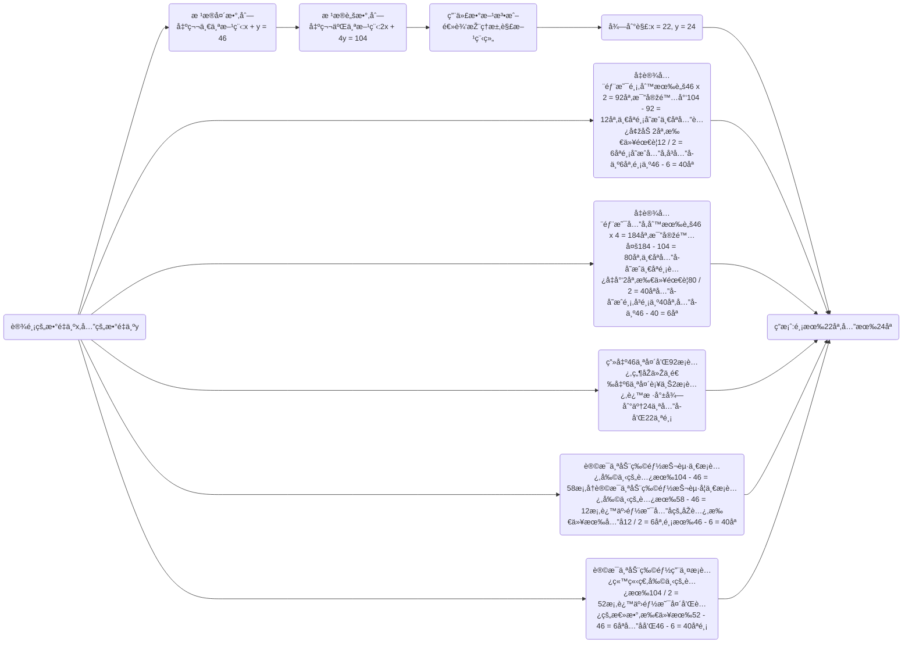
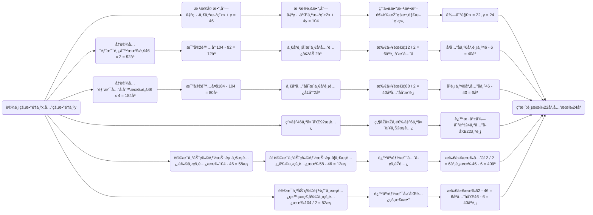
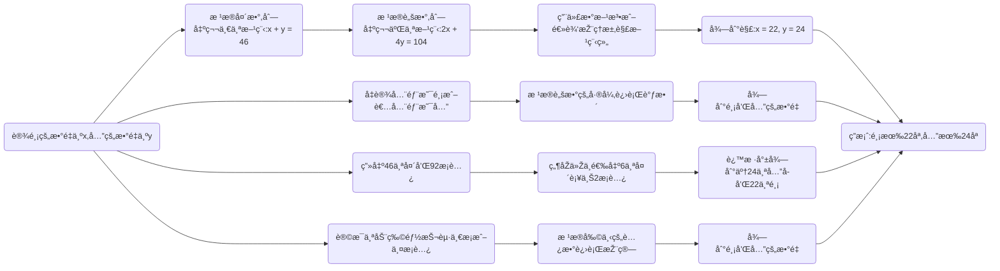
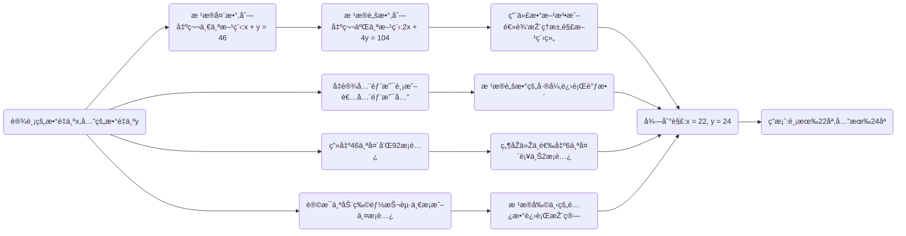

好的，我为你列出了一些解决鸡兔åŒç¬¼é—®é¢˜çš„ä¸åŒæ€è·¯ï¼Œä½ å¯ä»¥å‚考一下：

|æ€è·¯|方法|优点|缺点|
|---|---|---|---|
|方程法|用方程组表示鸡和兔的数é‡å’Œå¤´æ•°ã€è„šæ•°çš„关系，然åŽç”¨ä»£æ•°æ–¹æ³•æˆ–逻辑推ç†æ±‚解方程组|通用，适用于任何鸡兔åŒç¬¼é—®é¢˜|需è¦ä¸€å®šçš„代数知识和技巧|
|画图法|画出头和腿的图形，然åŽç”¨ç›´è§‚çš„æ–¹å¼æ‰¾å‡ºé¸¡å’Œå…”的区别|直观，容易ç†è§£|ä¸å¤Ÿç²¾ç¡®ï¼Œå¯èƒ½æœ‰å¤šç§æƒ…况|
|å‡è®¾æ³•|å‡è®¾å…¨éƒ¨æ˜¯é¸¡æˆ–者全部是兔，然åŽæ ¹æ®è„šæ•°çš„差异进行调整|简å•ï¼Œå®¹æ˜“æ“作|ä¸å¤Ÿæ™®é，å¯èƒ½æœ‰æ— è§£æˆ–多解的情况|
|金鸡独立法|让æ¯ä¸ªåŠ¨ç‰©éƒ½æŠ¬èµ·ä¸€æ¡è…¿ï¼Œç„¶åŽæ ¹æ®å‰©ä¸‹çš„腿数进行推算|巧妙，有趣|ä¸å¤Ÿç›´è§‚，需è¦ä¸€å®šçš„想象力|
|å¹å“¨æ³•|让æ¯ä¸ªåŠ¨ç‰©éƒ½ç”¨ä¸¤æ¡è…¿ç«™ç«‹ç€ï¼Œç„¶åŽæ ¹æ®å‰©ä¸‹çš„腿数进行推算|巧妙，有趣|ä¸å¤Ÿç›´è§‚，需è¦ä¸€å®šçš„想象力|

希望这个表格能帮助你ç†è§£è¿™ä¸ªé—®é¢˜çš„ä¸åŒæ€è·¯ã€‚如果你还有其他问题，欢迎继续æ问。😊

## 必应

好的，我为你绘制了一个包å«è¿™äº›æ–¹æ³•çš„æµç¨‹å›¾ï¼Œä½ å¯ä»¥å‚考一下：



希望这个æµç¨‹å›¾èƒ½å¸®åŠ©ä½ ç†è§£è¿™ä¸ªé—®é¢˜çš„ä¸åŒè§£æ³•ã€‚如果你还有其他问题，欢迎继续æ问。😊


## 必应

好的，我为你细化了一些æµç¨‹å›¾èŠ‚点，你å¯ä»¥å‚考一下：



希望这个æµç¨‹å›¾èƒ½å¸®åŠ©ä½ ç†è§£è¿™ä¸ªé—®é¢˜çš„ä¸åŒè§£æ³•ã€‚如果你还有其他问题，欢迎继续æ问。😊

## 必应

好的，我为你归并了一些é‡å¤æˆ–者近似的æµç¨‹èŠ‚点，你å¯ä»¥å‚考一下：



希望这个æµç¨‹å›¾èƒ½å¸®åŠ©ä½ ç†è§£è¿™ä¸ªé—®é¢˜çš„ä¸åŒè§£æ³•ã€‚如果你还有其他问题，欢迎继续æ问。😊



好的，我å°è¯•ç”¨markdownçš„mermaid表述ç»è¿‡çš„城市的æµç¨‹å›¾ã€‚请看下é¢çš„代ç å—。

```mermaid
graph LR
北京-->石家庄-->郑州-->洛阳-->三门峡-->渭å—-->西安
北京-->邯郸-->é‚¢å°-->安阳-->鹤å£-->洛阳
北京-->承德-->石家庄
北京-->济å—
北京-->太原
济å—-->西安
太原-->西安
```
